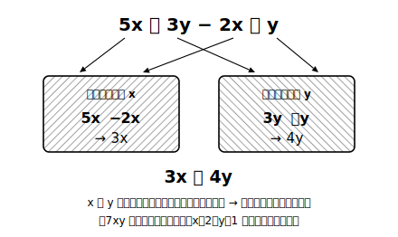

# L02 単項式・多項式・同類項——文字が2種類になると

## ねらい

- **単項式（たんこうしき）**と**多項式（たこうしき）**の意味を理解し、式を分類できるようになる。
- 式の**次数（じすう）**を数え、一次式・二次式を区別できるようになる。
- **同類項（どうるいこう）**の意味を理解し、文字が2種類ある式を整理できるようになる。「x と y はまとめられない」経験を通して、項の理解を一段深める。

## 主概念1：式の分類——単項式と多項式

中1の式は 3a＋2 のように文字が一種類だった。中2では 3x＋2y や 5ab のように、文字が2種類以上の式を扱っていく。まず、式を形で分類する言葉を用意しよう。

> **【ことば】単項式**……数や文字の**乗法だけ**でつくられた式。例: 5ab、−x²、7、a
> **【ことば】多項式**……単項式の**和**の形の式。例: 3x＋2y、x²−5x＋6

つまり単項式は「項が1個」、多項式は「項が2個以上」の式だ。x²−5x＋6 の項は x²、−5x、6 の3つ（L01の「符号ごと切り取る」がここでも効く）。7 のような数だけの項や、a のような文字1個も単項式に数える。

:::guide
**「−x² の係数は？」——見えない −1**

項の数の部分をその項の**係数（けいすう）**という。5ab の係数は 5。では −x² は？ −x²＝(−1)×x² だから、係数は **−1** だ。同じように x の係数は 1。「係数が書いていない＝係数は1か−1」という見えない数の存在は、同類項をまとめるときの計算ミスの震源地になる。−x²＋4x² を「4x²」でなく 3x² と正しく出せるかは、この −1 が見えているかで決まる。
:::

## 主概念2：次数——文字が何個かけ合わされているか

> **【ことば】次数**……単項式で、**かけ合わされている文字の個数**をその式の**次数**という。

- 5ab → a と b の2個 → 次数2
- −x² → x が2個（x×x）→ 次数2
- 7x → x が1個 → 次数1

（ノートでの書き方）x² の小さな「2」は2乗の記号で、ノートに書くときは x のななめ右上に小さく 2 と書く。x と同じ大きさで x2 と並べると「x×2」と区別がつかなくなるので注意。

多項式では、**各項の次数のうちもっとも大きいもの**をその多項式の次数とする。3x＋2y は次数1（**一次式**）、x²−5x＋6 は次数2（**二次式**）。中1で学んだ 3a＋2 は一次式だった、と言い直せる。

## 主概念3：同類項——「x と y はまとめられない」

いよいよこの章の主役級の言葉だ。

> **【ことば】同類項**……多項式の項のうち、**文字の部分が同じ項**を**同類項**という。

5x＋3y−2x＋y で考えよう。項は 5x、3y、−2x、y の4つ。文字の部分が x の項（5x と −2x）どうし、y の項（3y と y）どうしが同類項だ。同類項は、分配法則（ぶんぱいほうそく）を逆向きに使ってまとめられる。

5x−2x＝(5−2)x＝3x、 3y＋y＝(3＋1)y＝4y

だから 5x＋3y−2x＋y＝**3x＋4y**。そしてここが肝心なところ——3x と 4y は文字の部分が違うから同類項ではなく、**x と y は一つにまとめることができない**。3x＋4y が答えの形だ。

x＝2、y＝1 を入れて確かめよう。元の式は 10＋3−4＋1＝10。答えの式は 6＋4＝10。一致した。もし 3x＋4y を「7xy」とまとめてしまうと、7×2×1＝14 となり、値が合わない。7xy は別の式なのだ。

:::guide
**3x＋2y＝5xy としてしまう誤りの正体**

「3＋2＝5 だし、文字も x と y で合体して xy」——一見それらしいが、これは**係数だけ数の計算をして、文字を飾りのように扱った**誤りだ。3x は「x の3個分」、2y は「y の2個分」。種類の違うものの個数は合計できない（3時間と2kmを「5時間km」と足せないのと同じ理屈）。いっぽう 7xy は「x×y の7個分」という第三の種類で、3x とも 2y とも別物。あやしいと思ったら、x＝2、y＝1 の代入検算がすぐ暴いてくれる。
:::

:::zatsudan
「x と y はまとめられない」って、少し不便に聞こえるかもしれない。でも逆に見れば、3x＋4y という式は「x が3個、y が4個」という**2種類の情報を、混ざらないまま1本の式で持ち運べている**ということでもある。もし何でも混ざって1個の数になってしまったら、x の分と y の分の区別が消えてしまう。まとめられないのは欠陥ではなく、文字式が情報を守っている証拠なんだ。
:::

## まとめ方の手順（型）

1. 項に分ける（符号ごと切り取る＝L01の型）
2. 同類項を探す（**文字の部分は同じ？**と一言つぶやく）
3. 同類項ごとに係数を計算してまとめる
4. あやしければ代入検算（x＝2、y＝1 など）

x²＋3x−4x²＋x のように**同じ文字でも次数が違う項**（x² と x）は、文字の部分が違う（x×x と x）ので同類項ではない。x²＋3x−4x²＋x＝−3x²＋4x。

## 練習

1. 次の式を単項式と多項式に分け、それぞれの次数を答えよう。
   (1) 4ab　(2) −x²　(3) 3a＋2b　(4) x²−5x＋6
2. 次の式の同類項をまとめよう。
   (1) 6x＋4y−2x＋3y　(2) 5a−7b−a＋2b　(3) x²＋3x−4x²＋x　(4) 2ab−5＋3ab＋1
3. 次の計算の誤りを見つけ、正しく直そう。
   「4x＋3y−x＝3x＋3y＝6xy」
4. 2の(1)の答えが正しいことを、x＝2、y＝1 の代入で確かめよう。

:::stretch
**S1** 2ab と 2ba は同類項だろうか。また、x²y と xy² はどうだろう。「文字の部分が同じ」とはどういうことか、乗法の性質（かける順序を入れかえてよい）を手がかりに説明してみよう。
:::

---

対応解答: answer_key_L01-04.md

<!-- gen_nav:nav:start（自動生成・手編集しない） -->

---

[← 前のレッスン](lesson_01.md)｜[単元の目次](README.md)｜[解答](answer_key_L01-04.md)｜[次のレッスン →](lesson_03.md)

<!-- gen_nav:nav:end -->
