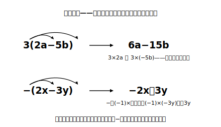

# L03 多項式の加法と減法

## ねらい

- 多項式どうしの加法・減法を、**かっこを外して同類項をまとめる**手順で確実に計算できるようになる。
- 数×多項式を分配法則で計算し、2(3x−2y)−3(2x＋5y) 程度の複合計算まで到達する。この形は次の章（連立方程式）で毎回使う道具になる。

## 主概念1：たすときはそのまま、ひくときは符号を反転

2つの多項式 4x＋5y と 2x−3y で、和と差を考えよう。

**加法**は、かっこをそのまま外して同類項をまとめるだけだ。

(4x＋5y)＋(2x−3y)＝4x＋5y＋2x−3y＝**6x＋2y**

**減法**は一段だけ注意がいる。「2x−3y をひく」とは「2x をひき、−3y をひく」こと。−3y をひくと ＋3y。つまり、**かっこの中のすべての項の符号を反転して外す**。

(4x＋5y)−(2x−3y)＝4x＋5y−2x＋3y＝**2x＋8y**

事故が起きるのは決まって後半の項だ。−(2x−3y) を「−2x−3y」と外すと、−3y の反転を忘れている。**−は、かっこの中の全員に配られる**——先頭の項だけでなく最後の項まで。

x＝2、y＝1 で検算しよう。元: (8＋5)−(4−3)＝13−1＝12。答え: 4＋8＝12。一致 ✓。

:::guide
**符号反転の見落としを防ぐ「−1の分配」**

−(2x−3y) がどうしても不安なら、−を「(−1)×」と書き直してしまうのが確実だ。(−1)×(2x−3y)＝(−1)×2x＋(−1)×(−3y)＝−2x＋3y。主概念2の分配法則そのもので、特別ルールを覚える必要がなくなる。**「ひき算のかっこ外し」は「−1を配る」の別名**。そう理解しておくと、この先どんな複雑な形でも同じ一手で処理できる。
:::

## 主概念2：数×多項式——分配してから、まとめる

3(2a−5b) のような数×多項式は、**分配法則**で外側の数をかっこの中の各項に配る。

3(2a−5b)＝3×2a＋3×(−5b)＝6a−15b

これを組み合わせると、この章の計算の到達点となる形が計算できる。

2(3x−2y)−3(2x＋5y)
＝6x−4y−6x−15y　（それぞれ分配。−3 は符号ごと配る）
＝(6x−6x)＋(−4y−15y)
＝**−19y**

x の項が消えて、答えが1つの項になった。「本当に消えるの？」と思ったら代入検算。x＝1、y＝1 で、元: 2×(3−2)−3×(2＋5)＝2−21＝−19。答え: −19y＝−19。一致 ✓。実はこの「係数をかけてからたし引きする」操作は、連立方程式で文字を消去するときの心臓部そのものだ。

:::zatsudan
いまの計算、x の項がきれいに消えたのを見て「たまたま？」と思ったかもしれない。たまたまじゃない。2×3＝6 と 3×2＝6 がぶつかって消えるように、**係数を選んで狙い撃ちで文字を消す**——次の章「連立方程式」は、まさにこの消える瞬間を自分でつくり出す技術だ。いま手を動かしているこの計算は、次の章の予告編でもある。
:::

## 手順の型（全計算共通）

1. 分配する（−は符号ごと、全員に配る）
2. 項に分ける
3. 同類項をまとめる（文字の部分は同じ？）
4. 代入検算（あやしいとき・仕上げのとき）

:::guide
**どこまで複雑な計算を練習すればいい？**

この章の計算は、2(3x−2y)−3(2x＋5y) 程度が到達目標で、それ以上に入り組んだ式を大量にこなす必要はない。計算はこの先の章（連立方程式・図形の証明など）で使うための**道具**であり、道具みがきだけが目的化すると、肝心の「文字式で考える力」の時間が削られてしまう。本レッスンの練習も、この上限の範囲で組んである。
:::

## 練習

1. 次を計算しよう。
   (1) (3a＋b)＋(2a−4b)　(2) (5x−2y)−(3x−7y)　(3) (x²＋2x)−(3x²−x)
2. 次を計算しよう。
   (1) 4(2a−b)　(2) −2(3x−y＋1)
3. 次を計算しよう。
   (1) 4(2a−b)＋3(−a＋2b)　(2) 3(2a−5b)−2(4a−7b)
4. 3の(2)の答えが正しいことを、a＝2、b＝1 の代入で確かめよう。

:::stretch
**S1** 分数の形の式も、同じ型で計算できる。次を計算してみよう（通分してから分子を1つのかっこと見て処理する）。
(x＋y)/2 ＋ (x−y)/3
（ヒント: 通分すると 3(x＋y)/6 ＋ 2(x−y)/6。分子どうしをたすとき、かっこの扱いは主概念1・2と同じ。）
（ノートでの書き方）(x＋y)/2 のような「/」の式は、ノートでは横線の分数で書く。x＋y を線の上（分子）に、2 を線の下（分母）に置くと、どこまでが分子かがかっこなしでも一目で分かる。
:::

---

対応解答: answer_key_L01-04.md

<!-- gen_nav:nav:start（自動生成・手編集しない） -->

---

[← 前のレッスン](lesson_02.md)｜[単元の目次](README.md)｜[解答](answer_key_L01-04.md)｜[次のレッスン →](lesson_04.md)

<!-- gen_nav:nav:end -->
