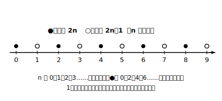
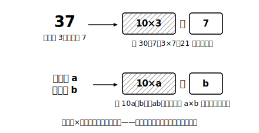

# L05 事象を文字式で表す——代入で確かめる

## ねらい

- 偶数・奇数・連続する整数・2けたの数などを、文字を使って**一般的に**表せるようになる。
- つくった式が題意に合っているかを、**具体的な数を代入してテストする**型を身につける。ここからの3レッスン（説明・変形・読む）すべての出発点になる。

## 主概念1：「すべての偶数」を1本の式で

4、10、26……偶数は無限にある。その全部をまとめて言い表すには、どうすればよいか。偶数とは「2でわり切れる数」、つまり **2×（整数）** の形の数だ。整数を n とすれば、

> **偶数は 2n と表せる**（n は整数）

n に 1、2、3……を入れると 2、4、6……が出てくる。1本の式が、無限にある偶数の**製造機**になっている。同じ発想で、

- **奇数**……偶数より1大きい数だから **2n＋1**（2n−1 でもよい）
- **連続する3つの整数**……**n、n＋1、n＋2**（真ん中を n として n−1、n、n＋1 でもよい）
- **十の位が a、一の位が b の2けたの数**……**10a＋b**

最後の 10a＋b は要注意だ。「ab」と書くと a×b の意味になってしまう（L04）。37 が 3×7＝21 ではなく 30＋7 であるように、**位の値×個数の和**で組み立てる。

:::guide
**「n は整数」の一言がなぜ必要か**

「偶数は 2n」と書くだけでは実は不十分で、「n は整数」という宣言（文字の範囲の指定）がセットで要る。もし n＝1.5 なら 2n＝3 となり、偶数でなくなってしまうからだ。文字は何でも入る箱だからこそ、**何を入れてよい箱なのか**を最初に決める。この一言は、次のレッスンの「式による説明」で説得力の土台になる。
:::

## 主概念2：つくった式は、代入でテストする

「連続する2つの偶数」を文字で表してみよう。次の2つの答案を、数を入れてテストする。

**答案A: 2n と 4n**。n＝3 を入れると 6 と 12。偶数ではあるが、6 の次の偶数は 8 だから**連続していない**。n＝1 のときだけ 2 と 4 で連続に見えるが、他の n で崩れる。この式は「連続する」を表せていない。

**答案B: n＋2 と n＋4**。n＝1 を入れると 3 と 5。差が2の数ではあるが、**そもそも偶数にならない**ことがある（n が奇数のとき）。「偶数である」の部分が式に組み込まれていない。

正しくは、**2n と 2n＋2**（n は整数）。2n が偶数であることを式の形が保証し、＋2 が「次の偶数」であることを保証する。n＝3 なら 6 と 8 ✓、n＝5 なら 10 と 12 ✓。

> **式をつくったら、具体的な数を2つ以上代入してテストする**。1つの数でうまくいっても安心しない（答案Aは n＝1 だけなら通ってしまう）。

このテストで見つけられるのは**誤り**だ。テストに合格し続けても「いつでも正しい」の証明にはならない。その一線をどう越えるかは、次のレッスンで扱う。

:::guide
**2つの答案は、別々の考え違い**

答案Aと答案Bは「どちらも誤り」だが、誤り方が違う。Aは「2倍・4倍」で偶数をつくろうとして**間隔**が崩れた。Bは間隔2を守ろうとして**偶数であること**が抜けた。自分の答案がどちら型なのかを代入テストで突き止めると、直すべき場所がピンポイントで分かる。「偶数である」と「連続する」——2つの条件の**両方**を式の形に埋め込むのがゴールだ。
:::

:::zatsudan
文字式って、じつは「究極の省略記法」だ。「どんな整数でも、2倍して1たせば奇数になります」と毎回しゃべる代わりに、2n＋1 のたった4文字。しかもこの4文字は、3 にも 101 にも 999999999……と、無限個の奇数すべての身分証明書を兼ねている。無限を4文字に圧縮する——人類の発明の中でも、かなりの傑作だと思う。
:::

## 練習

1. 次の数を、整数 n を使って表そう。
   (1) 5の倍数（この問題では n は自然数とする）　(2) 奇数　(3) 連続する2つの整数　(4) 3でわると1余る数
2. 十の位が a、一の位が b の2けたの自然数がある。
   (1) この数を a、b を使って表そう。
   (2) 十の位と一の位を入れかえてできる数を表そう。
3. 「連続する2つの奇数」を 2n＋1、2n＋3（n は整数）と表した。n＝4 を代入して、この式が「連続する2つの奇数」になっていることを確かめよう。
4. ある生徒が「連続する2つの偶数」を「n と n＋2」と表した。この表し方の不十分な点を、具体的な数の代入で示そう。

:::stretch
**S1** 「4でわると3余る数」を n を使って表そう。さらに、その式に n＝0、1、2 を代入してテストし、出てきた数を実際に4でわって余りを確かめよう。（発展: 「余り」に注目して整数を仕分けるこの考え方は、高校でも登場する考え方だ。気になる人は「合同式 とは」で調べてみよう。）
:::

---

対応解答: answer_key_L05-07.md

<!-- gen_nav:nav:start（自動生成・手編集しない） -->

---

[← 前のレッスン](lesson_04.md)｜[単元の目次](README.md)｜[解答](answer_key_L05-07.md)｜[次のレッスン →](lesson_06.md)

<!-- gen_nav:nav:end -->
