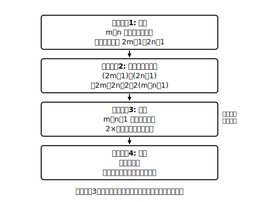

# L06 式による説明①——4ステップの足場

## ねらい

- 「二つの奇数の和は偶数になる」ことを、文字式を使って**すべての場合について**説明できるようになる。
- 説明を**表す→計算・変形→読む→結論**の4ステップに分解し、自分がどのステップでつまずいたか特定できるようになる。

## 導入：3つ試して、それで「いつでも」と言える？

3＋5＝8。7＋11＝18。23＋9＝32。どうやら奇数と奇数をたすと偶数になりそうだ。でも、奇数は無限にある。あと100個試しても「試していない奇数」が無限に残る。**「いつでも成り立つ」を有限回の実験で言い切ることはできない**。ここで、前のレッスンの道具が出番になる。2n＋1 という式は、無限個の奇数すべての身分証明書だった。式で計算すれば、無限個をまとめて一度に調べられる。

## 主概念1：4ステップの説明

**【説明したいこと】二つの奇数の和は偶数になる。**

**ステップ1: 表す。** m、n を整数とすると、二つの奇数は 2m＋1、2n＋1 と表せる。

**ステップ2: 計算・変形する。**
(2m＋1)＋(2n＋1)＝2m＋2n＋2＝2(m＋n＋1)

**ステップ3: 読む。** m＋n＋1 は整数だから、2(m＋n＋1) は **2×（整数）の形**、つまり偶数を表している。

**ステップ4: 結論。** したがって、二つの奇数の和は偶数になる。

この4ステップには、それぞれ役割がある。1で「無限個をまとめて」土俵に載せ、2で式の形を目的に向けて整え、3で**整えた式が何を意味するか**を言葉にし、4で最初の主張に戻って締める。とくにステップ3は忘れられやすいが、ここを飛ばすと「計算しただけ」で説明にならない——2(m＋n＋1) という式は、「読む」まで待ってくれている。

:::guide
**なぜ m と n の2文字？——1文字だと「同じ奇数」しか表せない**

二つの奇数を 2n＋1 と 2n＋1 にすると、n が共通なので「同じ奇数を2回たす」場合しか調べられない（3＋3 や 7＋7 だけ）。3＋5 のように**別々の奇数**を許すには、別々の整数 m、n を使って 2m＋1、2n＋1 とする必要がある。（なお m と n は、たまたま**同じ値になってもよい**。m＝1、n＝1 なら 3＋3 で、これも「二つの奇数の和」の立派な一員。別々の文字は「自由に選べる」という意味であって、「違う数でなければならない」という意味ではない。）逆に「連続する2つの奇数」のように**関係がある**2数なら、2n＋1、2n＋3 と1文字で書くのが正しい。**文字の数は、登場する数の「自由さ」の数**。ここが式による説明のいちばん繊細な設計ポイントだ。
:::

## 主概念2：ステップ2の変形は「読みたい形」から逆算する

ステップ2で 2m＋2n＋2 のまま止めずに 2(m＋n＋1) まで変形したのはなぜか。偶数だと言うためには **2×（整数）の形が見えること**が必要だからだ。つまり、変形のゴールは計算の都合ではなく、**ステップ3で読みたい形**から決まる。

- 偶数だと言いたい → **2×（整数）** の形へ
- 奇数だと言いたい → **2×（整数）＋1** の形へ
- 5の倍数だと言いたい → **5×（整数）** の形へ

「何の形をつくれば主張が読めるか」を先に決めてから手を動かす。これが式による説明の作戦の立て方だ。

:::zatsudan
「二つの奇数の和は偶数」——これ、どんなに巨大な奇数でも成り立つと、いま言い切れたのがすごいところ。たとえば何百けたある奇数どうしの和でも、電卓に入りきらなくても、偶数だと**計算せずに**断言できる。実験では絶対に届かない「無限個ぜんぶ」に、たった3行の式で手が届く。文字式の計算練習は、この一撃のためのトレーニングだったわけだ。
:::

## 足場つきの練習（穴埋め→選択→記述）

**足場1（式の提示・穴埋め）** 「二つの偶数の和は偶数になる」の説明を完成させよう。
m、n を整数とすると、二つの偶数は 2m、［　］と表せる。和は 2m＋［　］＝2(［　］)。m＋n は整数だから、これは偶数である。よって二つの偶数の和は偶数になる。

**足場2（根拠の選択）** 上の説明で「2(m＋n) は偶数だ」と言える根拠として正しいものを選ぼう。
ア: m＋n が整数で、2×（整数）の形をしているから
イ: m＝1、n＝2 のとき 6 で偶数だから
ウ: 偶数と偶数をたしたから

**足場3（部分記述）** 「偶数と奇数の和は奇数になる」を、4ステップで説明しよう。ステップ1は「m、n を整数とすると、偶数は 2m、奇数は 2n＋1 と表せる」を使ってよい。ステップ2以降を自分で書くこと。

## 練習

1. 足場1〜3を完成させよう。
2. 「連続する2つの整数の和は奇数になる」を4ステップで説明しよう（連続する2つの整数は n、n＋1 と表せる。文字は1つでよい。なぜ1つでよいかも一言添えよう）。
3. 次の説明のどこが不十分か指摘しよう。
   「3＋5＝8、11＋7＝18、9＋13＝22。だから二つの奇数の和は偶数になる。」

:::stretch
**S1** 「連続する3つの整数の和は3の倍数になる」を4ステップで説明しよう。真ん中の整数を n とすると、3つの整数は n−1、n、n＋1 と表せる。（変形のゴールは「3×（整数）の形」。主概念2の逆算を使おう。最初の整数を n と置いた場合とどちらが計算が楽か、比べてみるのも面白い。）
:::

---

対応解答: answer_key_L05-07.md

<!-- gen_nav:nav:start（自動生成・手編集しない） -->

---

[← 前のレッスン](lesson_05.md)｜[単元の目次](README.md)｜[解答](answer_key_L05-07.md)｜[次のレッスン →](lesson_07.md)

<!-- gen_nav:nav:end -->
