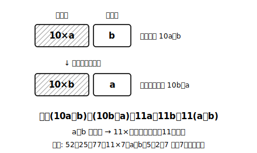

# L07 式による説明②——自力記述へ

## ねらい

- 2けたの数の性質を、足場なしで**自力で**4ステップ記述できるようになる。
- 「結論だけ書いて根拠がない」説明を、**結論・式・読みの3点セット**で防げるようになる。

## 導入：入れかえマジック

52 と 25。83 と 38。61 と 16。2けたの数と、十の位・一の位を入れかえた数。この2つをたすと——77、121、77。あれ、ぜんぶ **11の倍数**だ（77＝11×7、121＝11×11）。偶然だろうか？ 前のレッスンの武器で、無限個まとめて確かめよう。

## 主概念1：けたの数の説明——10a＋b が主役

**【説明したいこと】2けたの自然数と、その十の位と一の位を入れかえた数との和は、11の倍数になる。**

**ステップ1: 表す。** 十の位を a、一の位を b とすると、もとの数は 10a＋b、入れかえた数は 10b＋a と表せる。

**ステップ2: 計算・変形する。**
(10a＋b)＋(10b＋a)＝11a＋11b＝11(a＋b)

**ステップ3: 読む。** a＋b は整数だから、11(a＋b) は **11×（整数）の形**、つまり11の倍数を表している。

**ステップ4: 結論。** したがって、2けたの自然数と入れかえた数との和は、11の倍数になる。

52＋25＝77＝11×7 で、a＋b＝5＋2＝7。式の中の「a＋b」が、11×**7** の 7 の正体だったと分かる。説明の式は、答えの仕組みまで見せてくれる。

:::guide
**a、b の範囲の宣言を忘れない**

ステップ1では本当は「a、b はどちらも1から9までの整数」という範囲の宣言が要る（十の位に0は来ない・入れかえた数も2けたの数になるためには一の位にも0は来ない・各位は1けた）。L05の「n は整数」と同じで、文字の箱に何を入れてよいかの取り決めだ。この宣言がないと、10a＋b がどんな数を表しているのか読み手に伝わらず、式が説明の根拠として働かない。書く癖をつけておこう。
:::

## 主概念2：「結論だけ」を防ぐ3点セット

説明の答案でいちばん惜しいのは、**計算も考えもできているのに、結論しか書かない**答案だ。「11の倍数になる。」の一行では、なぜそう言えるのかが読み手に伝わらない。逆に、次の3点がそろえば説明として立つ。

1. **式**……(10a＋b)＋(10b＋a)＝11(a＋b) ←計算・変形の証拠
2. **読み**……a＋b は整数だから 11×（整数）の形 ←式と結論をつなぐ一文
3. **結論**……よって和は11の倍数になる

白紙にするくらいなら、まずステップ1の「表す」だけでも書こう。表す→式→読み→結論と、書けたところまでが積み上げであり、どこで止まったかが次の練習の的になる。**完全な説明は一度に身につくものではなく、部品ごとに積み上げるもの**だ。

:::guide
**書き終えたら「逆読みチェック」**

自分の説明を、結論から逆に読み上げてみよう。「11の倍数になる←11×（整数）の形だから←11(a＋b) と変形できたから←もとの数と入れかえた数を 10a＋b、10b＋a と表したから」。逆にたどって各矢印が「たしかにつながっている」なら合格。途中で「なぜ？」が出たら、そこが説明の穴だ。読み手に伝わるかを自分で点検できる、いちばん手軽な方法。
:::

:::zatsudan
入れかえマジック、和だけじゃなく**差**にも仕掛けがある。52−25＝27、83−38＝45、61−16＝45……今度はぜんぶ9の倍数。偶然か、必然か。タネはここでは明かさない。練習1で、4ステップの武器を使って自分の手で暴いてみてほしい。
:::

## 練習

1. 「2けたの自然数から、十の位と一の位を入れかえた数をひいた差は、9の倍数になる」を4ステップで説明しよう（a＞b とする）。
2. 「連続する5つの整数の和は、5の倍数になる」を4ステップで説明しよう（真ん中の整数を n とするのがおすすめ）。
3. 次の答案は3点セット（式・読み・結論）のどれが欠けているか指摘し、欠けた部分を書き足そう。
   「(2m＋1)＋2n＝2m＋2n＋1＝2(m＋n)＋1。よって奇数と偶数の和は奇数になる。」

:::stretch
**S1** 「偶数から奇数をひいた差は奇数になる」を4ステップで説明しよう。変形のゴールは 2×（整数）＋1 の形。2m−2n−1 で手が止まったら、−1＝−2＋1 と分解して 2(m−n−1)＋1 をつくる一手を試すこと（「読みたい形からの逆算」の少し骨のある実戦例）。
:::

---

対応解答: answer_key_L05-07.md

<!-- gen_nav:nav:start（自動生成・手編集しない） -->

---

[← 前のレッスン](lesson_06.md)｜[単元の目次](README.md)｜[解答](answer_key_L05-07.md)｜[次のレッスン →](lesson_08.md)

<!-- gen_nav:nav:end -->
