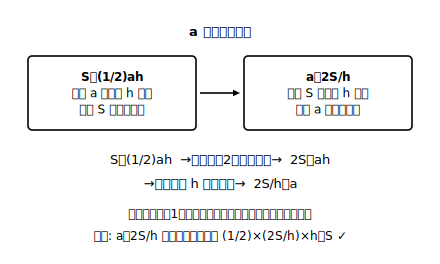

# L08 等式の変形——目的に合わせて式をつくり直す

## ねらい

- 等式を、指定された文字について解けるようになる（**「x について解く」＝「x＝〜」の形に変形する**）。
- 変形の**目的**を意識する。「なぜその文字について解くのか」が言えると、変形は道具になる。

## 導入：底辺を100回求める人

三角形の面積の公式 S＝(1/2)ah は、「底辺 a と高さ h から面積 S を出す」向きにできている。ところが、設計の仕事などでは逆向きの問いがよく来る。「面積 S と高さ h は決まっている。底辺 a は何cmにすればいい？」

1回きりなら、数を入れてから方程式を解けばいい。でも同じ計算を100回やるなら？ ——**先に公式そのものを「a を出す向き」につくり直しておく**方が圧倒的に速い。これが等式の変形の出番だ。

## 主概念1：「a について解く」——道具は中1の等式の性質だけ

S＝(1/2)ah を a について解いてみよう。使う道具は、中1の方程式で使った**等式の性質**（両辺に同じ数をたす・ひく・かける・0でない数でわる）だけ。新しい魔法は何もない。

S＝(1/2)ah
両辺に2をかけて 2S＝ah
両辺を h でわって 2S/h＝a

つまり **a＝2S/h**。「a＝〜」の形（右辺に a がいない形）になったので、「a について解けた」という。これでどんな S、h が来ても、代入一発で底辺が出る公式に生まれ変わった。

検算は、**元の等式に戻すこと**。a＝2S/h を S＝(1/2)ah の右辺に入れると (1/2)×(2S/h)×h＝S ✓。ちゃんと元の等式が成り立つ。

:::guide
**「解く文字」以外は、ただの数だと思って扱う**

文字が3つも並ぶと手が止まる人は多い。コツは、**解きたい文字以外を「7」や「3」のような決まった数のつもりで見る**こと。S＝(1/2)ah を a について解くとは、いわば「14＝(1/2)×a×4 を解く」のと同じ操作を、数の代わりに記号のまま行うだけだ。方程式が解けるなら、等式の変形は必ずできる。道具が完全に同じだからだ。
:::

## 主概念2：どこが誤り？——「一部だけ」わってしまう事故

次の変形を見てほしい。4x＋2y＝3 を y について解こうとした答案だ。

「4x＋2y＝3　→　2y＝3−4x　→　y＝−2x＋3」

1行目から2行目は正しい（両辺から 4x をひいた）。誤りは最後だ。両辺を2でわるとき、右辺の **−4x だけをわって、3 をわり忘れている**。両辺を2でわるとは、**右辺の全部の項を2でわる**こと（L03の「全員に配る」と同じ理屈）。正しくは、

y＝(3−4x)/2　すなわち　y＝−2x＋3/2

検算で暴こう。誤答 y＝−2x＋3 を元の式に入れ、x＝2 とすると: 左辺＝4×2＋2×(−2×2＋3)＝8＋2×(−1)＝6。右辺＝3。6≠3 で不成立。誤りが確定する。正答なら 4×2＋2×(3/2−2×2)＝8−5＝3 ✓。**変形を終えたら、元の等式に戻して1つ代入**。この検算は数秒で、割り忘れ事故のほぼすべてを捕まえる。

:::zatsudan
S＝(1/2)ah を a について解くと a＝2S/h——「面積の公式」が「底辺を求める公式」に変身した。同じ1本の等式なのに、どの文字について解くかで、見える顔がまったく違う。等式って、じつは1枚で何通りもの道具に化ける**多機能ナイフ**みたいなものなんだ。次の章の一次関数では、この「y について解く」変形が毎回の必須動作になる。
:::

## 手順の型

1. 解きたい文字を含む項を左辺に、それ以外を右辺に集める（移項（いこう））
2. 解きたい文字の係数で**両辺全体**をわる
3. 「文字＝〜」の形になったか確認
4. 元の等式に戻して代入検算（1つの数でたいてい見つかる。0や1は避け、成立しても不安が残るときは別の数でもう1回）

:::guide
**変形の「目的」をひとこと言えるか**

等式の変形は、技能テストのためにあるのではない。「h を何度も求めたいから h について解く」「グラフをかきたいから y について解く」。**目的があって初めて、どの文字について解くかが決まる**。練習でも「この変形は何がしたい場面か」を1秒想像してから手を動かすと、次の章（一次関数・連立方程式）で道具として即座に取り出せるようになる。
:::

## 練習

1. 次の等式を、〔　〕の中の文字について解こう。
   (1) x＋3y＝9 〔x〕　(2) 4x−y＝7 〔y〕　(3) V＝abc 〔c〕　(4) ℓ＝2(a＋b) 〔a〕
2. 5x＋2y＝10 を y について解こう。また、答えを元の等式に代入して検算しよう（x＝2 がおすすめ）。
3. 次の変形の誤りを見つけ、正しく直そう。
   「3a＋6b＝12 を a について解く: 3a＝12−6b、a＝4−6b」
4. 平均点の式 m＝(a＋b)/2（2教科の点数 a、b の平均が m）を b について解こう。「数学 a 点で平均 m 点にしたいとき、もう1教科で何点必要か」が一発で出る式になる。

:::stretch
**S1** 台形の面積の公式 S＝(1/2)(a＋b)h を h について解こう。さらに a について解くと、途中で「(a＋b) のかたまりを1つの文字のように扱う」場面が出てくる。かたまり視点（L03のかっこの扱い）がどこで効いたか、振り返って書き出してみよう。
:::

---

対応解答: answer_key_L08-10.md

<!-- gen_nav:nav:start（自動生成・手編集しない） -->

---

[← 前のレッスン](lesson_07.md)｜[単元の目次](README.md)｜[解答](answer_key_L08-10.md)｜[次のレッスン →](lesson_09.md)

<!-- gen_nav:nav:end -->
