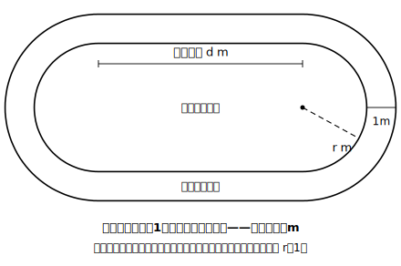
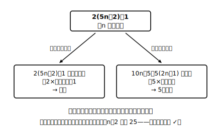

# L09 式を読む——変形済みの式が教えてくれること

## ねらい

- 計算・変形した結果の式から、**事実を読み取る**ことができるようになる（式は答えを出す道具であると同時に、読む対象でもある）。
- 「式からある文字が消えた」ことを「結果はその量に**関係なく**決まる」と読めるようになる。

## 導入：外側レーンは、どれだけ損？

陸上のトラックを思いうかべよう。形は「長方形の両端に半円をくっつけたもの」。直線部分が2本と、左右の半円（合わせてちょうど円1個分）でできている。内側のレーンのすぐ外側を、幅1mのレーンがもう1本囲んでいる。

外側のレーンは1周が長い。では、**どれだけ**長いのか。トラックが大きいほど差も大きくなりそうな気がする。本当だろうか。文字式で確かめよう。

## 主概念1：計算する——そして読む

直線部分の長さを d m、内側レーンの半円の半径を r m とする（走る線の上で測る）。

**内側レーンの1周**は、直線2本と円1個分の円周だから
2d＋2πr (m)

**外側レーン**は、直線部分は同じ d m が2本。半円の半径は 1m 外側だから r＋1。
2d＋2π(r＋1) (m)

差をとると、

{2d＋2π(r＋1)}−(2d＋2πr)＝2d＋2πr＋2π−2d−2πr＝**2π (m)**

計算はこれで終わり。ここからが本題——**この式を読む**。

答え 2π には、**d も r も残っていない**。つまり1周の差は、直線部分の長さにも、半円の半径にも関係なく、いつでも 2π m（約6.28m）。小さな公園のトラックでも、巨大な競技場でも、差はぴったり同じなのだ。計算の途中で 2d と 2πr が消えた瞬間こそ、「トラックの大きさは無関係」という事実が証明された瞬間だった。

:::guide
**「文字が消える」は事件である**

いまのような、たし算・ひき算の整理で文字が消えたとき、それは「その文字がどんな値でも結果が変わらない」という強い主張が生まれた瞬間だ。逆に、もし答えに r が残っていたら「半径によって差が変わる」と読む。**答えの式に何が残り、何が消えたか**——これが「式を読む」の第一チェックポイント。結果を数字で言う前に、式の形をひと目見る癖をつけよう。
:::

:::zatsudan
スタートラインが外側のレーンほど前にずれているのは、この 2π m を打ち消すためだ（1レーン外に出るごとに 2π×レーン幅ぶん前へ）。そして面白いのは、この「ずらす距離」を決めるのに競技場の設計図がいらないことだ。半径にも直線の長さにも関係なく、差は決まるのだから。式を1本読んだだけで、この形のトラックなら世界中のどんな大きさのものにも通用する結論が手に入る。
:::

## 主概念2：式の形から数の正体を読む

今度は図形ではなく、数そのものを読もう。**2(5n＋2)＋1 はどんな数だろうか**（n は整数）。

まず整理する: 2(5n＋2)＋1＝10n＋5。ここで読み方が分かれる。

- **2×（整数）＋1 と見る**……2(5n＋2)＋1 の形のまま見れば、5n＋2 は整数だから、これは**奇数**だ。
- **5×（整数）と見る**……10n＋5＝5(2n＋1) と変形すれば、2n＋1 は整数だから、これは**5の倍数**でもある。

同じ数が、**どの形に整えるかで違う顔を見せる**。L06で「読みたい形から逆算して変形する」と学んだが、その逆もまた真で、**変形の仕方の数だけ、読める事実がある**。n＝2 で確かめると 2(5×2＋2)＋1＝25。たしかに奇数で、5の倍数 ✓。

:::guide
**読む前に「n は整数」を確認**

式を読むときも、文字の範囲の宣言（L05）が土台にある。「5n＋2 は整数だから」という一言が言えるのは、n が整数と決まっているからだ。もし n が分数もとれるなら、奇数とも5の倍数とも言えなくなる。読みの一文には、必ず「〜は整数だから」を添える。L06のステップ3と同じ作法だ。
:::

## 練習

1. m、n を整数とする。次の式はどんな数を表しているか読み取ろう。
   (1) 2(m＋n)−1　(2) 5n＋5　(3) 10a＋5（a は0以上の整数）
2. 導入のトラックで、レーンの幅が 2m だったら、1周の差はいくらになるか。計算し、その結果を「読む」一文（何に関係なく決まるか）を添えよう。
3. ある整数 n について 4n＋6 という数がある。この数が「偶数である」と読める形（2×（整数）の形）と、「4でわると2余る数である」と読める形（4×（整数）＋2 の形）の両方を示し、n＝1 で確かめよう。

:::stretch
**S1** トラックのレーン幅を a m と文字にして、1周の差を求めよう（答えに残る文字・消える文字はどれか）。さらに「レーンを1本外に出るごとに、スタートラインを 2πa m ずつ前にずらせばよい」ことを、外側 k 本目のレーンの式で説明できるか挑戦してみよう。
:::

---

対応解答: answer_key_L08-10.md

<!-- gen_nav:nav:start（自動生成・手編集しない） -->

---

[← 前のレッスン](lesson_08.md)｜[単元の目次](README.md)｜[解答](answer_key_L08-10.md)｜[次のレッスン →](lesson_10.md)

<!-- gen_nav:nav:end -->
