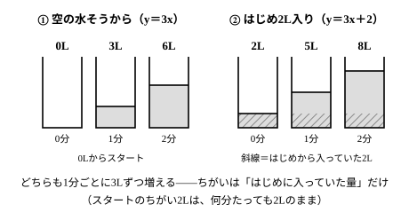
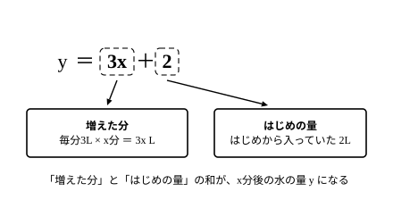

# L01 比例から一次関数へ——はじめの量を足すと y＝ax＋b

## ねらい

- 比例 y＝ax に「はじめからある量」を加えると一次関数 y＝ax＋b になることを、場面（水そう）とともに理解し、式を作れるようになる。
- 式の a を「x が1増えるときの y の変わり方（ペース）」、b を「x＝0 のときの y（はじめの量）」として読み分けられるようになる。

## 主概念1：はじめの量があると、比例では書けない

空の水そうに、1分あたり3Lずつ水を入れるとする。x 分後の水の量を y Lとすると、式は

> **y＝3x**

これは中1で学んだ比例だ。では、**はじめから2L入っている**水そうならどうだろう。1分で3Lずつ増えることは同じだが、スタートが0ではない。

はじめ2L、毎分3L増える水そうでは、

> **y＝3x＋2**

となる。**3x は増えた分、＋2 ははじめから入っていた分**だ。x 分たった時点の水の量は、「増えた分」と「はじめからあった分」の合計——だから足し算で書ける。比例の式 y＝3x に「＋2」が付いただけで、もう比例ではない新しい関係になった。このような式で表される関係を**一次関数**という。

## 主概念2：a はペース、b ははじめの量——比例は b＝0 の特別な場合

比例では、x が0のとき y も0だった。一次関数では、x が0のときの y が0とは限らない。一般に、一次関数は a と b を決まった数（a は0ではない）として

> **y＝ax＋b**

と書ける。2つの文字の役割はこうだ。

- **a**: x が1増えるときに y がどれだけ変わるか（変わる**ペース**）
- **b**: x＝0 のときの y（**はじめの量**）

水そうの式 y＝3x＋2 なら、a＝3 が「毎分3Lずつ」のペース、b＝2 が「はじめから2L」のスタートにあたる。

そして、比例は **b＝0 の一次関数**と見ることもできる。空の水そう（y＝3x）は、「はじめの量が0」というスタートの一次関数だったわけだ。

:::guide
**「＋2」を「毎分2Lずつ増える分」と読んでしまうまちがい**

y＝3x＋2 の「＋2」を「毎分2Lずつ増える分」と読んでしまうまちがいがある。＋2 は時間がたっても変わらない「はじめの量」だ。増えるペースは 3x の3**だけ**が表している。式の中に数が2つあったら、「どちらが変わるペースで、どちらがスタートか」を場面に戻って確かめよう。x に0を入れてみるのが確実だ——y＝3×0＋2＝2、つまり「まだ1分もたっていないときに2L」。これはペースではなくスタートの量だと分かる。
:::

:::guide
**a や b が負の数になっても、意味は同じ**

a も b も負の数になることがある。そのときも、a は「x が1増えるときの y の変わり方」、b は「x＝0 のときの y」という意味は変わらない。たとえば a が負なら、x が1増えるごとに y は**減っていく**——「毎分4Lずつ水をぬく」のような場面だ（練習3で試す）。「ペース」「はじめの量」は場面で読むときの言い方で、負の数でもそのまま通用する。
:::

## 型の導入：「スタートとペースの点検」

場面から式を作ったら、正しいかどうかを**代入して確かめる**習慣をつけよう。点検は2手ある。

1. **x＝0 を入れる** → 出てきた y が「はじめの量」と合っているか。
2. **x を1増やす**（x＝0 と x＝1 の y を比べる） → y の変わり方が「ペース」と合っているか。

水そうの式 y＝3x＋2 なら、x＝0 で y＝2（はじめの2Lと一致）、x＝1 で y＝5（1分で3L増と一致）。2つとも合えば、式は場面を正しく写している。この「求めた式に値を代入して確かめる」は、この単元のすべての問題で使える自前の検算法になる。答えを書く前に毎回やる習慣にしよう。

:::guide
**「どれだけずつ変わるか」と「どこから始まるか」を分けて見る**

この単元の背骨は、どんな場面でも「変わるペース（a）」と「はじめの量（b）」の2つを**分けて**取り出すことだ。最初は文字の名前を覚えることよりも、この2つを場面から読み取れることが大事になる。この先のレッスンでは、同じ関係を表・式・グラフという別々の道具で見ていく——道具は変わっても、追いかけるのはいつもこの2つだ。
:::

:::zatsudan
温度の単位には、ふだん使う摂氏（℃）のほかに華氏（°F）というものがある。摂氏 x 度を華氏 y 度に直す式は y＝(9/5)x＋32——実はこれも一次関数だ。摂氏0度は華氏32度だから「はじめの量」が32、摂氏が1度上がると華氏は1.8度上がるから「ペース」が9/5（＝1.8）。米国立気象局の換算表も、もとをたどればこの1本の式でできている。「はじめの量＋一定のペース」という見方は、水そうの外の世界でも働いている。
:::
<!-- zatsudan話題源: LINFN_RESEARCH_BRIEF_20260829 雑談枠許可リスト5（S15 NWS換算シート: Tf=(9/5)Tc+32 本文確認／S16 NIST: 1℃間隔=1.8°F間隔 確認）。出典の確認範囲内の数値のみ使用。話題再配分2026-08-29: リスト5はL01のみ（旧L02重複は解消） -->

## 練習

1. はじめ500円持っていて、毎日50円ずつ貯金する。x 日後の金額を y 円とすると、式はどうなるだろうか。 <!-- 旧ID: ex_L1_check_01 -->
2. はじめ6L入っている水そうに、毎分2Lずつ水を入れる。x 分後の水の量を y Lとして式を作り、5分後の水の量を求めよう。 <!-- 旧ID: ex_L1_check_02 -->
3. 水が20L入っている水そうから、毎分4Lずつ水をぬく。x 分後の水の量を y Lとして式を作り、3分後の水の量を求めよう。（ヒント: 水は減っていく——ペースの符号に注意）
4. 次の一次関数について、「x が1増えるときの y の変わり方」と「x＝0 のときの y」をそれぞれ答えよう。
   (1) y＝4x＋9　(2) y＝−3x＋5
5. 次の文が正しければ○、正しくなければ×を付けて、×は正しく直そう。
   (1) y＝3x＋2 の「＋2」は、x が1増えるごとに y が2ずつ増えることを表している。
   (2) 比例 y＝5x は、一次関数 y＝ax＋b の b が0になった特別な場合と見ることができる。

:::stretch
**S1** 「はじめの量」だけがちがう2つの水そうを考える。どちらも毎分3Lずつ水を入れ、一方ははじめ2L（y＝3x＋2）、もう一方ははじめ5L（y＝3x＋5）。x＝0, 1, 2, 3 のときのそれぞれの y を表に書き出し、2つの y の差がどうなるか調べよう。そして、その差がいつまでもそうなる理由を、式の計算（2つの式の差）で説明してみよう。この2本を後のレッスンでグラフにすると、差がひと目で見えるようになる。
:::

---

対応解答: answer_key_L01-04.md

<!-- gen_nav:nav:start（自動生成・手編集しない） -->

---

[単元の目次](README.md)｜[解答](answer_key_L01-04.md)｜[次のレッスン →](lesson_02.md)

<!-- gen_nav:nav:end -->
