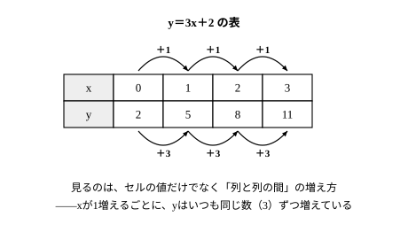
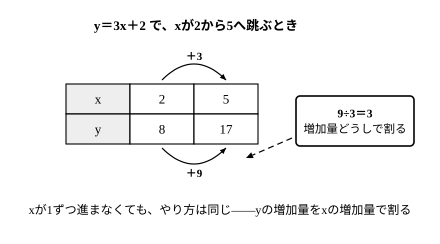

# L02 変化の割合——値ではなく増え方を見る

## ねらい

- 表の「yの値」そのものと「yの増えた量」を区別して読み、**変化の割合**（＝yの増加量÷xの増加量）を求められるようになる。
- 変化の割合が式 y＝ax＋b の a にあたること、b には左右されないことを理解し、xが1ずつ増えない表でも変化の割合を求められるようになる。

## 主概念1：見るのは「値」ではなく「増えた量」

L01の水そうの式 y＝3x＋2 に戻ろう。x分後の水の量yLの表はこうだった。

| x | 0 | 1 | 2 | 3 |
|---|---:|---:|---:|---:|
| y | 2 | 5 | 8 | 11 |

yの値は2、5、8、11と変わっていく。今日注目するのは、値そのものではなく「**yがどれだけ増えたか**」だ。となり合う値の差をとると、5−2＝3、8−5＝3、11−8＝3——どこを見ても3。

このように、xがある値からある値まで増えた量を**xの増加量**、それに対応してyが増えた量を**yの増加量**という。そして、

> **変化の割合 ＝ yの増加量 ÷ xの増加量**

を、この一次関数の**変化の割合**という。上の表では、xが1増えるたびにyが3増えるので、変化の割合は 3÷1＝3 だ。

大事な注意がひとつ。割るのは「増加量どうし」だ。「yの値そのもの」を「xの値そのもの」で割る（y÷x）のではない。ここを取りちがえる事故がとても多い（下のguideで詳しく見る）。

## 主概念2：変化の割合は式の a——bには左右されない

y＝3x＋2 の変化の割合は3。これは式のxの係数 a＝3 と同じ数だ。偶然ではない。L01で見たとおり、a は「xが1増えるごとにyが増える量」＝増えるペースだった。変化の割合は、この増えるペースを表から読み取ったものだから、いつでも a と一致する。

一方、b はスタート量なので、どこから始まるかを決めるだけで、増え方には関係しない。だから y＝3x＋2 でも y＝3x＋10 でも、変化の割合はどちらも3だ。

xが1ずつでなく、2や3ずつ増えるときも、同じ式で求められる。たとえば y＝3x＋2 で、xが2から5まで増えるとき——

- xの増加量: 5−2＝3
- yの値: x＝2 のとき y＝8、x＝5 のとき y＝17。yの増加量: 17−8＝9
- 変化の割合: 9÷3＝3

xの増加量が3に変わっても、変化の割合は3のまま——やはり式の a と一致する。

:::guide
**「y÷x」はなぜだめなのか**

表の値をそのまま割る 8÷2＝4 は、変化の割合ではない（y＝3x＋2 の変化の割合は3）。実は、x＝1の列なら 5÷1＝5、x＝3の列なら 11÷3 と、y÷x は見る場所によって値が変わってしまう。場所によって変わる数が「増えるペース」を表せるはずがない。中1の比例で y÷x から比例定数 a が求められたのは、比例が y＝ax、つまり b＝0 の特別な場合だったからだ（xが0でないとき）。b が0でない一次関数では一致しない——中1の便利な近道は卒業して、「割るのは増加量どうし」に乗り換えよう。
:::

## 型の導入：「割るのは増加量どうし」

変化の割合を求める手順を、型にしておこう。

1. **xの増加量**を求める（あとの値 − 前の値）。
2. **yの増加量**を求める（あとの値 − 前の値。xと同じ向きで）。
3. **yの増加量 ÷ xの増加量** を計算する。
4. 式が分かっているときは、求めた変化の割合を**式の a と見くらべる**。一致すれば安心、ずれていたら、どこかで「値」と「増加量」を取りちがえた合図だ。

手順4の「a と見くらべる」は、この章で毎回使える自前の検算法になる。答えを書く前の習慣にしよう。

:::guide
**「x＝2」と「xの増加量が2」は別のもの**

「x＝2 のときのyの値」は、表の**1つの列**の話。「xの増加量が2」は、**2つの列の間**の話だ。文字面が似ているので、問題文を読むときに「増加量」の3文字を丸で囲むくらいの用心がちょうどいい。「xの増加量が2」と言われたのに x＝2 を式に代入してしまうと、出てくるのは「yの値」であって「yの増加量」ではない——別の質問に答えたことになってしまう。
:::

:::zatsudan
「増え方を見る」目は、図形の世界でも働く。三角形の内角の和は180°。四角形は360°、五角形は540°——頂点の数を x、内角の和を y 度として表に並べてみると、x が1増えるごとに y はちょうど180ずつ増えている。増加量どうしで割れば 180÷1＝180。増え方がいつも一定、つまり**変化の割合が180**の一次関数の見方がそこにある。増えた分の正体は「三角形1つ分の内角の和」——頂点が1つ増えると、三角形1つ分だけ内角の和が増えているんだ。今日きみが表で追いかけた「値ではなく増え方」は、グラフ用紙の外にも顔を出す。
:::
<!-- zatsudan話題源: LINFN_RESEARCH_BRIEF_20260829 雑談枠許可リスト4「n角形の内角の和は頂点が1つ増えるごとに180°ずつ増える」（S1 解説 p.120相当の例示・変化の割合180・「三角形一つ分」も同例示の転記範囲）。四角形360°・五角形540°は 180×(n−2) からの算術（Python検算＝notes/lesson_02_notes.md）。話題再配分2026-08-29: 旧リスト5（華氏）はL01と重複のため、本レッスン主題（変化の割合）に適合するリスト4へ変更 -->

:::guide
**増加量が負の数になるとき**

y＝−2x＋7 のように a が負の一次関数では、xが増えるとyは減る。このとき、yの増加量は**負の数**になる（減った分をマイナスで表す）。「増加量」という名前でも、値が負になってよい。変化の割合も負の数になり、ちゃんと式の a＝−2 と一致する。「減っているのに増加量？」と戸惑ったら、「あとの値 − 前の値」という計算の約束に戻ればいい。
:::

## 練習

1. 一次関数 y＝2x＋3 について、次の表のア〜ウをうめよう。また、xが1増えるごとのyの増加量と、変化の割合を答えよう。

   | x | 0 | 1 | 2 | 3 |
   |---|---:|---:|---:|---:|
   | y | 3 | ア | イ | ウ |

2. y＝4x−1 で、xが2から5まで増えるとき、xの増加量、yの増加量、変化の割合を求めよう。 <!-- 旧ID: ex_L2_check_01 -->
3. y＝−2x＋7 で、xが1から4まで増えるとき、yの増加量と変化の割合を求めよう。 <!-- 旧ID: ex_L2_check_02 -->
4. 次はある人の答案である。まちがいを見つけて、正しく直そう。
   「y＝3x＋2 で、x＝2 のとき y＝8。だから変化の割合は 8÷2＝4 だ。」
5. 次の文が正しければ○、正しくなければ×を付けて、×は正しく直そう。
   (1) y＝3x＋2 と y＝3x＋10 の変化の割合は、どちらも3で等しい。
   (2) y＝−2x＋7 では、xが増えるとyが減るから、変化の割合は正の数である。

:::stretch
**S1** 変化の割合の式を逆向きに使うと、「**yの増加量 ＝ 変化の割合 × xの増加量**」となる。これを使って、表を書かずに次の2問に答えよう。
(1) y＝4x−1 で、xの増加量が10のときのyの増加量を求めよう。
(2) 変化の割合が3の一次関数で、yの増加量が21になるのは、xの増加量がいくつのときか求めよう。
:::

---

対応解答: answer_key_L01-04.md

<!-- gen_nav: 末尾ナビは tools/gen_nav.py の再実行で自動挿入する（手書きしない） -->

<!-- gen_nav:nav:start（自動生成・手編集しない） -->

---

[← 前のレッスン](lesson_01.md)｜[単元の目次](README.md)｜[解答](answer_key_L01-04.md)｜[次のレッスン →](lesson_03.md)

<!-- gen_nav:nav:end -->
