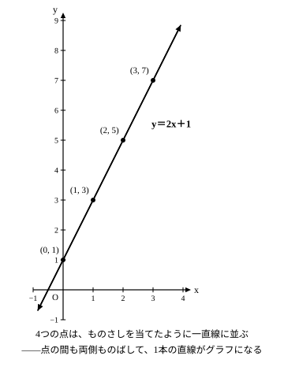
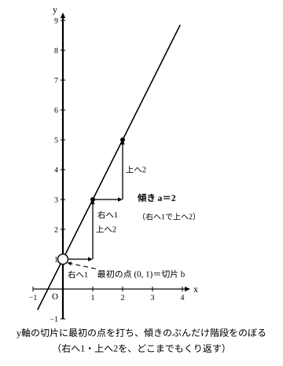

# L03 式からグラフへ——点を取れば直線が見える

## ねらい

- 一次関数の式から表を作り、座標平面に点を取ると、点が**まっすぐ並ぶ**（グラフが**直線**になる）ことを自分の手で確かめられるようになる。
- 式の **b** がグラフの**切片**（y軸と交わるところ）、**a** が**傾き**（右へ1進んだときの上がり方）として見えることを説明できるようになる。

## 主概念1：式から表、表から点——点はまっすぐ並ぶ

`y=2x+1` で、xにいくつか値を入れてみよう。

| x | 0 | 1 | 2 | 3 |
|---|---:|---:|---:|---:|
| y | 1 | 3 | 5 | 7 |

この4つの組を座標平面の点 (0, 1), (1, 3), (2, 5), (3, 7) として取ると——**まっすぐ並ぶ**。

なぜまっすぐになるのか。表をもう一度見ると、xが1増えるごとに、yは**いつも2ずつ**増えている。どの点からも「右へ1、上へ2」の**同じ歩幅**で次の点へ進む——歩幅が途中で変わらないから、点は一直線に並ぶわけだ。

点を結んだ直線は、**取った点の間だけで止めず、両側にのばして**かく。xは0から3までしか調べていないが、x＝4でもx＝−1でも式は成り立つ（x＝4ならy＝9で、ちゃんと直線の延長上に乗る）。

このレッスンでは、**式から表を作り、表から点を取る**流れに集中しよう。逆向きの「グラフから式を読む」ことは、次のレッスン（L04）で扱う。

## 主概念2：切片 b と傾き a がグラフに見える

`y=2x+1` のグラフを、式と見比べてみよう。`b=1` なので、グラフは**y軸の1のところ**を通る。`a=2` なので、**xが1増えるとyは2増える**。

- **切片**: y軸と交わるところ。bは「x＝0のときのy」だから、グラフは必ず点 (0, b) を通る。
- **傾き**: 右へ1進んだときの上がり方。

この傾きは、L02で表から求めた**変化の割合と同じ数**だ。「yの増加量 ÷ xの増加量」が、グラフでは直線の傾きとして見えている。式の中の2つの数aとbが、それぞれグラフの「傾き具合」と「y軸との交点」を担当している——**式とグラフは同じ関係の別の見せ方**なのだ。

## 型の導入：「最初の点は (0, b)」

グラフをかくときは、**まずy軸上の (0, b) に点を打つ**習慣にしよう。

1. y軸の b の高さに最初の点を打つ（`y=2x+1` なら (0, 1)）。
2. 表を作って点をあと2つほど取る（またはそこから「右へ1、上へa」で次の点へ）。
3. 点がまっすぐ並ぶのを確かめて、**両側にのばした直線**を引く。

最初の1点を切片で固定してから傾きへ進む——この順番にすると、かき始めで迷わないし、「切片をx軸と混ぜる」事故（下のguide）も防げる。

:::guide
**切片は「x軸」ではなく「y軸」の上**

切片を「x軸と交わるところ」と混ぜてしまうまちがいがある。切片 b は「**x＝0のときのy**」、つまり**y軸**の上の点 (0, b) だ。「xが0だから、x軸のほうは0歩も進んでいない＝横に動かずy軸の上にいる」と覚えるとよい。x軸のbの位置 (b, 0) は、ふつう直線上の点ですらない（練習4で実際に確かめる）。
:::

:::guide
**傾きと変化の割合は同じ数——表とグラフがつながる**

L02では表から「yの増加量 ÷ xの増加量」を計算して変化の割合を求めた。`y=2x+1` の表でxが1から3まで増えるところを見ると、yは3から7へ増えるから、変化の割合は (7−3)÷(3−1)＝2。これはグラフの傾き2と同じ数だ。**表のどこで測っても同じ値になる**——だからこそグラフは（曲がらずに）直線になる。「表の計算」と「グラフの見た目」が同じaを指している、というのがこの単元の背骨になる。
:::

:::guide
**点は3つ取ると安心**

直線は2点あれば引ける。それでもこのレッスンで点を3つ取るのは、**3つ目の点が検算になる**からだ。3点のうち1つでも直線から外れたら、どこかのyの計算がまちがっている合図。逆に3点がぴたりと並んだら、表の計算はまず安心してよい。「2点で引けるが、3点目で確かめる」——手で作図するときの自前の検算法だ。
:::

:::zatsudan
グラフをかく道具といえば定規だけれど、コンピュータのグラフソフトで `y=ax+b` の a や b を少しずつ変えてみると、直線がまるで生きもののように動く。bを変えると直線ごと**上下にスライド**し、aを変えると**傾き具合だけ**が変わる。式の中の2つの数が、直線の「置き場所」と「傾き具合」をそれぞれ握っている——手でかいたあとに一度動かして見ると、aとbの役割が目に焼きつくよ。
:::
<!-- zatsudan話題源: LINFN_RESEARCH_BRIEF_20260829 雑談枠許可リスト7「グラフをコンピュータで動かすとa・bの役割が見える」（S1 解説第4章 p.168相当＋S8 R6報告書指導欄） -->

## 練習

1. `y=x+2` の表（x＝0, 1, 2）を作り、点を3つ取って直線を引こう。 <!-- 旧ID: ex_L3_check_01 -->
2. `y=2x-3` の切片と傾きを言い、x＝0、1、2のときのyを求めて表にしよう。 <!-- 旧ID: ex_L3_check_02 -->
3. 次の一次関数の切片と傾きを言おう。
   (1) `y=3x+1`　(2) `y=x-4`　(3) `y=5x`
4. 次はある人の作図の様子である。まちがいを見つけて、正しく直そう。
   「`y=3x+6` のグラフをかこう。まず、**x軸の6の位置**に最初の点を打って……」
5. 次の文が正しければ○、正しくなければ×を付けて、×は正しく直そう。
   (1) 一次関数 `y=2x+5` のグラフは、y軸の5のところを通る。
   (2) グラフの直線は、表で取った点の間だけをかけばよい。
   (3) `y=4x+1` のグラフでは、xが1増えるとyは1増える。

:::stretch
**S1** `y=2x+1` と `y=2x+4` の表（x＝0, 1, 2, 3）をそれぞれ作り、同じ座標平面に2本の直線を引いてみよう。2本の直線はどんな位置関係になるだろうか。どこまでのばしても交わらないかどうか、同じxのときのyの差に注目して調べ、気づいたことを一言で書こう。
:::

---

対応解答: answer_key_L01-04.md

<!-- gen_nav:nav:start（自動生成・手編集しない） -->

---

[← 前のレッスン](lesson_02.md)｜[単元の目次](README.md)｜[解答](answer_key_L01-04.md)｜[次のレッスン →](lesson_04.md)

<!-- gen_nav:nav:end -->
