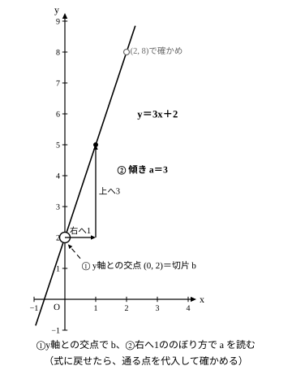
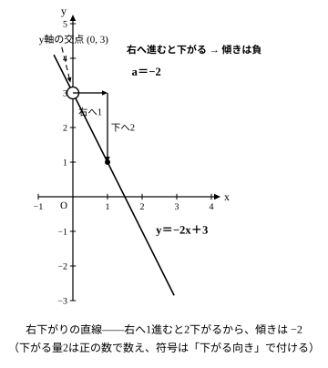
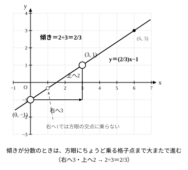
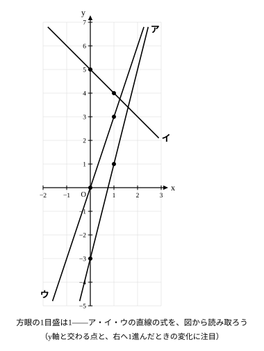
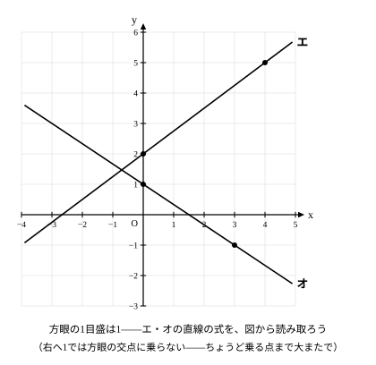

# L04 グラフから式へ——切片と傾きを読んで式を復元する

## ねらい

- グラフから**切片**（y軸との交点のyの値）と**傾き**（右へ1進んだときのyの変化）を読み取り、式 y＝ax＋b を復元できるようになる。
- 右下がりの直線では傾きが**負**になることを、「上がるか下がるかを先に言葉にする」読み方とセットで身につける。

## 主概念1：切片はy軸との交点に、傾きは「右へ1」の変化に見える

L03では、式から表を作り、グラフをかいた。今日は**向きが逆**だ。すでにかかれているグラフから、切片と傾きを読み取って、式を復元する。

あるグラフが、**y軸の2を通り、右に1進むと上に3進む**とする。このとき、切片と傾きは何になるだろうか？

L03で確かめたことを思い出そう。切片bは「グラフがy軸と交わるところのyの値」、傾きaは「右へ1進んだときのyの上がり方」だった。だから、読む場所は2つだけだ。

1. **y軸との交点**を読む——y軸の2を通っているから、**b＝2**。
2. **右へ1進んだときの変化**を読む——上に3進むから、**a＝3**。

切片が2、傾きが3なら、式は

> **y＝3x＋2**

だ。復元した式は、グラフの点で確かめられる。y軸の2を通る→x＝0で y＝3×0＋2＝2 ✓。右に1進むと上に3→x＝1で y＝3×1＋2＝5、たしかに2から3増えている ✓。**グラフから読んだ点と、式が指す点が一致すれば、読み取りは正しい**。

## 主概念2：右へ進んで下がるなら、傾きは負——細かい傾きは格子点2つで読む

右に進むと**下がる**直線では、傾きは**負**になる。たとえば右に1進むと2下がるなら、傾きは **−2** だ。y軸の3を通り、右に1進むごとに2下がる直線なら、b＝3、a＝−2 で、式は y＝−2x＋3 になる。

傾きが分数のときは、右へ1マス進んだときの変化が方眼の線にぴたりと乗らず、読み取りにくい。そんなときは、**読み取りやすい格子点**（方眼の交点にちょうど乗っている点）**を2つ選ぶ**と、傾きを計算しやすくなる。たとえば、y軸の−1を通る直線が、右へ**3**進む間に上へ**2**進むとする。右へ1あたりでは 2÷3＝**2/3** 上がっているから、傾きは 2/3。式は y＝(2/3)x−1 だ。

## 型の導入：「上がるか下がるかを先に言う」

右下がりの直線を見て、傾きを正の数で答えてしまうまちがいがある。防ぐ型はシンプルだ——**数を読む前に、「右へ進むと、上がる？　下がる？」を言葉にする**。

1. 右へ進んだとき、**上がるなら傾きは正、下がるなら負**。まず口に出す（符号が決まる）。
2. それから「いくつ分か」を読む（量が決まる）。
3. 符号と量を合わせて傾きに、y軸との交点を切片にして、y＝ax＋b へ。

「右に1進むと2下がる」なら、①下がる→負、②量は2、③傾きは−2。この順番を守るだけで、符号の付け忘れはほぼ防げる。

:::guide
**「2下がる」の2は正の数——量と向きを分けて読む**

「右に1進むと2下がる」の「2」は、下がった**量**を正の数で数えた言い方だ。傾きに直すときは、下がる**向き**のほうを符号（−）で表して −2 とする。「−2下がる」とは言わないことに注意——量は正の数で数え、向きは符号が引き受ける。この読み分けは、中1で負の数を「向きも表す数」として学んだことの続きになっている。
:::

:::guide
**復元した式は「使っていない点」で確かめる**

式を復元したら、**読み取りに使わなかった格子点**を1つ選んで代入してみよう。y＝3x＋2 の読み取りに使ったのは、y軸の点 (0, 2) と、右へ1の点 (1, 5)。ならば確かめは、さらに右へ1進んだ点 (2, 8) で——式に x＝2 を入れると 3×2＋2＝8 で、グラフの点と一致する。読み取りに使った点で確かめても、写しまちがいには気づけない。**使っていない点が一致してはじめて安心**——L03の「3点目で確かめる」と同じ発想の、グラフ読み取り版の検算だ。
:::

:::guide
**2点が与えられたら、傾きの計算は変化の割合そのもの**

練習1のように「点 (0,1) と (3,3) を通る」と2点で与えられたら、傾きは

> 傾き＝（yの増加量）÷（xの増加量）＝(3−1)÷(3−0)

で計算できる。これはL02の**変化の割合**の計算とまったく同じだ（傾き＝変化の割合＝a）。切片がすぐに書けるのは、(0,1) が**y軸上の点**（x＝0のときの点）だから。では、y軸上の点が与えられていない2点から式を求めるにはどうするか——それが次のレッスン（L05）の主役になる。
:::

:::zatsudan
グラフから式を読み取る今日の方法は、理科の実験室でも活躍する。水を熱しながら水温を何回か記録し、その点をグラフ用紙に打っていくと、点は**ほぼ一直線**に並ぶ。一定の火力で熱し続けている、水温は熱した時間だけで決まる——そう考えを単純にして「水温は時間の一次関数」と**みなす**と、点に沿って直線が引ける。あとは今日の技の出番。熱し始めの水温が「はじめの量」、直線の上がり具合が「傾き」で、読み取れば式ができる。式ができれば、まだ来ていない時間の水温や、ある温度になるまでの時間まで予測できて、その根拠も説明できる。測った点から式を復元する——今日の技は、実験データの世界への入り口でもあるんだ。
:::
<!-- zatsudan話題源: LINFN_RESEARCH_BRIEF_20260829 雑談枠許可リスト1「水を熱すると水温は時間の一次関数とみなせる」（S1 解説の例示・実験→理想化・単純化→予測。「点がほぼ一直線」「理想化・単純化」「時間を予測し根拠を説明」は同例示の転記範囲）。具体の温度・時間の数値は不使用（出典に数値なし・創作禁止）。話題再配分2026-08-29: 旧リスト4（n角形）はL02/L05/L06/L08と重複のため、本レッスン主題（グラフから式を復元）に適合するリスト1へ変更（検算対象数値なし＝notes/lesson_04_notes.md） -->

## 練習

1. 点 (0,1) と (3,3) を通る直線の傾きを求め、式を作ろう。 <!-- 旧ID: ex_L4_check_01 -->
2. 切片が4で、右に1進むと2下がる直線の式を作ろう。 <!-- 旧ID: ex_L4_check_02 -->
3. 図のア〜ウの直線の式を、それぞれ求めよう。
   
   (1) 直線ア　(2) 直線イ　(3) 直線ウ
4. 図のエ・オの直線の式を、それぞれ求めよう。（ヒント: 「右へ1あたり」に直そう）
   
   (1) 直線エ　(2) 直線オ
5. 次の文が正しければ○、正しくなければ×を付けて、×は正しく直そう。
   (1) 右下がりの直線の傾きは、負の数である。
   (2) 右に2進むと上に6進む直線の傾きは、6である。
   (3) 直線がy軸の −2 を通るとき、切片は −2 である。

:::stretch
**S1** 練習1で式を求めた直線（点 (0,1) と (3,3) を通る直線）には、方眼の交点にぴたりと乗る点（格子点）がほかにもある。求めた式を使って x＝6, 9 のときの y を計算し、この直線の格子点を全部で4つ並べよう。次に、その4つから2点を選ぶ組み合わせを3通り変えて、それぞれ傾きを計算してみよう。どの2点で測っても同じ値になるだろうか。そうなる理由を、L02の「変化の割合はどこで測っても一定」という言葉とつなげて一言で説明しよう。
:::

---

対応解答: answer_key_L01-04.md

<!-- gen_nav:nav:start（自動生成・手編集しない） -->

---

[← 前のレッスン](lesson_03.md)｜[単元の目次](README.md)｜[解答](answer_key_L01-04.md)｜[次のレッスン →](lesson_05.md)

<!-- gen_nav:nav:end -->
