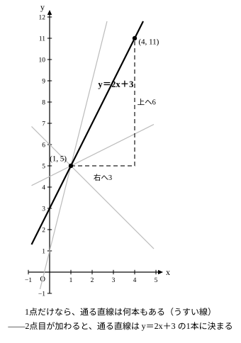

# L05 条件から式を決める——手がかり2つで直線は1本に決まる

## ねらい

- 傾きと1点の座標から、代入によって b を求め、一次関数の式を決められるようになる。
- 2点の座標から、まず傾き（変化の割合）を計算し、つぎに b を求めて式を決められるようになる。計算を始める前に「2点のx座標がちがうこと」を確認する習慣をつける。

## 主概念1：手がかりが2つあれば、式は決められる——傾きと1点

L04では、グラフから傾きと切片を読み取って式を復元した。今日は、グラフがなくても、言葉や座標で与えられた**手がかり**から式を決める。

一次関数 y＝ax＋b で決めるものは、a と b の**2つ**だ。だから、「傾きと1点」や「x座標がちがう2点」のように、a と b を決められる手がかりが**2つ**あれば、式を決められる。

**例1** 傾きが2で、点 (3, 7) を通る一次関数の式を求めよう。

傾きが2と分かっているから、式は y＝2x＋b の形。残る手がかりは「点 (3, 7) を通る」——グラフが点 (3, 7) を通るとは、**x＝3 のとき y＝7 になる**ということだ。代入すると、

> 7＝2×3＋b
> 7＝6＋b
> b＝1

式は **y＝2x＋1**。求めたら、与えられた手がかりに戻って確かめよう——x＝3 を入れると y＝2×3＋1＝7。たしかに点 (3, 7) を通る。

:::guide
**手がかりが1つだけだと、どうなるか**

「傾きが2」だけでは、y＝2x＋1 も y＝2x＋3 も y＝2x−5 も候補になって、1本に決められない（b が自由に残る）。逆に「点 (3, 7) を通る」だけでも、その点を通る直線はいくらでも引ける（a が自由に残る）。決めたい文字が a と b の2つだから、手がかりも2つそろって、はじめて直線が1本に絞られる。問題文を読んだら「手がかりはどれとどれか」を先に指さしてみよう。
:::

## 主概念2：2点から——まず傾き、つぎに b

**例2** 2点 (1, 5) と (4, 11) を通る一次関数の式を求めよう。

今度は、傾きがそのままは与えられていない。でも、2点あれば傾きは**計算で作れる**——傾きは、L02で表から求めた変化の割合と同じ数だった。まず、2つの点のx座標が 1 と 4 で**ちがうことを確認**してから、

> a＝(11−5)÷(4−1)＝6÷3＝2

傾きは2。ここまで来れば、あとは例1と同じ状況だ。点 (1, 5) のほうを使うと、

> 5＝2×1＋b
> b＝3

式は **y＝2x＋3**。検算は、b を求めるのに**使わなかったほうの点**で——x＝4 を入れると y＝2×4＋3＝11。たしかに (4, 11) も通る。

なお、b を求めるとき、2つの点の**どちらを使っても同じ式になる**。(4, 11) を使うと 11＝2×4＋b で b＝3——同じだ。計算しやすいほうの点を選んでよい。

:::guide
**引く向きは、分子と分母でそろえる**

傾きの計算 (11−5)÷(4−1) は、「あとの点 − 前の点」を分子（y）と分母（x）で**同じ向き**に引いている。向きをそろえてさえいれば、逆向きの (5−11)÷(1−4)＝(−6)÷(−3)＝2 でも同じ答えになる。だめなのは向きを**混ぜる**こと——(11−5)÷(1−4)＝6÷(−3)＝−2 と、符号だけが逆の別の数が出てしまう。「yはこの点から引いたのに、xは逆の点から引く」事故は、2点を (1, 5)→(4, 11) のように矢印で結んで、矢印の向きのまま両方引くと防げる。
:::

## 型の導入：「最初の一手は、x座標の確認」

2点から式を求めるときの手順を、型にしておこう。

1. **2点のx座標を見くらべる**——ちがうことを確認する。
2. 傾き a＝（yの増加量）÷（xの増加量）を計算する。
3. どちらか1点を代入して b を求める。
4. **もう一方の点を代入して検算**する。

いきなり傾きの計算（手順2）から始めたくなるが、**最初の一手は手順1のx座標の確認**だ。x座標が同じ2点には、そもそも今日の方法が使えない（理由は下のguide）。確認せずに計算を始めると、0で割る計算が現れて立ち往生する——練習5で実際の答案を見る。

:::guide
**x座標が同じ2点には、y＝ax＋b が作れない**

たとえば (3, 5) と (3, 9)。xの増加量が 3−3＝0 になるから、傾きの計算は「0で割る」ことになってできない。計算の手前には、もっと根本的な事情がある。関数では、xの値を1つ決めると、yの値は**ただ1つ**に決まるのだった（中1）。ところがこの2点は「x＝3 のとき y＝5」と「x＝3 のとき y＝9」——同じxに2つのyが対応してしまい、どんな a・b を選んでも、両方を満たす y＝ax＋b は作れない。この場合は、この単元の式の決定問題とは**分けて考える**。
:::

:::zatsudan
多角形の内角の和も、一次関数の目で見ることができる。三角形の内角の和は180°。頂点を1つ増やして四角形、五角形……とすると、内角の和は**三角形1つ分——180°ずつ**増えていく。増え方がいつも一定、つまり変化の割合が180だ。それなら今日の方法の出番。頂点の数を x、内角の和を y 度として、「傾き180」と「点 (3, 180)」（三角形）の2つの手がかりで式を作ると、180＝180×3＋b から b＝−360、つまり y＝180x−360。x＝4 を入れると360°、x＝5 なら540°。図形の章で多角形の内角の和の公式 (x−2)×180 に出会ったら、展開してみてほしい——今日の2つの手がかりから作った式と、ぴったり同じになる。
:::
<!-- zatsudan話題源: LINFN_RESEARCH_BRIEF_20260829 雑談枠許可リスト4（S1 解説p.120相当——n角形の内角の和は頂点1増で三角形1つ分＝180°増・変化の割合180）。y＝180x−360 の導出と (x−2)×180 の展開一致は本レッスンの方法による純数学の計算（Python検算＝notes/lesson_05_notes.md）。三角形180°・四角形360°は小学校算数の既習。公式(n−2)×180は「図形の章で出会ったら」と未習前提の書き方にした。話題再配分2026-08-29: リスト4はL02（変化の割合の面）と本レッスン（式の決定の面）の2本のみ＝規則「同一話題は最大2レッスン」内（旧L04/L06/L08の重複は解消） -->

## 練習

1. 傾きが −1 で、点 (4, 1) を通る一次関数の式を求めよう。 <!-- 旧ID: ex_L5_check_02 -->
2. 点 (2, 7) と (5, 16) を通る一次関数の式を求めよう。 <!-- 旧ID: ex_L5_check_01 -->
3. 変化の割合が3で、x＝1 のとき y＝2 となる一次関数の式を求めよう。
4. 点 (−2, 9) と (1, 3) を通る一次関数の式を求めよう。
5. 次はある人の答案である。まちがいを見つけて、正しく直そう。
   「点 (3, 5) と (3, 9) を通る一次関数の式を求めよう。まず傾きは a＝(9−5)÷(3−3) で……」

:::stretch
**S1** 例2で求めた直線 y＝2x＋3 の上に、x＝7 の点を作ると (7, 17)（y＝2×7＋3＝17）。では、点 (1, 5) と (7, 17) の2点から式を求めると、どんな式になるだろうか。実際に計算して確かめよう。そして、「同じ直線の上なら、どの2点を選んで計算しても——」に続く一言を書こう。（ヒント: L02で学んだ「変化の割合はどこで測っても一定」とつながっている）
:::

---

対応解答: answer_key_L05-08.md

<!-- gen_nav:nav:start（自動生成・手編集しない） -->

---

[← 前のレッスン](lesson_04.md)｜[単元の目次](README.md)｜[解答](answer_key_L05-08.md)｜[次のレッスン →](lesson_06.md)

<!-- gen_nav:nav:end -->
