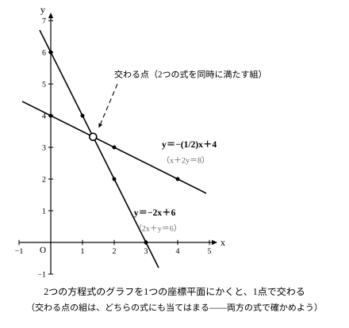

# L06 二元一次方程式とグラフ——交わる点は2つの式を同時に満たす組

## ねらい

- 二元一次方程式（2x＋y＝6 のような、xとyを使った方程式）をyについて解いて y＝ax＋b の形に直し、一次関数のグラフとして表せるようになる。
- 2つのグラフの交わる点が「2つの式を同時に満たす x, y の組」——連立方程式の解——であることを理解し、交点を x と y の組で答えられるようになる。

## 主概念1：二元一次方程式は、yについて解くとグラフがかける

2x＋y＝6 は、xとyの2つの文字を使った方程式だ（このような方程式を**二元一次方程式**という。連立方程式の単元で主役になる方程式だが、まだ習っていなくても、ここでは「xとyを使った方程式」という意味で読めば十分だ）。

この形のままでは、L03で学んだグラフのかき方が使えない。そこで**yについて解く**——yだけを左辺に残す形に変形する。

> 2x＋y＝6
> **y＝−2x＋6**

すると、傾き−2・切片6の一次関数になり、グラフがかける。

もう1つ、x＋2y＝8 もyについて解いてみよう。

> 2y＝−x＋8
> **y＝−(1/2)x＋4**

傾き−(1/2)・切片4の直線だ。つまり二元一次方程式は、yについて解けば一次関数の式に直せる——**方程式も、グラフの世界へ持ち込める**わけだ。

:::guide
**yについて解くときは、「すべての項」を割る**

2y＝−x＋8 から y＝−x＋4 としてしまうまちがいがある。右辺の8だけを2で割って、−x のほうを割り忘れた形だ。両辺を2で割るということは、右辺の**すべての項**を2で割ること——正しくは y＝−(1/2)x＋4 となる。係数が分数になっても気にしなくていい。変形が正しいか不安なときは、xに1つ値を入れて確かめられる。x＝4 なら y＝−(1/2)×4＋4＝2 で、組 (4, 2) をもとの式に入れると 4＋2×2＝8——ちゃんと成り立つ。まちがいの式 y＝−x＋4 だと x＝4 で y＝0 となり、4＋2×0＝4 で 8 にならない。
:::

## 主概念2：交わる点は、2つの式のどちらにも当てはまる

yについて解いた2つの式 y＝−2x＋6 と y＝−(1/2)x＋4 のグラフをかくと、交わる点がある。この点（**交点**）は、2つの式のどちらにも当てはまるだろうか？

グラフの直線は、その式を成り立たせる x, y の組を座標平面の点として集めたものだった（L03）。交点は2つの直線の**両方に乗っている**点——だから、2つの方程式の**どちらにも**当てはまる。もとの式で言えば、2x＋y＝6 と x＋2y＝8 の両方を同時に成り立たせる x, y の組が、交点の座標だ。

この「2つの式を同時に満たすxとyを探す」考え方は、**連立方程式**の考え方とつながっている。連立方程式をまだ習っていない場合も、「2つの式を同時に満たすxとyの組を探している」と読みかえれば、このレッスンはこのまま進められる。

交点を探すときは、片方の式を y＝… と見て、「**もう一方の式でも同じ y になる x はどれか**」と考える。なお、このレッスンで考えるのは、yについて解くと y＝ax＋b の形になる方程式だ。

:::guide
**交点は「点」——xの値だけでは答えにならない**

交点を聞かれて x＝3 のように x の値だけを答えてしまうまちがいがある。交点は座標平面上の**点**なので、たとえば交点が点 (3, 1) なら、答えは (3, 1) のように x と y の組で言う。「同時に満たす**組**を探していた」ことを思い出せば、答えが組になるのは当然だ——x の値だけでは、答えの半分でしかない。
:::

## 型の導入：「交点は両方の式で確かめる」

交点の座標を求めたら、答えを書く前に、**もとの2つの方程式の両方に代入して確かめる**。

1. 求めた組 (x, y) を1つ目の式に入れる → 成り立つか。
2. 同じ組を2つ目の式に入れる → 成り立つか。

**片方だけ成り立ってもだめ**だ。交点は「2つの式を同時に満たす組」だから、確かめも必ず2本セットになる。L01の「スタートとペースの点検」と同じく、答えを書く前に毎回やる習慣にしよう。

:::guide
**なぜ「交点の座標＝連立方程式の解」と言えるのか**

ふり返って、理由を自分の言葉で言えるか試してみよう。筋道は3歩ある。①グラフの直線は、その式を成り立たせる組の集まり。②交点は両方の直線に乗っている。直線に乗っているとは、①で言えば「その式を成り立たせる組である」ということ——両方の直線に乗っているなら、両方の式を成り立たせる。③だから交点の座標は、2つの式を**同時に**成り立たせる組——これは連立方程式の「解」の意味そのものだ。計算で解いても、グラフの交点を読んでも、同じ答えにたどり着く。式の世界とグラフの世界が、ここで1本につながる。
:::

:::zatsudan
火をつけた線香は、先のほうからほぼ一定のペースで短くなっていく。そこで「残りの長さは時間の一次関数」と**みなす**と、燃え尽きるまでの時間が予測できる——雑談のようで、じつは今日の見方がそのまま使える話だ。残りの長さのグラフは右下がりの直線になり、燃え尽きる瞬間は**残りの長さが0になる点**、つまりグラフが横軸と交わる点。ところで横軸は「y＝0」という式のグラフ、1本の直線とも見られる。すると燃え尽きる時間を求めることは、2本の直線の交点を求めること——今日学んだ「交点の座標は2つの式を同時に満たす組」の見方が、線香のけむりの先にもつながっている。
:::
<!-- zatsudan話題源: LINFN_RESEARCH_BRIEF_20260829 雑談枠許可リスト3「線香が燃え尽きるまでの時間の予測」（S1 解説の事例・「みなす」の意味）。横軸＝y＝0のグラフという読みかえと「交点=同時に満たす組」への接続は本レッスン本文の範囲の純数学（出典外の数値・事実なし）。話題再配分2026-08-29: 旧リスト4（n角形）はL02/L05等と重複のため、本レッスン主題（グラフの交点と方程式）に接続できるリスト3へ変更 -->

## 練習

1. 3x＋y＝9 をyについて解き、傾きと切片を答えよう。 <!-- 旧ID: ex_L6_check_02 -->
2. 次の二元一次方程式をyについて解こう。
   (1) 2x＋4y＝12　(2) x−2y＝4
3. まず x＋y＝5 は、yについて見ると y＝5−x と表せる。そのうえで、もう一方の式でも同じ y になる x を探そう。——x＋y＝5 と y＝2x−1 の交点の座標を求め、その点を2つの式に代入して確かめよう。 <!-- 旧ID: ex_L6_check_01 -->
4. 2つの二元一次方程式 x＋y＝7 と x−y＝1 について、それぞれをyについて解き、2つのグラフの交点の座標を求めよう。求めた交点は、両方の式に代入して確かめること。
5. 次の文が正しければ○、正しくなければ×を付けて、×は正しく直そう。
   (1) x＋2y＝8 をyについて解くと y＝−x＋4 になる。
   (2) 2つの直線の交点の座標は、2つの方程式を同時に満たす x, y の組である。

:::stretch
**S1** 本文で直線にした 2x＋y＝6（y＝−2x＋6）に対して、今度は 2x＋y＝10 をyについて解いてみよう。2つの直線の傾きと切片を比べると、何が起きるだろうか。交点があるかどうかを考え、「2つの式を同時に満たす x, y の組」があるかどうかも、同じ x での2つの y の差を計算して確かめよう。（L01のstretchで調べた「ペースが同じ2本の式」を、グラフの言葉で言い直すと——）
:::

---

対応解答: answer_key_L05-08.md

<!-- gen_nav:nav:start（自動生成・手編集しない） -->

---

[← 前のレッスン](lesson_05.md)｜[単元の目次](README.md)｜[解答](answer_key_L05-08.md)｜[次のレッスン →](lesson_07.md)

<!-- gen_nav:nav:end -->
