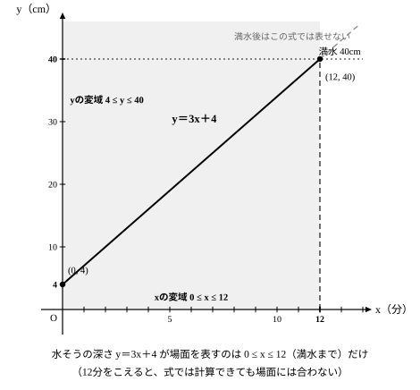
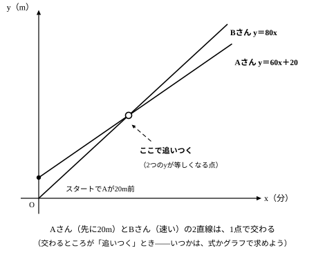

# L07 一次関数の利用——式が使える範囲まで考える

## ねらい

- 現実に近い場面を一次関数の式に表し、そこに「一定のペースが続くとみなす」という単純化（モデル化の仮定）が入っていることを意識できるようになる。
- 式が場面を表す範囲（変域）を求め、出した答えが場面に合うかを確かめてから答えられるようになる。

## 主概念1：場面を式にする——「一定のペースが続く」とみなす

深さ40cmの水そうがある。はじめの水の深さは4cm。水を入れると、水面の高さは1分あたり3cmずつ上がる。x 分後の水の深さを y cmとすると——L01でやったとおり、「はじめの量」と「ペース」を読み取れば式が作れる。

> **y＝3x＋4**

3x が増えた分、＋4 がはじめからあった分だ（点検: x＝0 で y＝4＝はじめの深さ、x＝1 で y＝7＝1分で3cm増。式は場面と合っている）。

ここで1つ、立ち止まっておきたい。「水面は毎分**ちょうど**3cmずつ上がる」と考えるのは、現実の場面を単純にした見方だ——これを**モデル化の仮定**という。現実の場面を一次関数で表すときは、いつもこうした「一定のペースが続くとみなす」仮定が入っている。仮定を置いて式にするからこそ、「この先どうなるか」を計算で予測できるようになる。

## 主概念2：式が使える範囲——変域

この水そうの深さは40cmしかない。いっぱいになるのはいつだろう。y＝40 として、

40＝3x＋4 → 36＝3x → **x＝12**

12分でいっぱいになる。したがって、この場面で式を使えるのは

> **0 ≤ x ≤ 12**

の間だけだ。これは「0分後から12分後まで」という意味で、この「x のとりうる値の範囲」を**変域**という（中1の比例・反比例で学んだ言葉だ）。12分をこえるとどうなるか？ 水そうから水があふれるので、この式だけで場面を表すことはできない。

x に変域があるように、**y にも変域がある**。x が0から12まで動くとき、y は4（はじめの深さ）から40（満水）まで動くので、y の値の範囲は 4 ≤ y ≤ 40 になる。

## 型の導入：「場面に戻って確かめる」

式に入れれば計算できる値でも、場面として意味があるとは限らない。一次関数を場面で使うときの点検は2段だ。

1. **数の点検**: 出てきた値を式に戻して、計算が合っているか確かめる。
2. **場面の点検**: その値が**変域の中にあるか**、場面として意味があるかを確かめる。

L01の「スタートとペースの点検」は、作った式が場面と合っているかの点検だった。利用の場面では、そこに「答えを場面に戻す」点検が加わる。答えを書く前に、この2つを毎回やる習慣にしよう。

:::guide
**「計算できる」と「場面で使える」を混ぜない**

y＝3x＋4 に x＝100 を入れれば計算はできる（y＝304）。だがこの水そうは12分で満水になるので、100分後の水の深さがこの式の値になることはない。式がこの場面を表しているのは 0 ≤ x ≤ 12 の間だけだ。「計算できるか」と「場面で使えるか」は別の問い——答えを出したら、その値が場面に合っているか一度確かめよう。
:::

:::guide
**y の変域は、x の変域の両はしから**

y の変域は、x の変域の両はしの値を式に代入すると求められる。水そうなら x＝0 で y＝4、x＝12 で y＝40——だから 4 ≤ y ≤ 40。ただし「左はしの x が小さい方の y」とは限らない。ペース a が負の場面（水がぬけていく等）では、x が大きいほど y は小さくなるので、大小が入れかわる（練習3で試す）。どちらが小さい方かは、代入した結果を見て決めよう。この方法が使えるのは、一次関数のグラフがまっすぐ一方向に増える（減る）からだ——まっすぐでないグラフ（中3で学ぶ）なら、両はしだけでは決められない。
:::

:::guide
**「追いつく」は、2つの y が等しくなるとき**

2人が同じ道を進む場面で「追いつく」とはどういうことだろう。同じ時刻に、同じ地点にいる——つまり、同じ x で2人の y（進んだ地点）が等しくなることだ。2人の進み方をそれぞれ一次関数の式に表せば、追いつく時刻は「2つの式の y が等しくなる x」として方程式で求められる。これはL06で見た「2つのグラフの交点」と同じ見方で、グラフでいえば2本の直線が交わる点が「追いついた瞬間」を表している（練習4で試す）。
:::

:::zatsudan
8月に富士山の6合目まで登るとしたら、どんな服装で行けばいいだろう。じつはこれも、一次関数で考えられる問いだ。高さのちがういくつかの観測地点で気温を調べて表やグラフにすると、変化の割合がほぼ一定で、点がほぼ一直線に並ぶ。そこで「気温は高さの一次関数」と**みなして**式を作れば、まだ測っていない高さの気温を予測できる——服装の準備という現実の判断に、この章の道具がそのままつながる。ちなみに気象庁の「過去の気象データ検索」には「富士山」という観測地点が実際にあるので、予測を実測と突き合わせることもできる。ただし、みなしているのはある範囲でのこと。今日学んだ「式が使える範囲」の考え方は、山の上でも効いている。
:::
<!-- zatsudan話題源: LINFN_RESEARCH_BRIEF_20260829 雑談枠許可リスト2（S1 解説の活動例〔富士山6合目・8月の服装準備・変化の割合がほぼ同じ／点がほぼ一直線→一次関数とみなす〕本文確認／S17 気象庁「過去の気象データ検索」観測地点「富士山」実在確認）。具体の気温数値は不使用（Briefの指示: 数値は都度データページから取ること）。「みなしているのはある範囲でのこと」は解説の制約明文の保持 -->

## 練習

1. 上の水そうの式 y＝3x＋4 で、5分後の水の深さを求めよう。また、x＝15 のとき、この式はこの場面を正しく表すだろうか。理由も答えよう。 <!-- 旧ID: ex_L7_check_02 -->
2. 深さ30cmの水そうに、はじめ6cmまで水が入っている。水を入れると、水面は毎分2cmずつ上がる。x 分後の水面の高さを y cmとする。
   (1) 式を作ろう。　(2) 満水になるのは何分後だろうか。　(3) x の変域と y の変域を求めよう。
3. L01の練習3で作った式 y＝−4x＋20（20L入りの水そうから毎分4Lずつ水をぬく。x 分後の水の量が y L）に、「使える範囲」を付けよう。
   (1) 水そうが空になるのは何分後か。　(2) x の変域と y の変域を求めよう。　(3) この式で x＝7 のときの y を計算すると、どんな値になるか。その値は場面で意味があるだろうか。
4. AさんとBさんが、同じ道を同じ向きに進む。AさんはBさんの20m前の地点から毎分60mで、BさんはAさんと同時に出発して毎分80mで進むとする。BさんがAさんに追いつくのは、出発してから何分後だろうか。 <!-- 旧ID: ex_L7_check_01 -->
   ヒント: AさんとBさんの差は、1分ごとに 80−60＝20m ずつ縮まる。
   **追加ヒント（自分で考えたあと）**: 式で見るなら、出発してからの時間を x 分、Bさんの出発地点から進んだ道のりを y mとすると、Aさんは y＝60x＋20、Bさんは y＝80x と表せる。追いつくときは、2つの y が同じになる。
5. 問4の「追いつく時刻の求め方」を、問4を解いていない人にも伝わる文で説明しよう。「**何を使って・どうやって・何を求める**」の3つが入っているかを確かめること。（文の形の例: 「──を使って、──して、──を求める。」）

:::stretch
**S1** 問4で、もしBさんの速さが毎分50mだったらどうなるだろう。
(1) 追いつく時刻を式（50x＝60x＋20）で求めると、x はどんな値になるか。
(2) その値はこの場面の変域に入っているか。「BさんはAさんに追いつけるか」を、式の結果と場面のようすの両方から説明しよう。（参考: 2人の差 (60x＋20)−50x を計算して、差がこの先どうなっていくかも見てみよう）
:::

---

対応解答: answer_key_L05-08.md

<!-- gen_nav:nav:start（自動生成・手編集しない） -->

---

[← 前のレッスン](lesson_06.md)｜[単元の目次](README.md)｜[解答](answer_key_L05-08.md)｜[次のレッスン →](lesson_08.md)

<!-- gen_nav:nav:end -->
