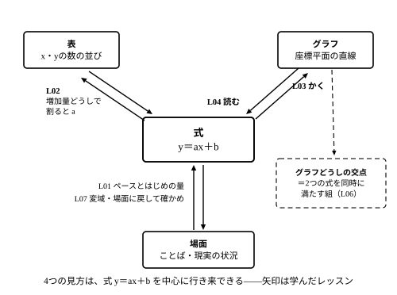

# L08 章末まとめ——表・式・グラフ・場面を行き来する

## ねらい

- 表・式・グラフ・場面の4つの見方の行き来を、3部屋（式の意味／式とグラフの行き来／使い方）で自己点検し、穴のある部屋と戻り先のレッスンを特定できるようになる。
- 単元の用語を式の a・b と結びつけて整理し、総合演習で単元全体の解き方をひとまわり使えるようになる。

## 4つの見方——単元のまとめ

一次関数は、表、式、グラフ、場面をつなぐ道具だ。

- **式**を見ると、増え方とスタート量がわかる。
- **表**を見ると、変化の割合を確かめられる。
- **グラフ**を見ると、全体の傾向や交点が見える。
- **場面**を見ると、式が使える範囲が決まる。

この4つを行き来できると、一次関数はぐっと使いやすくなる。この単元は、次の3段で進んできた。

| 部屋 | レッスン | してきたこと |
|---|---|---|
| 部屋1: 式の意味 | L01〜L02 | 比例に「はじめの量」を足す（y＝ax＋b）／増え方を数で表す（変化の割合） |
| 部屋2: 式とグラフの行き来 | L03〜L05 | 式からグラフをかく（傾き・切片）／グラフから式を読む／手がかりから式を決める |
| 部屋3: 使い方 | L06〜L07 | 方程式とグラフをつなぐ（交点）／場面で使う（変域） |

## 3部屋の自己チェック

次の各問いに、**本文やノートを見ずに**自分の言葉で答えられるか試そう。詰まった部屋が、復習に戻る場所だ。

**部屋1: 式の意味（L01〜L02）**
- y＝ax＋b の a と b は、場面ではそれぞれ何を表す？（「ペース」と「はじめの量」という言葉を使って）
- y＝3x＋2 の「＋2」を「毎分2Lずつ増える分」と読んではいけないのはなぜ？
- 変化の割合を求めるとき、割り算するのは「値どうし」？それとも「増加量どうし」？
- y＝3x＋2 と y＝3x＋10 の変化の割合が同じと言えるのはなぜ？

**部屋2: 式とグラフの行き来（L03〜L05）**
- 式の a と b は、グラフのどこに見える？（「傾き」「切片」という言葉を使って）
- グラフをかくとき、最初に打つ点はどこ？
- 右下がりの直線の傾きは正？負？——数を読む前に、何を言葉にする？
- 一次関数の式を1本に決めるには、手がかりがいくつ必要？それはなぜ？
- 2点から式を求めるとき、傾きの計算を始める前に確認することは？

**部屋3: 使い方（L06〜L07）**
- 2x＋y＝6 のような方程式を、一次関数のグラフとして表すには、まず何をする？
- 交点を聞かれたら、答えは x の値だけでいい？それとも (x, y) の組？
- 交点の座標が「連立方程式の解」と言える理由を説明できる？
- 「式で計算できる値」と「場面で使える値」のちがいを、水そうの例で言える？
- 変域は x だけのもの？それとも y にもある？

:::guide
**「解ける」と「読める」は別の到達点**

計算がすらすらできることと、部屋の問いに自分の言葉で答えられることは、別のチェック項目だ。部屋1で詰まったら L01の水そう（増えた分＋はじめの量）と L02の表（増加量どうしで割る）へ、部屋2で詰まったら L03の「式から表を作って点を取る」作業へ、部屋3で詰まったら L07の「満水になったら式は使えない」場面へ戻ろう。どの部屋も、抽象的な規則ではなく具体的な場面や表に戻れば思い出せるように作ってある——戻ることは後退ではなく、いちばん速い復習だ。
:::

## 総合演習

どの問題も、この単元で解いてきた型の再演だ。詰まったら（　）内のレッスンへ戻ろう。答えを書く前に、求めた式に値を代入して確かめること。

1. 次の場面を式に表そう。（L01）
   (1) はじめ12L入っている水そうに、毎分3Lずつ水を入れる。x 分後の水の量を y Lとして式を作り、6分後の水の量を求めよう。
   (2) 900円持っていて、毎日40円ずつ使う。x 日後の残りの金額を y 円として式を作り、10日後の残りを求めよう。
2. y＝5x−3 で、x が2から6まで増えるとき、x の増加量、y の増加量、変化の割合を求めよう。（L02）
3. 次の問いに答えよう。（L03・L04）
   (1) y＝−x＋3 の切片と傾きを言い、x＝0, 1, 2 のときの y を求めて表にしよう。
   (2) 切片が−2で、右に1進むと3上がる直線の式を作ろう。
4. 点 (2, 9) と (5, 18) を通る一次関数の式を求めよう。（L05）
5. 次の問いに答えよう。（L06・L07）
   (1) 2x＋y＝7 と y＝x＋1 の交点の座標を求め、その点を2つの式に代入して確認しよう。
   (2) 深さ30cmの水そうに、はじめ6cmの深さまで水が入っていて、水面は毎分4cmずつ上がる。x 分後の水面の高さを y cmとして式を作り、満水になるのは何分後か、式を使える x の範囲はどこまでかを答えよう。また、x＝10 のとき、この式はこの場面を正しく表すだろうか。

:::guide
**迷ったら、別の見方に乗りかえる**

総合演習で手が止まったら、「いまどの見方で考えているか」を確かめて、別の見方に乗りかえてみよう。式で行き詰まったら表を作る（x に0, 1, 2 を入れる）。表で増え方が見えなければ増加量を書きこむ。場面の問題で混乱したら、まず「ペースはどれか・はじめの量はどれか」の2つだけ探す。4つの見方はどれも同じ関係の別の顔だから、1つの入り口でつまずいても、別の入り口から入り直せる——これがこの単元の一番の道具だ。
:::

## 用語ミニ整理

| 用語 | 意味 |
|---|---|
| 一次関数 | y＝ax＋b（a、b は決まった数で、a は0でない）の形で表せる関係 |
| 変化の割合 | yの増加量 ÷ xの増加量 |
| 傾き | 右に1進んだときの上がり下がり（式の a） |
| 切片 | y軸と交わるところの y（式の b、x＝0 のときの y） |
| 交点 | 2つのグラフが交わる点。座標 (x, y) の組で表す |
| 変域 | 変数のとりうる値の範囲。x だけでなく y にも変域がある（この単元では主に、場面で式を使える x の範囲を扱った） |

:::guide
**用語は式の a・b に結びつけて覚える**

6つの用語のうち3つは、実は式の同じ場所を指している。「傾き」も「変化の割合」も式の a のこと（グラフで見るか、表で見るかのちがい）。「切片」は式の b のこと（グラフで見た呼び名）。だから用語を暗記するより、「y＝ax＋b のどこの話か」を言えるようにする方が確実だ。a でも b でもないのは「交点」（2本のグラフの間の話）と「変域」（式が使える範囲の話）——この2つが部屋3で足した新しい視点だった。
:::

:::zatsudan
章の終わりに、出発点をもう一度。中1で学んだ比例 y＝ax は、じつは一次関数 y＝ax＋b の **b が0の特別な場合**だ。この章の4つの見方のどれで見ても、それが確かめられる。式で見れば「はじめの量」の項がない形。表で見れば x＝0 のとき y＝0。グラフで見れば原点を通る直線。場面で見れば「スタートが0から始まる」話。新しい章を学ぶことは、前に学んだことを捨てることではなく、より大きな入れものに入れ直すことだ——比例で身につけた見方は、この章でそのまま一次関数の見方の一部になった。この先の数学でも、同じことが何度も起こる。
:::
<!-- zatsudan話題源: LINFN_RESEARCH_BRIEF_20260829 雑談枠許可リスト6「比例は一次関数の特別な場合（b=0）」（S1 解説明文「比例関係は，一次関数y＝ax＋bの特別な場合である」）。x＝0でy＝0・原点を通る等はb＝0の純数学の言いかえ（出典外の数値なし）。話題再配分2026-08-29: 旧リスト4（n角形）はL02/L05等と重複のため、本レッスン主題（4つの見方の総点検・学び直し）に適合するリスト6へ変更 -->

## 次の章へ——予告編

**ふり返りの回収**: 連立方程式の章末で「解の組が図の上でどこにいるのか」という予告があった。この単元のL06で、それは**2直線の交点**として見えた——予告はもう回収ずみだ。

**中3の関数へ**: この単元の関数は、変化の割合がいつも一定だった。だからグラフは直線になった。ところで、中1の反比例を思い出してほしい。表で増加量を調べると、あちらは変化の割合が一定に**ならない**。中3では、このような「変化の割合が一定でない関数」を本格的に学び、直線にならないグラフが登場する。そのとき最初に使う道具が、この単元で鍛えた「変化の割合は一定か？」という問いだ——いまはこの一文の予告まで。

:::stretch
**S1** 2つの一次関数 y＝2x＋3 と y＝2x−1 のグラフは、交わるだろうか。x＝0, 1, 2, 3 のときの2つの y の値を表に書き出し、差がどうなるか調べよう。次に、y＝2x＋3 と y＝−x＋6 の組ではどうか、交点があれば座標を求めよう（求めたら両方の式に代入して確かめること）。2つの直線が交わるかどうかは、a と b のどちらで決まると言えそうか、考えたことを自分の言葉で書こう。（ヒント: L01のstretchで調べた「差がいつまでも変わらない」2本を思い出そう）
:::

---

対応解答: answer_key_L05-08.md

<!-- gen_nav:nav:start（自動生成・手編集しない） -->

---

[← 前のレッスン](lesson_07.md)｜[単元の目次](README.md)｜[解答](answer_key_L05-08.md)

<!-- gen_nav:nav:end -->
