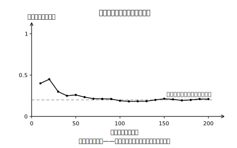
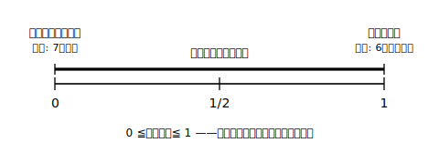

# L01 起こりやすさを数で表す——中1の確率をたしかめ直す

## ねらい

- 多数回の試行をくり返すと相対度数が**一定の値に近づいていく**こと、その値が確率であること（中1の学習）を、実験を通してたしかめ直す。
- 確率の**意味**を正しく言えるようになる——確率は「必ずそうなる」という約束ではないこと、確率は**0以上1以下**の数であることを理解する。

## 準備運動：道具箱の点検（前提診断）

新しい章に入る前に、次の4問をやってみよう。あやしいところが見つかったら、それだけで収穫だ。

1. 500円玉を1回投げるとき、出方は何通りあるだろう。すべて書き出そう。
2. 1個のさいころを1回投げるとき、出る目は何通りあるだろう。すべて書き出そう。
3. ある中学校で通学方法を調べたら、全校生徒400人のうち徒歩通学が280人だった。徒歩通学の生徒の**相対度数**（全体に対する割合）を小数で表そう。
4. 硬貨を200回投げたら表が92回出た。表が出た相対度数を小数で表そう。

3・4の「全体のうち、どれだけの割合か」を小数で表す計算が、この章の土台になる。中1で学んだ**確率**は、まさにこの相対度数の考えから生まれた数だった。

## 主概念1：多数回投げると、割合は落ち着いてくる

紙コップを1個用意して、机の上に投げてみよう。落ち方は「上向き（口が上）」「下向き（口が下）」「横向き」の3つに分ける（机から落ちたときや、ふちに斜めに引っかかって決められないときは、その回はやり直し。投げる高さや机の面など、投げ方の条件はそろえること）。さて、**横向きになる確率**はどれくらいだろうか。

投げる前に予想を書いておこう。そして実際に投げて、10回ごとに「横向きの回数÷投げた回数」（相対度数）を計算して記録していく。

回数が少ないうちは、相対度数は大きく揺れる。10回投げて横向きが1回も出ないことも、逆に続けて出ることもある。ところが回数を増やしていくと、揺れはだんだん小さくなり、**ある一定の値に近づいていく**。この近づいていく先の値を、そのことがらの起こる**確率**という——これが中1で学んだ確率だった。**多数回の試行によって得られる確率**である。

:::guide
**「少ない回数で決めつけない」がこの章の最初のルール**

10回投げて横向きが3回出たからといって、「横向きの確率は0.3」と即断してはいけない。相対度数が信頼できる値に落ち着くには、**多数回**の試行が要る。逆に言うと、回数を重ねさえすれば、紙コップのようにいびつな形のものでも起こりやすさを数でつかまえられる——これが実験による確率の強みだ。実験の記録と計算は、表計算ソフトに「投げた回数・横向きの回数・相対度数」の3列を作って任せると、集計ミスなく続けられる。
:::

## 主概念2：確率は「保証」ではない

さいころの1の目が出る確率は1/6である（なぜ実験しなくてもそう言えるのかは、次のL02の主役）。ではこの「1/6」は、何を約束してくれる数だろうか。

次の文は正しいだろうか——「**確率が1/6だから、さいころを6回投げれば1の目は必ず1回出る**」。

正しくない。ためしに6回投げてみれば、1の目が2回出ることも、1回も出ないこともふつうに起こる。確率1/6が言っているのは、「6回に1回**必ず**出る」ではなく、「**多数回**投げれば、1の目の出る相対度数が1/6に近づいていく」ということだ。確率は未来の1回を保証する数ではなく、**起こりやすさの度合い**を表す数である。

:::zatsudan
「確率1/6なら6回に1回出るはず」——この感覚、実はかなりしぶとい。6回投げて1が出ないと「このさいころ、おかしくない？」と言いたくなるし、逆に2回続けて出ると「今日はついてる」と思ってしまう。でも確率の目で見れば、どちらも十分起こりうる、ごくふつうの出来事。確率と付き合うコツは、1回1回の結果に一喜一憂せず、「たくさん集めたときの傾向」として眺めることなんだ。
:::

## 主概念3：確率の値の範囲——0から1まで

確率は相対度数（起こった回数÷全体の回数）の近づく先だから、その値は必ず

> **0 ≦（確率）≦ 1**

の範囲に入る。**決して起こらない**ことがらの確率は0、**必ず起こる**ことがらの確率は1である。たとえば「さいころを1回投げて7の目が出る」確率は0、「さいころを1回投げて6以下の目が出る」確率は1。確率が1.2になったり−0.3になったりしたら、それは計算のどこかがまちがっているという警報だ。

:::guide
**0.5と表すか、1/2と表すか**

相対度数の計算では0.46のような小数が自然に出てくる。一方、この章のこの先では1/2、1/6のような分数の確率が主役になる。どちらも同じ「割合」で、0.5＝1/2のように行き来できる。実験の値（小数）と数え上げの値（分数）を**比べる**場面がこの章では何度も出てくるので、分数を小数に直す練習（1/6＝0.166…など）をここで思い出しておくと後がらくになる。
:::

## 練習

1. 王冠（飲み物のびんのふた）を300回投げたら、表向きが114回出た。表向きが出た相対度数を小数で表そう。
2. 次の文が正しければ○、正しくなければ×を付けて、×のものは理由を一言書こう。
   (1) 硬貨の表が出る確率が1/2だから、10回投げれば表はちょうど5回出る。
   (2) 「あることがらの確率が0」とは、そのことがらが決して起こらないという意味である。
   (3) 確率が3/2になることがある。
3. 1個のさいころを1回投げるとき、次の確率を答えよう（中1の知識で答えてよい）。
   (1) 0以下の目が出る確率　(2) 1以上6以下の目が出る確率
4. ペットボトルのキャップを投げて上向きになる確率を調べたい。「20回投げて上向きが7回だったから、確率は0.35だ」という結論の**弱点**を、この時間に学んだことばで指摘しよう。

:::stretch
**S1** 紙コップ投げの実験を、投げる回数を変えて2セットやってみよう（例: 30回と150回）。それぞれの「横向きの相対度数」を比べると、どちらがより信頼できる値と言えるだろうか。理由も書こう。（コンピュータで実験の代わりをする方法もある——「乱数 シミュレーション コイン投げ」で調べると、ブラウザ上で何千回分も一瞬で試せるページの作り方が見つかる。）
:::

---

対応解答: answer_key_L01-05.md

<!-- gen_nav:nav:start（自動生成・手編集しない） -->

---

[単元の目次](README.md)｜[解答](answer_key_L01-05.md)｜[次のレッスン →](lesson_02.md)

<!-- gen_nav:nav:end -->
