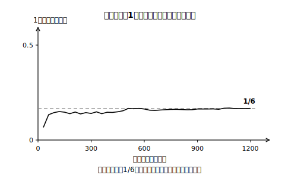

# L02 投げる前に分かる確率——場合の数を基にして求める

## ねらい

- 「**同様に確からしい**」の意味を理解し、それが成り立つときに限って、実験しなくても**場合の数を基にして**確率が求められることを理解する。
- 場合の数を基にして得られる確率と、多数回の試行によって得られる確率とを**関連付けて**、確率の意味を実感を伴って理解する。

## 主概念1：実験なしで「1/6」と言えるのはなぜか

L01の紙コップは、投げてみないと確率が分からなかった。ところがさいころは、投げる前から「1の目が出る確率は1/6」と言える。この差はどこから来るのだろう。

さいころの出る目は1・2・3・4・5・6の**6通り**。そしてさいころは、どの面も同じ大きさ・同じ形で、かたよりのない材質で作られている。だから、**どの目が出ることも同じ程度に期待できる**とみなせる。このとき、どの結果が起こることも**同様に確からしい**という。

紙コップはどうか。「上向き・下向き・横向き」の3通りに分かれはするが、形がいびつだから、この3つが同じ程度に起こるとはとても言えない。**3通りだからといって、それぞれ1/3ではない**。——「何通りに分かれるか」と「それぞれが同じ程度に起こるか」は、別の問題なのだ。

:::guide
**確率計算の前の合言葉:「その分け方、同様に確からしい？」**

場合の数から確率を求めてよいのは、分けた1つ1つの場合が**同様に確からしい**ときだけ。この確認を飛ばすと、紙コップに1/3を割り当てるような誤りが生まれる（次のL03で、もっと巧妙な例に出会う）。確率を計算する前に、「この分け方の1つ1つは、同じ程度に起こると言えるか？」と一度声に出して疑う——これをこの章の合言葉にしよう。
:::

## 主概念2：場合の数を基にして得られる確率

どの場合が起こることも同様に確からしいとき、確率は数え上げで求められる。

> 起こり得る場合が全部で **n通り** あり、どの場合が起こることも**同様に確からしい**とする。そのうち、ことがらAの起こる場合が **a通り** あるとき、Aの起こる確率pは
>
> **p ＝ a/n （そのことがらの起こる場合の数 ÷ 起こり得る全部の場合の数）**

さいころで偶数の目が出る確率なら、全部の場合はn＝6通り、偶数の目（2・4・6）はa＝3通りだから、p＝3/6＝1/2。実験を1回もしなくても求められる——これが**場合の数を基にして得られる確率**だ。

分子aは分母nの一部だから、この定義からも 0≦p≦1 が確かめられる（a＝0なら決して起こらない＝確率0、a＝nなら必ず起こる＝確率1。L01の範囲の話とぴったり一致する）。

## 主概念3：2つの確率は同じものを指している

「実験で求める確率」（L01）と「数え上げで求める確率」（この時間）は、別ものではない。さいころを多数回投げて1の目の相対度数を記録していくと、その値は1/6＝0.166…に**近づいていく**。たとえば1200回投げて1の目が205回出たとすれば、相対度数は205÷1200＝0.170…で、すでに1/6のすぐ近くにいる（この数値は説明用の例——ぜひ自分の実験やシミュレーションで確かめてほしい）。

つまり、**場合の数を基にして求めた確率は、多数回の試行によって得られる確率の「近づく先」を、実験なしで言い当てている**。だからこそ数え上げの確率には意味がある。逆に、紙コップのように同様に確からしい分け方が見つからないものは、実験で求めるしかない。2つの求め方は、こうして1つの「確率」につながっている。

:::zatsudan
多数回投げると相対度数が一定の値に近づいていく——この現象には「**大数の法則**」というかっこいい名前が付いていることが知られている。「たいすう」と読む。回数（数）が大きくなるほど、でたらめさの中から安定した割合が顔を出す。1回1回はまったく予測できないのに、たくさん集めると驚くほど行儀よくなる。不確定な事象のこの二面性こそ、確率という数が成り立つ土台なんだ。
:::

:::guide
**「同様に確からしい」は、みなしてよいかの判断でもある**

厳密に言えば、現実のさいころや硬貨に完全なかたよりゼロはない。それでも私たちは、形の対称性から「どの目が出ることも同様に確からしい**とみなして**」計算を進める。このみなしが適切かどうかは、多数回の試行の結果とつき合わせて確かめられる（実験値が1/6から大きくずれ続けるさいころは、みなしを疑う）。数学の確率は、現実へのこの「みなし→検証」のセットで使うものだと覚えておこう。
:::

## 練習

1. 1個のさいころを1回投げるとき、次の確率を求めよう。
   (1) 3の倍数の目が出る確率　(2) 5以上の目が出る確率　(3) 7の約数の目が出る確率
2. 赤玉3個、白玉2個が入った袋から玉を1個取り出す。どの玉が取り出されることも同様に確からしいとき、赤玉が出る確率を求めよう。
3. 1から10までの数字を1つずつ書いた10枚のカードをよくきって1枚引く。
   (1) 偶数のカードを引く確率　(2) 4の倍数のカードを引く確率
4. 次の㋐〜㋒のうち、「同様に確からしい」と言えないため**場合の数を基にして確率を求めてはいけない**ものを選び、理由を書こう。
   ㋐ 正しく作られたさいころの1〜6の目
   ㋑ 画びょうを投げたときの「針が上向き・針が横向き」の2通り
   ㋒ よくきった10枚のカード（練習3）の各カード

:::stretch
**S1** 「1個のさいころを投げて、出た目を『1の目・1以外の目』の2通りに分ける。2通りだから、1の目が出る確率は1/2である」——この主張のまちがいを、この時間のことばを使って説明しよう。さらに、正しい確率と「1以外の目」の正しい確率も求めよう。
:::

---

対応解答: answer_key_L01-05.md

<!-- gen_nav:nav:start（自動生成・手編集しない） -->

---

[← 前のレッスン](lesson_01.md)｜[単元の目次](README.md)｜[解答](answer_key_L01-05.md)｜[次のレッスン →](lesson_03.md)

<!-- gen_nav:nav:end -->
