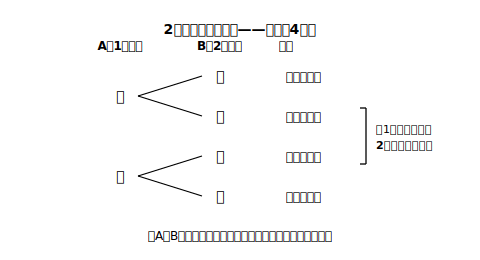

# L03 「3通り」か「4通り」か——同様に確からしいかを疑う

## ねらい

- 2枚の硬貨の出方を「3通り」と数える考えと「4通り」と数える考えを**比較**し、実験と樹形図によって、同様に確からしい分け方は4通りであることを確かめる。
- **同じ種類のものでも区別して数える**という、場合の数を確率に使うときの決定的なルールを身につける。

## 主概念1：もっともらしい2つの答え

100円硬貨を2枚、同時に投げる。**2枚とも表になる確率**はいくらだろうか。まず自分の予想を書いてから読み進めてほしい。

この問題では、考えが2つの陣営に分かれやすい。

- **3通り説**: 出方は「2枚とも表」「表と裏が1枚ずつ」「2枚とも裏」の3通り。だから確率は **1/3**。
- **4通り説**: 出方は4通りあって、確率は **1/4**。

3通り説は一見まったく正しそうだ。実際、出方をことばで分類すればこの3つで全部であり、もれも重複もない。L02の合言葉を思い出そう——**「その分け方、同様に確からしい？」**。3通り説が答えであるためには、この3つが同じ程度に起こらなければならない。さて、本当だろうか。

## 主概念2：実験は3通り説に味方しない

確かめ方は、この章ですでに2つ手にしている。まず**実験**だ。硬貨2枚を50回投げて、3つの出方の回数を数えてみよう（表計算ソフトやブラウザのコイン投げシミュレーションなら、何百回分もすぐ試せる）。

やってみると、「表と裏が1枚ずつ」だけが目立って多く出る。3つが同じ程度なら相対度数はどれも1/3＝0.33…に近づくはずなのに、1枚ずつはそれよりはっきり多く、0.5の近くをうろつく。**3つの分け方は、同様に確からしくない**。実験がそう告げている。

では、同様に確からしい分け方は何か。ここで**樹形図**（じゅけいず）の出番だ。2枚の硬貨に**AとBの名前を付けて区別し**、Aの出方→Bの出方の順に枝分かれをかくと:

全部で**4通り**。硬貨AもBもそれぞれ表裏が同様に確からしく、たがいの出方に影響し合うしくみもないから、この4通りはどれも同じ程度に起こるとみなせる。「表と裏が1枚ずつ」には（表・裏）と（裏・表）の**2通りがふくまれていた**。つまり3通り説は、この2つを1つに束ねてしまっていたのだ。

したがって、2枚とも表になる確率は **1/4**。表と裏が1枚ずつになる確率は 2/4＝**1/2**。実験で1枚ずつが多かった理由も、これでぴったり説明がつく。

:::guide
**3通り説は「まちがい」というより「おしい」**

3通り説の分類そのものは正しい（もれも重複もない）。落とし穴はただ1点、**同様に確からしいかの確認を飛ばした**ことにある。だからこの誤りへの正しい対処は「4通りと暗記する」ことではなく、分け方を立てたら毎回「1つ1つは同じ程度に起こるか？」と疑うことだ。疑い方も学んだとおり、あやしければ**実験とつき合わせる**。数え上げの確率と多数回の試行の確率が食いちがい続けたら、まず数え方の側を疑う（回数が少ないうちは偶然のずれもふつうに出るので、回数を増やしてから判断すること）。
:::

:::zatsudan
（表・裏）と（裏・表）。「どっちも『1枚ずつ』じゃん、同じでしょ」と束ねたくなる気持ちは、実はとても自然なもの。「結果の見た目」で分類するのは自然に浮かぶのに、「起こり方の道すじ」で分類するのは、意識しないとなかなか出てこない。樹形図のえらいところは、見た目ではなく**道すじ**を1本ずつ枝にして、束ねる前の姿を見せてくれること。「同じに見えるものをほどいて数える」。この章でいちばん頭がやわらかくなる瞬間かもしれない。
:::

## 主概念3：同じ100円玉2枚でも、答えは変わらない

「AとBって、それは100円と10円みたいに区別できる場合でしょ？ **同じ100円玉2枚**なら見分けがつかないから、やっぱり3通りでは？」——いい質問だ。

見分けがつくかどうかは、**人間の目の都合**にすぎない。2枚の硬貨は物としては別々に存在していて、それぞれが別々に表か裏かを出す。片方に赤い印を付けたと想像してみればいい。印を付けても落ち方は変わらないのだから、確率も変わらない。つまり、**同じ種類のものでも、確率を考えるときは1つ1つを区別して数える**。これはこの先、同じ色の玉・同じ数字のカードでもくり返し使う決定的なルールだ。

:::guide
**「区別して数える」を習慣にする小わざ**

同じものが2つ以上出てきたら、手を動かして**名前を付ける**（硬貨ならA・B、赤玉2個なら赤1・赤2）。頭の中だけで処理しようとすると、（表・裏）と（裏・表）を束ねる誘惑に必ず負ける。樹形図や表をかくときに最初に名前を書いてしまえば、あとは枝が勝手に区別してくれる。「名前を付けてから数える」を作業手順として体にしみ込ませよう。
:::

## 練習

1. 2枚の硬貨を同時に投げるとき、2枚とも裏になる確率を、樹形図をかいて求めよう。
2. 2枚の硬貨を同時に投げるとき、「少なくとも1枚は表になる」確率を求めよう（樹形図の4通りのうち、あてはまるものを数える）。
3. 「500円玉と5円玉の2枚を投げる場合は4通りだが、同じ10円玉2枚を投げる場合は見分けがつかないので3通りになり、2枚とも表の確率は1/3になる」。この主張は正しいか。正しくない場合は、理由を説明しよう。
4. 赤玉2個と白玉1個が入った袋をよく混ぜて、玉を1個取り出す（どの玉が取り出されることも同様に確からしいとする）。「出る色は赤か白の2通りだから、赤玉が出る確率は1/2」という考えのまちがいを指摘し、正しい確率を求めよう。

:::stretch
**S1** 2枚の硬貨投げの実験（またはシミュレーション）を200回行い、「2枚とも表」「1枚ずつ」「2枚とも裏」の相対度数を求めて、1/4・1/2・1/4と比べてみよう。3通り説の1/3・1/3・1/3と、どちらが実験に合うだろうか。
:::

---

対応解答: answer_key_L01-05.md

<!-- gen_nav:nav:start（自動生成・手編集しない） -->

---

[← 前のレッスン](lesson_02.md)｜[単元の目次](README.md)｜[解答](answer_key_L01-05.md)｜[次のレッスン →](lesson_04.md)

<!-- gen_nav:nav:end -->
