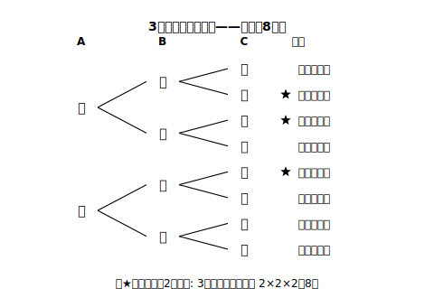
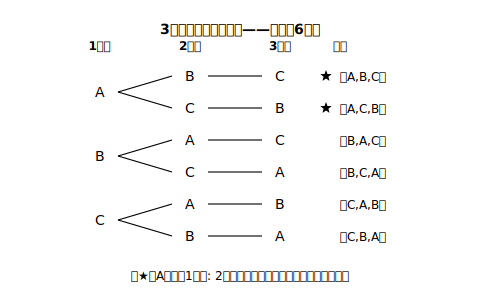

# L04 樹形図——枝分かれで全部の場合をかき切る

## ねらい

- **樹形図**を使って、3枚の硬貨・順番決め・じゃんけんなどの起こり得る全ての場合を**もれなく・重複なく**かき切り、確率を求められるようになる。
- 「かき切ってから数える」を確率計算の標準手順として身につける。

## 主概念1：3枚になっても、枝を増やすだけ

硬貨を3枚（A・B・C）同時に投げる。**ちょうど2枚が表になる確率**を求めよう。頭の中だけではもう追い切れない——樹形図の枝を1段増やせばよい。

全部で**8通り**。A・B・Cそれぞれの表裏が同様に確からしく、たがいの出方に影響し合わないから、8通りはどれも同じ程度に起こるとみなせる。ちょうど2枚が表（★印）は（表表裏）（表裏表）（裏表表）の**3通り**。よって確率は **3/8**。

大事なのは手順だ。①枝分かれの**順番を決める**（A→B→C）、②各段で**全部の枝**をかく、③最後まで**かき切ってから**、あてはまる結果に印を付けて数える。途中で「もう分かった」とやめると、数え落としがしのび込む。

:::guide
**樹形図の自己点検:「枝の本数のかけ算」と合っているか**

かき切った結果の総数は、各段の枝の本数のかけ算で点検できる。硬貨3枚なら2×2×2＝8通り——樹形図の末端が8本なければ、どこかでかき落としている。これはあくまで**点検法**であって、確率を求める本体はあくまで樹形図の数え上げ（どの場合が同様に確からしいかは、図をかいてはじめて確かめられる）。「かき切る→かけ算で検算」をセットにしよう。
:::

## 主概念2：順番を決める場合も樹形図で

場合の数は「投げる」以外にも現れる。**Aさん・Bさん・Cさんの3人が、発表の順番をくじで決める**。Aさんが1番目になる確率はいくらだろう。

1番目→2番目→3番目の順に枝をかく。1番目はA・B・Cの3通り、1番目が決まれば2番目は残り2人、3番目は残り1人:

全部で**6通り**、くじで決めるからどの並びも同様に確からしい。Aさんが1番目なのは★の**2通り**。よって確率は 2/6＝**1/3**。「3人のうちだれが1番目になるかは公平だから1/3」という直観とも一致する——樹形図は直観の正しさを**確かめる**道具にもなる。

:::zatsudan
樹形図は英語で tree diagram——文字どおり「木の図」。根もとから枝が分かれて、枝の先にまた枝が付く。未来に起こりうる展開を、枝分かれの地図として全部かき出してしまおうという発想だ。「起こり得る全ての場合」なんて言われると途方もない気がするけれど、1段ずつ枝を増やすだけなら手が動く。大きな問いを「次の1段」に分解する——これは数学に限らず、ものごとを考えるときのかなり強力な型だと思う。
:::

## 主概念3：じゃんけんも「全部かき切る」

AさんとBさんが1回じゃんけんをする。ここでは、**2人ともどの手を出すことも同様に確からしい**とする（実際のじゃんけんにはくせや読み合いがあるが、ここでは考えないという約束だ）。**あいこになる確率**を求めよう。Aの手（グー・チョキ・パー）→Bの手の順に枝をかくと、3×3＝**9通り**で、この約束のもとでは9通りはどれも同じ程度に起こる。あいこは（グー,グー）（チョキ,チョキ）（パー,パー）の**3通り**だから、確率は 3/9＝**1/3**。

「あいこ・Aの勝ち・Bの勝ちの3通りだから1/3」と答えても今回はたまたま合うが、それはL03で見たとおり危ない橋だ。この3つが同様に確からしいかは、9通りをかき切ってはじめて確認できる（実際、それぞれ3通りずつで等しい）。**答えが合うかではなく、確かめられる形で求めたか**——それがこの章の作法だ。

:::guide
**樹形図が向く場面・向かない場面**

樹形図は「順番に決まっていくもの」（硬貨を1枚ずつ・順番を1人ずつ・手を1人ずつ）に万能だが、段数が増えると枝が急に増える。この章で扱うのは「起こり得る全ての場合を**簡単に**求めることができる程度」まで——枝が数十本を超えるような問題は、そもそもこの章の範囲外だ。また「2つのさいころ」のように2つのものの組だけが問題になる場合は、次のL05で学ぶ**二次元の表**のほうが見通しがよい。道具は2つ、使い分けはL05で。
:::

## 練習

1. 3枚の硬貨を同時に投げるとき、次の確率を求めよう（主概念1の樹形図を使ってよい）。
   (1) 3枚とも表になる確率　(2) 表が2枚以上になる確率　(3) 3枚とも同じ面になる確率
2. AさんとBさんが1回じゃんけんをするとき、Aさんが勝つ確率を、樹形図（9通り）から求めよう。
3. Aさん・Bさん・Cさんの3人がくじで発表順を決めるとき、Bさんが2番目になる確率を求めよう。
4. 1・2・3の数字を1つずつ書いた3枚のカードをよくきって、左から順に1列に並べる。並べた3けたの数が偶数になる確率を求めよう。

:::stretch
**S1** 4枚の硬貨を同時に投げるとき、「ちょうど2枚が表」になる確率を樹形図で求めよう（全部で16通り。かけ算検算: 2×2×2×2）。3枚のとき（3/8）と比べて、確率は大きくなっただろうか、小さくなっただろうか。
:::

---

対応解答: answer_key_L01-05.md

<!-- gen_nav:nav:start（自動生成・手編集しない） -->

---

[← 前のレッスン](lesson_03.md)｜[単元の目次](README.md)｜[解答](answer_key_L01-05.md)｜[次のレッスン →](lesson_05.md)

<!-- gen_nav:nav:end -->
