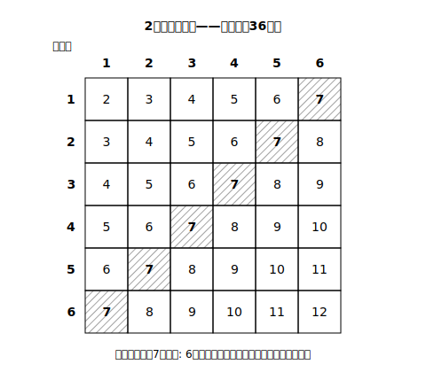
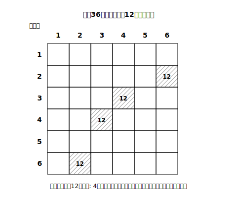

# L05 二次元の表——2つのさいころを一望する

## ねらい

- **二次元の表**を使って、2つのさいころのような「2つのものの組」の起こり得る全ての場合を一望し、確率を求められるようになる。
- 樹形図と表の**使い分け**を判断できるようになる。

## 主概念1：36マスの地図をつくる

大小2つのさいころを同時に投げる。**目の和が7になる確率**を求めよう。樹形図でもかけるが、1段目6本×2段目6本＝36本の枝はさすがに窮屈だ。2つのものの組なら、**縦と横の表**にするほうが早い。

大きいさいころの目を縦、小さいさいころの目を横にとり、マスに目の和を書き込む。

マスは全部で6×6＝**36通り**。2つのさいころのどの目の組も同様に確からしいから、36マスはどれも同じ程度に起こる。和が7のマスは、表の斜めに並んだ**6通り**——(1,6)(2,5)(3,4)(4,3)(5,2)(6,1)。よって確率は 6/36＝**1/6**。

L03のルールがここでも効いている。(2,5)と(5,2)は「見た目は同じ2と5」だが、**大小を区別する**から別のマスだ。同じ大きさのさいころ2個でも、区別して36通り——理由はL03の硬貨とまったく同じである。

:::guide
**表の読み方のコツ:「模様」で数える**

和が7は右上から左下への斜めライン、ぞろ目（同じ目）は左上から右下への対角線、「大きい方が6」は最下行——条件に合うマスは、表の上でしばしば**模様**として現れる。1マスずつ拾うより、模様として見つけてから個数を数えると、速くて数え落としも減る。ただし最後に必ず「マスの個数」を声に出して数え直すこと。模様の思い込みで1マス拾いすぎる事故は起こる。
:::

## 主概念2：和だけでなく、積も・差も

同じ36マスの地図の上で、いろいろな確率が求められる。たとえば**目の積が12になる確率**。積が12になる組は (2,6)(3,4)(4,3)(6,2) の**4通り**だから、確率は 4/36＝**1/9**。

ここで一度立ち止まろう。「和が7」は6通り、「積が12」は4通り——**同じ36マスでも、ことがらによって場合の数はちがう**。和の値ごとに数えると、和2は1通り、和3は2通り、…、和7が6通りで最多、…、和12は1通り。「和が7が一番出やすい」という、やってみないと分からなそうなことが、表からひと目で読み取れる。これが**起こり得る全ての場合を一望する**ことの力だ。

:::zatsudan
6×6＝36マスの表は、いわば「2つのさいころの宇宙の全地図」。この宇宙で起こりうることは36マスのどれかで、例外はない。地図さえ作ってしまえば、「和が7は？」「積が12は？」とどんな質問が来ても、あとは地図の上で該当地点を数えるだけ。問題ごとに一から考え直すのではなく、**まず世界の全体をかき出してしまう**——確率の考え方のいちばん誠実なところだと思う。
:::

## 主概念3：樹形図と表、どちらを使うか

道具が2つそろった。使い分けの目安はこうだ。

- **二次元の表**: 「2つのもの」の組で全部が決まるとき（さいころ2個・硬貨2枚・2人の出す手など）。全体が長方形に並び、一望できる。
- **樹形図**: 3つ以上が順に決まるとき（硬貨3枚・3人の順番）や、**途中で枝の本数が変わる**とき（引いたくじを戻さない場合——L07で登場）。

どちらを選んでも、やることは同じ——**同様に確からしい場合を全部かき切り、あてはまるものを数える**。道具のちがいは「かき切りやすさ」のちがいにすぎない。

:::guide
**確率の答えの検算習慣**

この章の答えの確かめは、①場合の数の**数え直し**（表なら模様→個数、樹形図なら末端の本数のかけ算点検）、②**範囲の確認**（0≦p≦1になっているか。分子＞分母は即アウト）、③可能なら**別の道具で再計算**（表で求めた答えを樹形図で・またはその逆）。テストで使えるのは主に①②だが、練習の段階で③までやっておくと、道具そのものへの信頼が体に入る。
:::

## 練習

1. 大小2つのさいころを同時に投げるとき、次の確率を求めよう（主概念1の表を使ってよい）。
   (1) 目の和が10になる確率　(2) 目の和が4以下になる確率　(3) 2つの目が同じになる確率
2. 大小2つのさいころを同時に投げるとき、目の積が6になる確率を求めよう。
3. 大小2つのさいころを同時に投げるとき、「目の和が7」と「目の和が10」では、どちらが起こりやすいか。確率を根拠にして答えよう。
4. 100円硬貨1枚とさいころ1個を同時に投げる。「硬貨が表で、さいころの目が偶数」になる確率を、二次元の表（2×6）をかいて求めよう。

:::stretch
**S1** 大小2つのさいころの「目の差（2つの目の数のうち大きい数から小さい数を引いた差。どちらのさいころの目かは問わない。同じ目なら0）」について、0から5までのそれぞれの確率を36マスの表から求め、どの差が最も起こりやすいか答えよう。（和のとき（7が最多）とは、分布の形がどうちがうだろうか。）
:::

---

対応解答: answer_key_L01-05.md

<!-- gen_nav:nav:start（自動生成・手編集しない） -->

---

[← 前のレッスン](lesson_04.md)｜[単元の目次](README.md)｜[解答](answer_key_L01-05.md)｜[次のレッスン →](lesson_06.md)

<!-- gen_nav:nav:end -->
