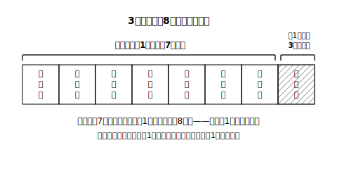

# L06 「〜でない」確率——1から引くという近道

## ねらい

- あることがらについて、「起こる場合」と「起こらない場合」を合わせると全部の場合になることから、**（〜でない確率）＝1−（〜である確率**）が成り立つことを、数え上げで確かめて使えるようになる。
- 「**少なくとも1つは〜**」型のことがらを「〜でない」の側から数える見方を身につける。

## 主概念1：外れの確率は、当たりから分かる

10本のうち当たりが3本入っているくじから、1本引く。**はずれる確率**はいくらだろう。

まともに数えれば、はずれは10−3＝7本だから 7/10。ここで数の関係をよく見ると、

> （はずれの確率）＝ 7/10 ＝ (10−3)/10 ＝ 1 − 3/10 ＝ 1 −（当たりの確率）

となっている。偶然ではない。どんなことがらAでも、**Aが起こる場合とAが起こらない場合を合わせると、起こり得る全部の場合**になる（どの場合も、Aが起こるか起こらないかのどちらか一方だ）。場合の数で書けば（Aの起こらない場合の数）＝n−a。だから

> **（Aの起こらない確率）＝ (n−a)/n ＝ 1 − a/n ＝ 1 −（Aの起こる確率）**

「〜でない」側をいちいち数えなくても、「〜である」側の確率を1から引けばよい。

:::guide
**近道は、遠回りで一度確かめてから使う**

1−pの式は便利だが、**丸暗記した式は事故のもと**。はじめのうちは、①「〜でない」場合を樹形図・表で直接数える、②1−pで計算する、の両方をやって一致を確かめよう（answer_keyの解答もこの様式で書いてある）。一致を数回体験すると、「起こる＋起こらない＝全部」という理屈ごと体に入る。理屈ごと入れば、テスト中に式の形を忘れても自力で復元できる。
:::

## 主概念2：「少なくとも1枚は表」は、裏側から数える

3枚の硬貨を同時に投げて、「**少なくとも1枚は表**になる」確率を求めよう。

正面から数えると、「表が1枚」「表が2枚」「表が3枚」を全部拾うことになる。L04の樹形図（8通り）で数えれば 3＋3＋1＝7通り、確率は**7/8**。できるにはできるが、拾う場所が多い。

そこで言い換えに気づきたい。「少なくとも1枚は表」が**起こらない**のは、どんなときか——**1枚も表がない**、つまり「3枚とも裏」のときだけだ。3枚とも裏は8通り中1通りで確率1/8。よって

> （少なくとも1枚は表になる確率）＝ 1 −（3枚とも裏になる確率）＝ 1 − 1/8 ＝ **7/8**

直接数えた7/8と一致した。「**少なくとも〜**」と来たら、「起こらないのはどんなときか」をまず考える——反対側が1通りや2通りしかないことが多く、そちらから数える方が圧倒的に楽なのだ。

:::zatsudan
「少なくとも1枚は表」を正面から数えようとすると、1枚・2枚・3枚と場合分けの荷物が増えていく。ところが裏口に回ると「全部裏」のたった1通り。数学にはこういう「正面玄関は行列、裏口はがら空き」という場面がときどきある。問題に真正面からぶつかるのは立派だけれど、**回り込んだら一瞬**という道がないか探すのも、同じくらい大事な数学の力なんだ。
:::

## 主概念3：使いどころの見きわめ

2つのさいころ（36通り）で、「**目の和が4にならない**確率」を求めよう。和が4になるのは (1,3)(2,2)(3,1) の3通りで、確率は 3/36＝1/12。よって

> （和が4にならない確率）＝ 1 − 3/36 ＝ 33/36 ＝ **11/12**

直接数えるなら36−3＝33マスを確認することになる——1から引く方が明らかに速い。目安はこうだ: **「〜でない」「少なくとも」の形のことがら、または数える側が全体の大半を占めることがら**は、反対側から数える。どちらで解いても答えは同じだから、迷ったら速そうな側を選び、余裕があればもう一方で検算すればよい。

:::guide
**1−pが使えるのは「起こる・起こらない」で全部を二分できるときだけ**

1−pの理屈の土台は「Aが起こる場合＋起こらない場合＝全部の場合」という**二分**にある。たとえば「和が7の確率」と「和が10の確率」を足しても1にはならない（この2つで全部を尽くしていないから）。1から引く前に、「いま引こうとしている確率は、本当に『残り全部』の確率か？」と一度確認する習慣を付けよう。
:::

## 練習

1. 1個のさいころを1回投げるとき、6の目が**出ない**確率を求めよう（①直接数える②1から引く、の両方で）。
2. 2枚の硬貨を同時に投げるとき、「少なくとも1枚は裏になる」確率を求めよう。
3. 大小2つのさいころを同時に投げるとき、2つの目が**同じにならない**確率を求めよう。
4. ジョーカーを除く52枚のトランプをよくきって1枚引くとき、絵札（ジャック・クイーン・キング）で**ない**カードを引く確率を求めよう。

:::stretch
**S1** 3人（A・B・C）がじゃんけんを1回する（だれもどの手を出すことも同様に確からしいとする。出し方は3×3×3＝27通り）。「あいこにならない」確率を、次の手順で求めよう。①あいこ（3人が同じ手、または3人がグー・チョキ・パーを1つずつ）の場合の数を樹形図で数える ②1から引く。
:::

---

対応解答: answer_key_L06-09.md

<!-- gen_nav:nav:start（自動生成・手編集しない） -->

---

[← 前のレッスン](lesson_05.md)｜[単元の目次](README.md)｜[解答](answer_key_L06-09.md)｜[次のレッスン →](lesson_07.md)

<!-- gen_nav:nav:end -->
