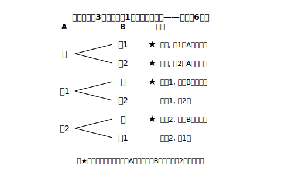
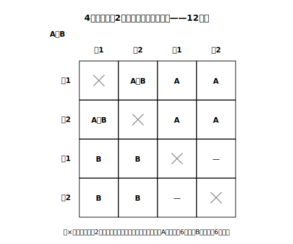

# L07 くじ引きは何番目でも公平か

## ねらい

- 引いたくじを**戻さない**くじ引きを樹形図で数え上げ、先に引く人と後に引く人の当たる確率を求められるようになる。
- 「**確率が等しいから公平である**」という、確率を根拠にした説明を書けるようになる。

## 主概念1：先に引くのと、後に引くのと

3本のうち当たりが1本入っているくじがある。Aさんが先に1本引き、引いたくじは**戻さずに**、続いてBさんが1本引く。**先に引くAさんと後に引くBさんでは、どちらが当たりやすいだろうか**。

読み進める前に、自分の予想と理由を書いておこう。「先に引く方が、当たりくじがまだ残っているから有利」「後に引く方は、前の人の結果次第だから不利」——いろいろな直観があるはずだ。この章の作法どおり、**予想→数え上げ→比較**で決着をつける。

## 主概念2：樹形図でかき切る——くじに名前を付けて

まず名前を付ける（L03のルール）。当たりくじを「当」、2本のはずれくじを「は1」「は2」と**区別**する。Aの引くくじ→Bの引くくじの順に樹形図をかく。Aが引いたくじは戻さないから、**Bの枝にはAが引いたくじが現れない**——枝の本数が途中で変わる、樹形図の出番だ（L05主概念3）。

全部で**6通り**。3本のくじはよく混ぜてあり、どのくじの引かれ方も同様に確からしいから、6通りはどれも同じ程度に起こる。

- Aさんが当たるのは（当,は1）（当,は2）の**2通り** → 確率 2/6＝**1/3**
- Bさんが当たるのは（は1,当）（は2,当）の**2通り** → 確率 2/6＝**1/3**

**同じ**だった。そこで、結論をこう書く。

> Aさんの当たる確率は1/3、Bさんの当たる確率も1/3で**等しい**。したがって、**このくじ引きは先に引いても後に引いても公平である**。

これが「**確率が◯だから、…である**」という説明の形だ。確率を求めて終わりにせず、求めた確率を**根拠**にして、聞かれたこと（公平かどうか）に**結論**で答え切る。

:::guide
**「Bは前の人次第なのに、なぜ確率が決まるのか」**

「Bの当たりやすさはAの結果で変わるのでは？」という違和感は自然だ。たしかにAが当たりを引いた**後なら**Bは絶対に当たらない。しかしいま求めているのは、くじ引きが始まる**前**に見たBの当たりやすさ——樹形図の6通りには「Aが当たりを引いてしまう未来」も「Aがはずれる未来」も全部ふくまれていて、そのうえでBの当たりは2通りある。**どの時点から見た確率か**を意識すると、この違和感は解消する（引いた後の話まで数に入れたいなら、それはずっと先の学習になる）。
:::

:::zatsudan
席替えのくじ、掃除当番のくじ、賞品の抽選——くじ引きが「もめない道具」になれるのは、何番目に引いても当たる確率が同じだと**数え上げで示せる**から。「オレ後だからズルい！」に「いや、確率は同じ」と答えられる。だれかの気分や声の大きさではなく、全部の場合をかき切った数で決める——くじ引きは、教室の中のささやかな数学的公正なんだ。
:::

## 主概念3：当たり2本ならどうか——設定を変えて確かめる

公平は偶然だったのか？ 設定を変えて確かめよう。**4本のうち当たりが2本**のくじを、A→Bの順に（戻さずに）引く。当たりを当1・当2、はずれをは1・は2と名前を付けて樹形図をかくと、Aの枝4本×Bの枝3本＝**12通り**。数えると（answer_keyに全12通りを載せた）、

- Aさんが当たり: 6通り → 6/12＝**1/2**
- Bさんが当たり: 6通り → 6/12＝**1/2**

やはり等しい。当たりの本数を変えても、**何番目に引くかで有利・不利は生まれない**——くじ引きの公平性は、設定を取り替えても成り立つ頑丈な事実らしい、と確かめられた。

:::guide
**説明の答案は3行で書く**

公平かどうかを問う記述問題の答案は、次の3行型で書けばまず崩れない。
①（数え上げ）「起こり得る場合は全部で◯通りで、どれも同様に確からしい」
②（根拠）「Aの当たる確率は◯、Bの当たる確率は◯」
③（結論）「確率が等しい（等しくない）から、公平である（〜の方が有利である）」
①を省くと「なぜその確率と言えるのか」が宙に浮く。**樹形図・表そのものが説明の一部**——答案に図ごと書く。
:::

## 練習

1. 主概念2のくじ（3本中当たり1本）で、「AもBも当たらない」確率を樹形図から求めよう。
2. 主概念2のくじ引きを、「Aが引いたくじを**戻してから**Bが引く」ルールに変える。このときBさんが当たる確率を求め、戻さない場合と比べよう。
3. 2本のうち当たりが1本のくじを、Aさん→Bさんの順に（戻さずに）引く。AさんとBさんの当たる確率をそれぞれ求め、公平かどうかを主概念3のguideの3行型で説明しよう。
4. 「くじは残り物に福があるから、最後に引く人が有利だ」という主張に対して、主概念2の樹形図を根拠に反論を書こう。

:::stretch
**S1** 3本中当たり1本のくじをA→B→Cの3人が順に（戻さずに）引くとき、Cさん（最後）の当たる確率を樹形図で求めよう。（全部で6通り。A・Bと比べてどうなるだろうか。）
:::

---

対応解答: answer_key_L06-09.md

<!-- gen_nav:nav:start（自動生成・手編集しない） -->

---

[← 前のレッスン](lesson_06.md)｜[単元の目次](README.md)｜[解答](answer_key_L06-09.md)｜[次のレッスン →](lesson_08.md)

<!-- gen_nav:nav:end -->
