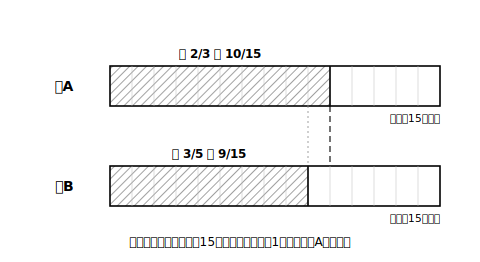
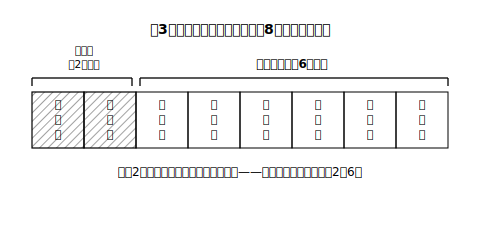

# L08 「確率が◯だから」——判断を説明する型

## ねらい

- 直観で判断しそうな場面（どちらが出やすいか・ゲームは公平か）で、確率を**比較できる形にそろえて**求め、それを根拠に判断を**説明**できるようになる。
- 「根拠（確率の値）＋結論（判断）」の記述の型を、くじ引き以外の場面にも使えるようになる。

## 主概念1：「多い方が出やすい」は本当か

2つの袋がある。**袋A**には赤玉2個と白玉1個、**袋B**には赤玉3個と白玉2個が入っている。どちらかの袋をよく混ぜて玉を1個取り出す（どの玉が取り出されることも同様に確からしいとする）。赤玉なら成功だ。**どちらの袋を選ぶべきだろうか**。

「袋Bは赤玉が3個もあるんだから、Bでしょ」——赤玉の**個数**は確かにBが多い。しかし出やすさを決めるのは個数そのものではなく、**全体に対する割合**、つまり確率だ。予想を書いたら、計算で確かめよう。

- 袋A: 全部で3個、赤玉2個 → 赤玉の確率 **2/3**
- 袋B: 全部で5個、赤玉3個 → 赤玉の確率 **3/5**

さて、2/3と3/5はどちらが大きいか。分母がちがう分数の比較だから**通分**する。2/3＝10/15、3/5＝9/15。

> 袋Aの赤玉の確率は10/15、袋Bは9/15で、**袋Aの方が大きい**。したがって、**袋Aを選ぶ方が赤玉が出やすい**。

赤玉の個数が多い袋Bが負けた。個数のような目立つ数字に引っぱられず、**同じものさし（通分した確率）にそろえてから比べる**。これが確率で判断するということだ。

:::guide
**比較の場面では「そろえてから比べる」を型にする**

確率どうしの大小比較で分母がちがうときは、通分（または小数に直す: 2/3＝0.66…、3/5＝0.6）でものさしをそろえてから比べる。答案では「10/15＞9/15だから」のように、**そろえた後の形を書いてから**大小を言うこと。「2/3の方がなんとなく大きい」では根拠にならない。そろえる作業そのものが説明の一部だ。
:::

## 主概念2：このゲーム、乗ってよいか

こんなゲームに誘われたとしよう。「**3枚の硬貨を投げて、3枚とも同じ面ならきみの勝ち、それ以外ならわたしの勝ち**。勝ち負けの種類は『そろう』か『そろわない』かの2通りだから、五分五分だよ」。

——この章をここまで学んだ目には、あやしさが2つ見えるはずだ。①「2通りだから五分五分」は、**同様に確からしいかの確認を飛ばしている**（L03の3通り説と同じ穴）。②確かめる道具は自分が持っている。L04の樹形図（8通り）で数えると、3枚とも同じ面は（表表表）（裏裏裏）の**2通り**。

> きみが勝つ確率は 2/8＝**1/4**、相手が勝つ確率は 6/8＝**3/4**。確率が等しくないから、**このゲームは公平ではなく、相手が有利である**。

「五分五分だよ」ということばに、数え上げで反論できた。確率は、うのみにしない力でもある。

:::zatsudan
「不確定な事象」。さいころの目も、くじの結果も、次の1回はだれにも分からない。それでも「どちらが起こりやすいか」なら、樹形図と表で**きちんと比べられる**。未来を言い当てる魔法ではないけれど、「分からないなりに、賢く選ぶ」ための数、それが確率。次の1回が分からないことと、選び方に良し悪しがあることは、両立するんだ。
:::

## 主概念3：不公平なら、直せばいい

主概念2のゲームは1/4対3/4で不公平だった。では、**ルールをどう変えれば公平になる**だろうか。

たとえば「**ちょうど2枚が表**ならきみの勝ち、**ちょうど2枚が裏**ならわたしの勝ち、それ以外は引き分けにしてやり直し」としてみる。樹形図で数えると、ちょうど2枚表は3通り（3/8）、ちょうど2枚裏も3通り（3/8）で**等しい**。これなら公平だ。

判定（公平か否か）で終わらず、**確率をそろえるようにことがらを選び直す**ところまでできれば、確率は「使える」道具になったと言える。ルールの直し方は1通りではない。自分の案が公平かどうかは、必ず樹形図・表で確かめること。

:::guide
**説明問題の自己チェックリスト**

書いた答案を出す前に、この4つを確認しよう。
①場合の数の根拠（樹形図・表・「全部で◯通り、どれも同様に確からしい」）を書いたか
②確率を**比較できる形**（通分・同じ分母）で示したか
③聞かれたこと（どちらが有利か・公平か）に**結論で答え切った**か
④確率の値だけ書いて文を終えていないか（「確率は1/4」で終わるのは、根拠だけ書いて判断を書いていない答案）
この章の記述問題は、計算力よりこのチェックの丁寧さで差がつく。
:::

## 練習

1. 袋Xには赤玉3個と白玉3個、袋Yには赤玉4個と白玉5個が入っている。どちらの袋もよく混ぜて玉を1個取り出すとき、赤玉が出やすいのはどちらの袋か。確率を比較できる形にそろえて説明しよう。
2. 大小2つのさいころを投げて、「目の和が6以下ならAさんの勝ち、7以上ならBさんの勝ち」というゲームは公平か。36マスの表で数えて、3行型で説明しよう。
3. 練習2のゲームを公平に直したい。「和が7のときは引き分けにしてやり直し、6以下ならA、8以上ならB」という案は公平になっているか、確かめよう。
4. 「2枚の硬貨を投げて、2枚とも表ならあなたの勝ち、2枚とも裏ならわたしの勝ち、1枚ずつなら引き分け」。このゲームは公平と言えるか。樹形図を根拠に説明しよう。

:::stretch
**S1** 自分で「一見公平そうに見えて、実は不公平なゲーム」を1つ設計してみよう（硬貨・さいころ・くじ・玉のどれを使ってもよい）。そのゲームが不公平であることの説明（3行型）と、公平に直すルール案までをセットで書けたら完成。
:::

---

対応解答: answer_key_L06-09.md

<!-- gen_nav:nav:start（自動生成・手編集しない） -->

---

[← 前のレッスン](lesson_07.md)｜[単元の目次](README.md)｜[解答](answer_key_L06-09.md)｜[次のレッスン →](lesson_09.md)

<!-- gen_nav:nav:end -->
