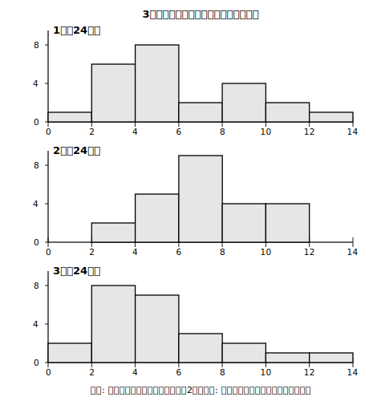
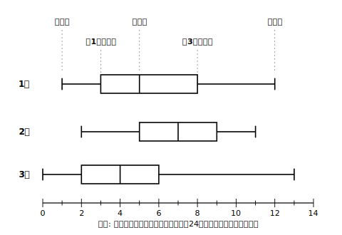

# L01 グラフが多すぎて比べられない——箱ひげ図との出会い

## ねらい

- ヒストグラムを何枚も並べて比べることの大変さを体感し、**複数の集団を比べるための新しい図**が必要になる場面を知る。
- **箱ひげ図**から5つの値（最小値・第1四分位数・中央値・第3四分位数・最大値）を読み取れるようになる。
- **箱で示された区間に、全てのデータのうち真ん中に集まる約半数が含まれる**——この読み方を最初に固定する。

## 準備運動：道具箱の点検（前提診断）

この章では、これまでに学んだ「データの整理」の道具を総動員する。次の4問で点検しておこう。

1. 7人の生徒の先週の読書時間（時間）は 1, 2, 3, 5, 6, 8, 10 だった。中央値を求めよう。
2. 8人の生徒の通学時間（分）は 5, 7, 8, 10, 12, 15, 18, 20 だった。中央値を求めよう。
3. 問2のデータの範囲（最大値−最小値）を求めよう。
4. ヒストグラムで、ある階級の長方形が他より高いことは何を表しているだろう。

問1と問2で求め方が違ったことに注意——データが**奇数個ならど真ん中の値**、**偶数個なら真ん中2つの平均**。この場合分けは、この章の主役「四分位数」を求めるときにくり返し登場する。あやしかった人は、ここで確実にしておこう。

## 主概念1：ヒストグラム3枚は、いっぺんに比べられない

図書委員のあなたが、1組・2組・3組の「先週の家庭学習時間」を調べて、クラスごとにヒストグラムを作ったとしよう。

<!-- figure-spec: 意図=ヒストグラム複数枚の比較が視覚的に大変であることの体感（必要性の導入）。データ=3クラス各24人の家庭学習時間(架空・1組=山が中央4〜6/2組=山がやや右6〜8/3組=山が左2〜4で右すそ長)。軸=横軸0〜14時間(階級幅2)・縦軸度数(人)・3枚縦並び。生成方法=assets_provenance/generate_figures.py のパラメトリックSVG（度数を生データから再集計しassert検算・主概念2の箱ひげ図と同一データ） -->

1枚1枚はよく分かる。でも「どのクラスがいちばん勉強しているか」「散らばりが大きいのはどこか」を答えようとすると、3枚のあいだで目を往復させることになる。これが5クラス、10クラスだったら？　ヒストグラムは**1つの集団の分布の形**を見るのは得意だが、**たくさんの集団を並べて比べる**のは苦手なのだ。

そこで発想を変える。**1つの集団の情報を、思い切って数個の値に縮めてしまい**、その数個だけを図にすれば、何本でも並べて比べられるはずだ。情報を縮める——これがこの章の合言葉になる。

## 主概念2：箱ひげ図——5つの値だけでデータを語る

同じ3クラスのデータを、新しい図で表すとこうなる。

<!-- figure-spec: 意図=箱ひげ図の初対面（3本並置の一覧性と5つの値の名前の導入）。データ=家庭学習時間・各24人(架空)。1組=1/3/5/8/12・2組=2/5/7/9/11・3組=0/2/4/6/13。生成時制約=主概念1のヒストグラムと同一の生データ3クラス分から両図を生成（五数要約と山の位置の両立をスクリプトでassert検算——充足済み）。軸=横軸0〜14時間・縦3本(1組にだけ五数の名前を引き出し線注記・数値ラベルなし)。生成方法=assets_provenance/generate_figures.py のパラメトリックSVG -->

この図を**箱ひげ図**（はこひげず）という。使う値はたった5つだ。

- **最小値**・**最大値**——データの両端。ひげの先がここまでのびる。
- **中央値**——データを大きさの順に並べたときの真ん中の値（小学校で学んだあの中央値）。箱の中の縦線。
- **第1四分位数**・**第3四分位数**——箱の左端と右端。データを小さい順に並べて**四つに等しく分けたときの区切りの値**で、くわしい求め方はL03で学ぶ。今日は「箱の両端の値」として読み取れれば十分。

3本を同じ数直線の上に並べると、「2組の箱はいちばん右にある」「3組は左寄りで、右に長くひげがのびている」——比較が**一目**でできる。ヒストグラム3枚とくらべてほしい。情報をたった5つの値に縮めた見返りが、この一覧性だ。

:::guide
**「たった5つに縮めて、大事なことが消えないの？」**

いい疑問で、答えは「消えるものもある」。箱ひげ図では、山がいくつあるかといった**分布の形**は見えなくなるし、**平均値**も図に書き込まれていない限り読み取れない。何が消えて何が残るかは、この章の最後（L06）で正面から扱う。道具の限界を知って使うのが、データの活用の流儀だ。
:::

## 主概念3：箱の意味——真ん中に集まる「約半数」がそこにいる

箱ひげ図の読み方で、最初に固定してほしいことが1つある。

> **箱で示された区間には、全てのデータのうち、真ん中に集まる約半数のデータが含まれる。**

1組の箱は3時間から8時間。つまり「1組の24人のうち、真ん中あたりの**約半数（約12人）**は、家庭学習時間が3〜8時間の範囲にいる」と読める。残りの約半数は、左のひげ側と右のひげ側に**約4分の1ずつ**分かれている。

「**約**半数」の「約」を落とさないでほしい。データの個数や同じ値の重なり方によって、ぴったり半数になるとは限らないからだ（次のL02で、実際に数えて確かめる）。

そして、ここで先に1本くぎを打っておく。箱の**長さ**は「真ん中の約半数がどれくらいの幅に**散らばっている**か」を表すのであって、**箱が長いほどデータの個数が多いわけではない**。個数はどの部分でも約4分の1ずつ——長い箱も短い箱も、中にいる人数の割合はほぼ同じだ。これは多くの人がひっかかるポイントなので、L02でじっくり実験する。

:::zatsudan
この「箱ひげ図」、実は君たちのすこし上の世代は高校で習っていた内容なんだ。今の学習指導要領（平成29年告示）で高校の数学Iから中2に移されて、2020年度の中2から前倒しで教えられるようになった、教科書の中でもかなり新しい章。世の中でデータを読む力がそれだけ大事になってきた、ということの表れでもあるね。
:::

## 練習

1. 2組の箱ひげ図（主概念2の図）から、最小値・第1四分位数・中央値・第3四分位数・最大値を読み取ろう。
2. 1組で、真ん中に集まる約半数の生徒が入っている区間は何時間から何時間だろう。
3. 中央値がもっとも大きいのはどのクラスだろう。また、そのことは「そのクラスの全員が他のクラスより長く勉強している」ことを意味するだろうか。
4. 次の文が正しければ○を、正しくなければ×を付けて理由を言おう。
   (1) 1組には、家庭学習時間が12時間の生徒が少なくとも1人いる。
   (2) 3組は1組より箱が短いので、3組の方が人数が少ない。
   (3) 2組の生徒の約半数は、家庭学習時間が5時間以上9時間以下の区間にいる。

:::stretch
**S1** ヒストグラムを作るにも、実は「1人1人の生データ→階級ごとの度数」という情報の縮約が起きている。箱ひげ図はさらに5つの値まで縮める。「情報を縮めると、比べられる集団の数が増える」——この関係を、生データ・ヒストグラム・箱ひげ図の3段階で、自分の言葉で説明してみよう。（気になる人は「データ 要約 なぜ必要」で調べてみると、統計の考え方の入り口が見つかる。）
:::

---

対応解答: answer_key_L01-03.md

<!-- gen_nav:nav:start（自動生成・手編集しない） -->

---

[単元の目次](README.md)｜[解答](answer_key_L01-03.md)｜[次のレッスン →](lesson_02.md)

<!-- gen_nav:nav:end -->
