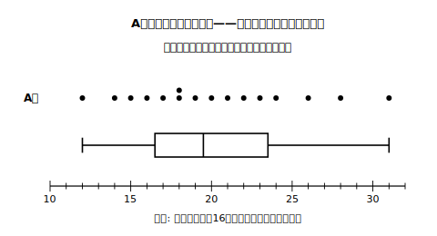
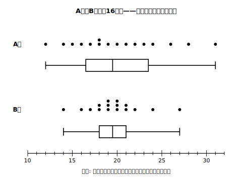

# L02 箱の中には「約半数」——箱ひげ図の読み方

## ねらい

- ドットプロット（1人1点の図）と箱ひげ図を並べて、**箱の区間に真ん中の約半数が入る**ことを自分の目で数えて確かめる。
- **箱の長さはデータの個数を表さない**ことを、同じ人数の2つの班の比較で確かめる。
- ヒストグラムの形と箱ひげ図の形を対応づけられるようになる。

## 主概念1：数えてみよう——箱の中には何人いる？

A班16人の「上体起こしの回数」を調べたら、次のようになった（小さい順）。

**A班（回）**: 12, 14, 15, 16, 17, 18, 18, 19, 20, 21, 22, 23, 24, 26, 28, 31

このデータのドットプロット（1人を1つの点で表した図）と箱ひげ図を、同じ数直線の上に重ねてかくとこうなる。

<!-- figure-spec: 意図=箱の区間に入るデータの個数を実際に数えさせる（「約半数」の実測）。データ=A班16人の上体起こし回数(本文の生データ)・五数=12/16.5/19.5/23.5/31。軸=横軸10〜32回・上段ドットプロット(1人1点・18は2点積み)・下段同じ数直線上の箱ひげ図。生成方法=assets_provenance/generate_figures.py のパラメトリックSVG（五数を教科書方式で再計算・箱内8人をassert検算） -->

箱は16.5回から23.5回まで。**箱の区間の真上にあるドットを数えてみよう**——17, 18, 18, 19, 20, 21, 22, 23 の**8人**。16人のちょうど半数だ。左のひげ側（12〜16）に4人、右のひげ側（24〜31）に4人——**約4分の1ずつ**が両側に分かれている。

L01で予告したとおり、箱ひげ図の箱には「真ん中に集まる**約半数**」が入る。この例ではちょうど半数だったが、データの個数や同じ値の重なり方によっては、ぴったりにはならない。同じ値がたくさん重なるデータでは、箱の中の割合が半数から大きくずれることもある。だから「約」を付けて言う——この一語がある答えとない答えでは、正確さがまるで違う。

:::guide
**ひげも合わせると、図の全体の幅は「範囲」**

ひげの左端（最小値）から右端（最大値）までの長さは、中1で学んだ**範囲**（最大値−最小値）そのものだ。A班なら 31−12＝19回。つまり箱ひげ図1本には、範囲（全体の幅）と「真ん中の約半数の幅」（箱）が同時に写っている。この「箱の幅」には次のL04で正式な名前が付く。
:::

## 主概念2：箱が短い＝人数が少ない？——同じ16人で実験

今度はB班16人の記録だ（小さい順）。

**B班（回）**: 14, 16, 17, 18, 18, 19, 19, 19, 20, 20, 20, 21, 21, 22, 24, 27

<!-- figure-spec: 意図=同じ人数(16人ずつ)なのに箱の長さが大きく違う2本を並べ「箱の長さ=個数」の誤読を反証（本単元最大の誤概念への中心活動）。データ=A班・B班各16人の生データ(本文)・A班五数=12/16.5/19.5/23.5/31・B班五数=14/18/19.5/21/27。軸=横軸10〜32回・上からA班ドット・A班箱ひげ・B班ドット・B班箱ひげの4段。生成方法=assets_provenance/generate_figures.py のパラメトリックSVG（両班の五数と打点数16をassert検算） -->

A班の箱の長さは 23.5−16.5＝7回分。B班の箱は 21−18＝3回分しかない。箱ひげ図だけをパッと見ると、「B班は箱が小さい……人数が少ないのかな？」と感じた人はいないだろうか。

**ドットを数えてほしい。どちらも16人だ。**

箱が短いのは、B班の真ん中の約半数が**18〜21回のせまい幅にぎゅっと集まっている**から。箱が長いA班は、真ん中の約半数が**広い幅に散らばっている**から。つまり——

> **箱の長さが表すのは「真ん中の約半数の散らばりの幅」。データの個数ではない。**

個数の割合は、長い箱でも短い箱でも「約半数」で変わらない。ひげについても同じで、**ひげが長い＝その側に人が多い、ではない**。ひげ側にいるのは約4分の1ずつで、長いひげは「その約4分の1の散らばりの幅が広い」ことを表す（幅が広いだけで、その中のどこに集まっているかまでは分からない）。

この読みちがいは、大学生でもやってしまうという報告があるくらい、しつこい。この章では今後も何度か、別の場面でこの点を確かめ直す。

:::zatsudan
「箱には真ん中の約半数が入る」——このシンプルな1文が、箱ひげ図のいちばんの発明ポイントなんだ。何百人・何万人のデータでも、箱を見れば「真ん中の約半数はこの範囲」と一瞬で分かる。たくさんの集団を並べても読める——箱ひげ図のこの強さは、比べる集団の数が増えるほど効いてくるんだ。
:::

## 主概念3：ヒストグラムの形と箱ひげ図の形

中1のヒストグラムと箱ひげ図は、同じデータの2つの顔だ。対応のコツは次の2つ。

- **山のある(度数の多い)あたり**では、データがぎゅっと詰まっている→四分位数の区切りがせまい間隔で並ぶ→**箱ひげ図のパーツが短くなる**。
- **すそ(度数の少ない)側**では、データがまばら→区切りの間隔が広がる→**ひげや箱がその方向に長くのびる**。

たとえば、山が左にあって右にすそが長いヒストグラムなら、箱ひげ図は左寄りに箱があり、右のひげが長くなる。

ただし、この対応づけは「ヒストグラムの形→箱ひげ図の形」の向きで使う目安だ。逆向きに、箱ひげ図だけから山の数など分布の細かい形を復元することはできない（このことはL06で正面から確かめる）。

:::guide
**箱ひげ図から読み取れないもの——平均値**

箱ひげ図の5つの値の中に平均値は入っていない。だから、箱ひげ図から平均値は**図に書き込まれていない限り読み取れない**。書き込む場合は＋などの印で示す流儀がある。「中央値＝平均値」と思い込まないこと——2つは別の代表値で、一致するとは限らない（極端にかけ離れた値があると大きくずれる。この話はL04でもう一度出てくる）。
:::

:::guide
**最小値・第1四分位数・中央値・第3四分位数・最大値の5つ組**

この5つ組は、慣用的に「**五数要約**」と呼ばれることがある。便利な呼び名だが、学習指導要領で決められた正式用語ではないので、テストの答案では5つの値の正式な名前（最小値・第1四分位数・中央値・第3四分位数・最大値）で書くのが安全だ。
:::

## 練習

1. A班のドットプロットで、右のひげの区間（23.5回より大きい側）にいるのは何人か数えよう。それは16人の約何分の1にあたるだろう。
2. 次の文が正しければ○を、正しくなければ×を付けて理由を言おう。
   (1) B班はA班より箱が短いので、B班の方が人数が少ない。
   (2) A班の右のひげはB班より長いので、A班では記録の大きい側の約4分の1が広く散らばっている。
   (3) 箱の外（両ひげの区間）にあるデータは、合わせると全体の約半数である。
3. 次のヒストグラムの説明ア〜ウと箱ひげ図の説明A〜Cを、正しく対応させよう。
   - ア: 山が左寄りで、右にすそが長い。
   - イ: 左右対称の一山。
   - ウ: 山が右寄りで、左にすそが長い。
   - A: 箱が右寄りにあり、左のひげが長い。
   - B: 中央値が全体のほぼ真ん中にあり、左右のひげがほぼ同じ長さ。
   - C: 箱が左寄りにあり、右のひげが長い。
4. B班の箱ひげ図から範囲を求めよう。また、A班と範囲を比べ、どちらが大きいか答えよう。

:::stretch
**S1** ある中学校の2年生160人の反復横とびの記録を1本の箱ひげ図に表したとき、箱の区間に入っている人数はおよそ何人と考えられるだろう。また「およそ」と付けなければならない理由を、A班・B班の例をもとに説明してみよう。
:::

---

対応解答: answer_key_L01-03.md

<!-- gen_nav:nav:start（自動生成・手編集しない） -->

---

[← 前のレッスン](lesson_01.md)｜[単元の目次](README.md)｜[解答](answer_key_L01-03.md)｜[次のレッスン →](lesson_03.md)

<!-- gen_nav:nav:end -->
