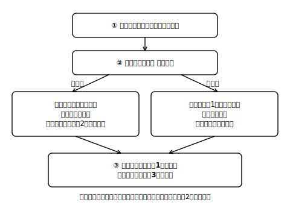
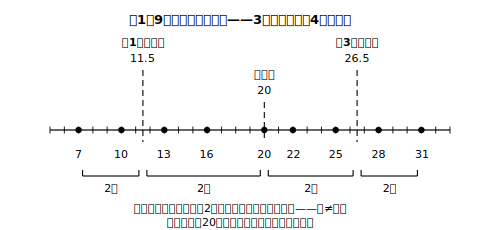

# L03 四分位数の求め方——データを4等分する3つの区切り

## ねらい

- **四分位数**（第1四分位数・第2四分位数＝中央値・第3四分位数）を、採用方式にしたがって求められるようになる。
- データが**奇数個のとき・偶数個のとき**の手順の違いを、場合分けチャートで整理する。
- 求めた四分位数を「**数えて確かめる**」検算の型を身につける。

## 主概念1：3つの区切りでデータを「四つに等しく分ける」

L01・L02では、箱ひげ図を「読む」だけだった。今日は箱の両端——**四分位数**（しぶんいすう）を自分で求める。

> **四分位数とは、全てのデータを小さい順に並べて四つに等しく分けたときの、三つの区切りの値のこと。**

小さい方から順に**第1四分位数**、**第2四分位数**、**第3四分位数**という。真ん中の区切り＝第2四分位数は、実は**中央値そのもの**だ。つまり新しく求め方を覚えるのは第1・第3の2つだけで、その2つも「半分にしたデータの中央値」にすぎない。手順はこうだ。

1. **データを小さい順に並べる。**（すでに並んでいても、必ず個数を数える）
2. **中央値（第2四分位数）で、前半と後半に分ける。**データが奇数個のときは、ど真ん中の値＝中央値は**前半にも後半にも入れない**。
3. **前半の中央値が第1四分位数、後半の中央値が第3四分位数。**

この求め方は、四分位数の意味（4等分の区切り）がそのまま見える方法だ。この教材では、**すべての問題をこの方式で**解き、答えもこの方式で検算する。

**例1（データが奇数個・割り切れないケース）** ある学級文庫の、9週間の貸出冊数（冊）を小さい順に並べた。

7, 10, 13, 16, **20**, 22, 25, 28, 31

- 9個の真ん中は5番目→**中央値（第2四分位数）＝20**。
- 中央値を除いて前半は 7, 10, 13, 16 の4個。その中央値は2番目と3番目の平均→**第1四分位数＝(10＋13)÷2＝11.5**。
- 後半は 22, 25, 28, 31 の4個→**第3四分位数＝(25＋28)÷2＝26.5**。

四分位数は、このように**データにない値（小数）になってもよい**。区切りの「位置」を表す値だからだ。

**例2（データが偶数個・割り切れるケース）** ある町の、4月のはじめの10日間の最高気温（℃）を小さい順に並べた。

12, 14, 15, 17, 19 ｜ 21, 24, 26, 28, 30

- 10個の真ん中は5番目と6番目の間→**中央値＝(19＋21)÷2＝20**。
- 前半は 12, 14, 15, 17, 19 の5個。その中央値は3番目→**第1四分位数＝15**。
- 後半は 21, 24, 26, 28, 30 の5個→**第3四分位数＝26**。

こちらは区切りがデータの値そのものに重なった。**割り切れるときも、割り切れないときもある**——どちらも正しい答えだ。

:::guide
**Q1・Q2・Q3という略記について**

第1四分位数・第2四分位数・第3四分位数は、慣用的に**Q1・Q2・Q3**と略記されることがある（Qは英語のquartile＝四分位数の頭文字）。便利なので見かけたら読めるようにしておくとよいが、学習指導要領で決められた正式な書き方ではない。答案では「第1四分位数」のように正式な名前で書くのが安全だ。
:::

## 主概念2：場合分けチャート——迷ったら「まず個数」

手順が枝分かれするのは2か所ある。**全体が奇数個か偶数個か**（中央値を除くかどうか）と、**半分にした側が奇数個か偶数個か**（ど真ん中をとるか、2つの平均をとるか）だ。次のチャートを手元に置こう。

<!-- figure-spec: 意図=四分位数計算の場合分けを1枚に固定し手順ミス（中央値の除き忘れ・平均のとり忘れ）を防ぐ。データ=フロー図（①小さい順に並べ個数を数える→②全体は偶数個？奇数個？→偶数=きっちり半分ずつ／奇数=ど真ん中の中央値を除いて分ける→③各半分の中央値が第1・第3四分位数）。軸=なし。生成方法=assets_provenance/generate_figures.py のパラメトリックSVG（手順ロジックを例1・例2に適用して本文の答えと一致をassert検算） -->

特に起こりやすいミスは、奇数個のときの**中央値の除き忘れ**と、**個数を数えずに目分量で半分にする**こと。だから手順1に「必ず個数を数える」を入れてある。n＝9なら「4個｜1個｜4個」、n＝10なら「5個｜5個」と、**分けた個数をメモしてから**中央値をとろう。

## 検算の型：「求めたら、数えて確かめる」

四分位数の定義は「四つに**等しく**分ける区切り」だった。だから検算はこうする。

> **3つの区切りでデータがほぼ同数の4ブロックに分かれているか、数えて確かめる。**

例1なら 7, 10 ｜ 13, 16 ｜（20）｜ 22, 25 ｜ 28, 31——中央値を除いた8個が**2個ずつの4ブロック** ✓。

<!-- figure-spec: 意図=「4等分の区切り」の意味の固定と、ブロックの幅≠個数の計算側からの確認（検算の型の可視化）。データ=例1の9個(7,10,13,16,20,22,25,28,31)・区切り=11.5/20/26.5。軸=数直線(値ラベルは各データ点の下)。生成方法=assets_provenance/generate_figures.py のパラメトリックSVG（五数・4ブロック各2個・幅4.5/8.5/4.5をassert検算） -->例2なら、第1四分位数（15）より小さい値は 12, 14 の2個、第3四分位数（26）より大きい値は 28, 30 の2個——どちらも全体10個の約4分の1 ✓。

そしてここで、L02のくぎをもう一度。4ブロックの**個数はほぼ同じ**なのに、ブロックの**幅**（数直線上の広がり）はバラバラだ。例1では、どのブロックも個数は2個ずつだが、区切り（四分位数）で切った数直線上の幅はバラバラだ——最小値から第1四分位数まで（7〜11.5）は幅4.5、第3四分位数から最大値まで（26.5〜31）も幅4.5なのに、第1四分位数から中央値まで（11.5〜20）は幅8.5もある。**幅が広い＝個数が多い、ではない**——計算の側から見ても、箱の長さと個数が別ものだと分かる。

:::zatsudan
今日、中央値を何回使ったか数えてみよう。全体で1回、前半で1回、後半で1回——計3回だ。中央値は小6で出会った道具だけど、「半分にする」を重ねがけすると4等分の道具に化ける。数学では、新しい道具をゼロから作るより、手持ちの道具の使い方を一段深くすることの方が多いんだ。
:::

:::guide
**四分位数の求め方は、実は一通りではない**

世の中には四分位数の求め方（区切りの位置の決め方）が複数提案されていて、学習指導要領の解説も「幾つかの方法が提案されているが，ここでは四分位数の意味を把握しやすい方法を用いる」と述べたうえで、この教材と同じ方式を採っている。方法が違うと答えの値がわずかに変わることがあるが、中学の学習ではこの教材の方式で一貫させれば混乱しない。コンピュータの表計算ソフトが別の方式で計算することがある件は、L06で注意する。
:::

## 練習

**求めたら必ず「4ブロックの個数」で検算すること。**

1. 7人の生徒の、1週間の読書時間（時間）: 3, 5, 6, 8, 9, 12, 14
   第1四分位数・中央値・第3四分位数を求めよう。
2. 8人の生徒の通学時間（分）: 10, 13, 15, 16, 18, 21, 24, 29
   第1四分位数・中央値・第3四分位数を求めよう。
3. 11人の漢字テスト（30点満点）の得点が、採点した順に次のように記録されている。
   18, 7, 25, 12, 10, 15, 22, 9, 13, 30, 16
   四分位数を求めよう。（最初にやることは何だった？）
4. 12人の「けん玉チャレンジ」成功回数: 5, 6, 8, 9, 11, 12, 14, 15, 17, 20, 23, 26
   第1四分位数・中央値・第3四分位数を求め、最小値・最大値と合わせて5つの値を書き出そう。

:::stretch
**S1** データが13個のとき、この教材の方式では「中央値を除いて前半6個・後半6個」に分ける。このとき3つの区切りでできる4ブロックの個数の内訳を答え、「四つに**等しく**分ける」という言葉が、13個のような場合には「**ほぼ**等しく」の意味になることを説明してみよう。（発展: 求め方が複数ある理由が気になる人は「四分位数 求め方 なぜ複数」で調べてみよう。）
:::

---

対応解答: answer_key_L01-03.md

<!-- gen_nav:nav:start（自動生成・手編集しない） -->

---

[← 前のレッスン](lesson_02.md)｜[単元の目次](README.md)｜[解答](answer_key_L01-03.md)｜[次のレッスン →](lesson_04.md)

<!-- gen_nav:nav:end -->
