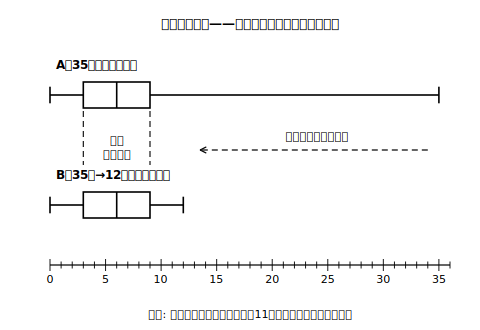
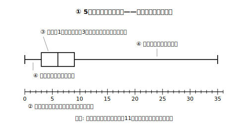

# L04 四分位範囲——「かけ離れた値」に強い散らばりの物差し

## ねらい

- **四分位範囲**（第3四分位数−第1四分位数）を求められるようになる。
- 中1で学んだ**範囲**との違い——**極端にかけ離れた値**の影響の受け方——を、実験で確かめる。
- 5つの値から**箱ひげ図をかく**手順を身につける。

## 主概念1：範囲のよわみ——たった1人で数字が跳ね上がる

11人の生徒が冬休みに借りた本の冊数を調べたら、こうなった（小さい順）。

**A：** 0, 2, 3, 4, 5, 6, 7, 8, 9, 10, **35**

1人だけ、35冊の読書家がいる。まず中1の**範囲**を求めると、35−0＝**35冊**。……でも、ちょっと待ってほしい。「このデータの散らばりは35冊分」と言われて、実感と合うだろうか。11人中10人は0〜10冊の中に収まっている。範囲の35という数字は、**ほとんど1人の生徒だけで作られている**。

範囲は「最大値−最小値」——両端の2つの値**だけ**で決まる。だから、**極端にかけ離れた値**が1つあると、その影響をまともに受けてしまう。

**実験してみよう。** もし35冊の生徒が12冊だったら（**B：** 0, 2, 3, 4, 5, 6, 7, 8, 9, 10, 12）、各値はどう変わるか。

| | A（35冊あり） | B（12冊に差し替え） |
|---|---|---|
| 範囲 | 35−0＝**35** | 12−0＝**12** |
| 中央値 | 6 | 6 |
| 第1四分位数 | 3 | 3 |
| 第3四分位数 | 9 | 9 |

範囲は35→12へ**激変**した。ところが、中央値も第1・第3四分位数も**1ミリも動いていない**（Aの四分位数: 中央値＝6番目の6、前半 0,2,3,4,5 の中央値＝3、後半 7,8,9,10,35 の中央値＝9。Bでも後半は 7,8,9,10,12 で中央値は9のまま）。区切りの値は「**何番目か**」で決まるから、端の1個がどんなに大きくても、順位が変わらなければ区切りは動かないのだ。

## 主概念2：四分位範囲——真ん中の約半数の幅を測る

そこで、両端の代わりに**箱の両端**で散らばりを測る物差し——**四分位範囲**（しぶんいはんい）を導入する。

> **四分位範囲＝第3四分位数−第1四分位数**

つまり**箱ひげ図の箱の長さ**であり、意味は「**真ん中に集まる約半数のデータが、どれくらいの幅に散らばっているか**」。上の実験なら、A・Bどちらも四分位範囲は 9−3＝**6冊**。

<!-- figure-spec: 意図=差し替え実験(35冊→12冊)の可視化。範囲は激変するのに箱(四分位数)は1ミリも動かないことを破線ガイドの上下対応で見せる。データ=A・B各11人の生データ(本文の表と同じ)・A五数=0/3/6/9/35・B五数=0/3/6/9/12。軸=横軸0〜36冊・2段。生成方法=assets_provenance/generate_figures.py のパラメトリックSVG（両データの五数・範囲35対12・四分位範囲6で不変をassert検算） -->

範囲と四分位範囲は、こう使い分ける。

- **範囲**: データ**全体**の幅。極端にかけ離れた値の影響を**受けやすい**。
- **四分位範囲**: 真ん中の**約半数**の幅。極端にかけ離れた値の影響を**ほとんど受けない**。

名前が似ているので、定義を丸暗記するより「**35冊の実験でどちらが動いたか**」で覚えるのがおすすめだ。テストで「四分位範囲を求めよ」と聞かれて範囲（最大値−最小値）を答えてしまう混同は起こりやすい。求める前に「箱の長さの方だっけ、全体の幅の方だっけ」と一呼吸おこう。

:::guide
**「外れ値」という言葉について**

35冊のように、他から極端にかけ離れた値のことを、「**外れ値**」と呼ぶことがある。ただし学習指導要領の解説がこの場面で使う言い方は「**極端にかけ離れた値**」で、「外れ値」は中2で正式に指定された用語ではない（どこからを外れ値とするかの決まった線引きも、中学では扱わない）。また、かけ離れた値を見つけたら機械的に無視してよいわけではない——記録ミスなのか、本当にそういう人がいるのか、**理由を考える**のがデータとの正しい付き合い方だ（この姿勢はL06でもう一度出てくる）。
:::

:::zatsudan
「範囲はかけ離れた値の影響を受けやすいが、四分位範囲はほとんど受けない」——これ、学習指導要領の解説にわざわざ書いてある、四分位範囲のいちばんの売り文句なんだ。世の中のデータには、入力ミスや特別な事情による極端な値がしょっちゅうまぎれこむ。それでも壊れにくい物差しを持っておく——四分位範囲は、それくらい実戦向きの道具なんだ。高校から中2に降りてきて、この道具を早くから使えるようになったんだね。
:::

## 主概念3：データから箱ひげ図をかく

読む→求める、ときたので、最後は**かく**。手順は4ステップ。

1. **5つの値を求める**: 最小値・第1四分位数・中央値・第3四分位数・最大値（L03の手順＋4ブロック検算）。
2. **数直線をかく**: データ全体が収まる目盛りをとる。
3. **箱をかく**: 第1四分位数から第3四分位数までの長方形をかき、**中央値の位置に縦線**を入れる。
4. **ひげをかく**: 箱の左端から**最小値**まで、右端から**最大値**まで線を引く。

<!-- figure-spec: 意図=かく手順の見本。Aデータ(35冊あり)の完成図で、かけ離れた値がひげを長くのばす様子も同時に見せる。データ=A11人の生データ(本文)・五数=0/3/6/9/35。軸=横軸0〜36冊・手順①〜④の番号を対応箇所(数直線・箱と中央値線・左右のひげ)に注記。生成方法=assets_provenance/generate_figures.py のパラメトリックSVG（五数を教科書方式で再計算しassert検算） -->

かき上がったら**検算を2つ**: ①5つの値が図の左から小さい順に並んでいるか。②箱の区間に全体の**約半数**が入っているか（元のデータで数える）。Aなら箱（3〜9）の中は 4, 5, 6, 7, 8 と、区切り上の3, 9——区切りの上の値（3と9）を箱の中に入れて数えるかどうかで個数は多少ゆれる。だからこその「**約**半数」だ。

:::guide
**かくときの定番ミス2つ**

①**箱を最小値〜最大値でかいてしまう**（それはひげも含めた全体）。箱はあくまで第1〜第3四分位数の間。②**ひげのかき忘れ・ひげを四分位範囲と同じ長さにしてしまう**。ひげの先は最小値・最大値——データによって左右の長さはふつう違う。完成したら「箱＝約半数」「ひげの先＝両端の値」と声に出して点検しよう。
:::

## 練習

1. 9日間の最高気温（℃）: 22, 23, 24, 25, 26, 27, 28, 29, 31
   範囲と四分位範囲をそれぞれ求めよう。
2. あるバス停での、10日間のバスの待ち時間（分）: 4, 5, 6, 7, 8, 9, 10, 11, 12, 40
   (1) 範囲と四分位範囲を求めよう。
   (2) 40分（ダイヤの乱れた日）を14分に差し替えると、範囲と四分位範囲はそれぞれどうなるか計算し、影響の受け方の違いを一言で説明しよう。
3. L03練習4で求めたけん玉データの5つの値（答え合わせを済ませてから使おう）から、箱ひげ図をかこう。かいたら検算2つ（値の並び順・箱＝約半数）を行おう。
4. 次の文が正しければ○を、正しくなければ×を付けて理由を言おう。
   (1) 四分位範囲は、真ん中に集まる約半数のデータの散らばりの幅を表す。
   (2) 範囲と四分位範囲は、どちらも極端にかけ離れた値の影響を同じように受ける。
   (3) 四分位範囲が大きい箱ひげ図ほど、データの個数が多い。

:::stretch
**S1** Aのデータ（0〜10と35）で、**最大値の35をどれだけ大きくしても**四分位範囲が変わらない理由を、「区切りは何番目かで決まる」という言葉を使って説明しよう。逆に、**どの値を変えれば**四分位範囲が変わるだろうか。実際に1つ値を変えて試し、自分の予想を確かめてみよう。
:::

---

対応解答: answer_key_L04-06.md

<!-- gen_nav:nav:start（自動生成・手編集しない） -->

---

[← 前のレッスン](lesson_03.md)｜[単元の目次](README.md)｜[解答](answer_key_L04-06.md)｜[次のレッスン →](lesson_05.md)

<!-- gen_nav:nav:end -->
