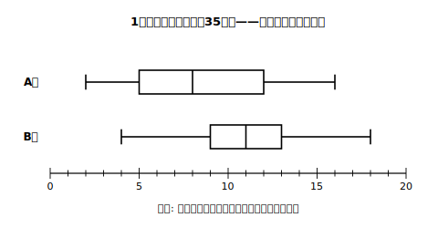

# L05 くらべて、根拠を書く——箱の位置で語る

## ねらい

- 2つの集団の箱ひげ図を、**箱の位置・四分位数**を根拠に比較できるようになる。
- 記述の型「**①どの指標を見て ②どちらがどうで ③だから結論**」で、比較の根拠を文章に書けるようになる。
- 「長さ」で「位置」を語ってしまう定番の誤答を、自分で直せるようになる。

## 主概念1：どちらのクラスが「よく読んでいる」か

A組とB組（各35人）の「1か月の読書時間」を箱ひげ図で表した。

<!-- figure-spec: 意図=位置の比較の主教材。B組は箱が短いのに位置が右——「長い方が上」と「短い方が少ない」の両誤読を同時に試せる配置。データ=読書時間・各35人。A組=2/5/8/12/16・B組=4/9/11/13/18(五数提示型)。軸=横軸0〜20時間・縦にA組・B組の2本(五数の数値ラベルなし——読み取りは練習)。生成方法=assets_provenance/generate_figures.py のパラメトリックSVG（五数の並び順・箱の長さ7対4・位置関係が本文記述と一致することをassert検算） -->

「どちらのクラスの方が、全体として読書時間が長い傾向にあるか」。箱の**長さ**ならA組（7時間分）がB組（4時間分）より長い。だが、L02・L04で確かめたとおり、**箱の長さは散らばりの幅**であって、「多い・長い傾向」の根拠にはならない。見るべきは**位置**だ。

- **中央値**: A組8時間、B組11時間——B組が大きい。
- **第1四分位数**: A組5、B組9——B組が大きい。**第3四分位数**: A組12、B組13——これもB組。
- 図全体で見ても、**B組の箱はA組より右側**にある。

だから「**B組の方が読書時間が長い傾向にある**」と言える。比較の根拠に使ってよいのは、**箱の位置・中央値・四分位数**（散らばりを比べたいときは四分位範囲）。「箱やひげが長いから大きい・多い」は根拠にならない——これは起こりやすい定番の誤りなので、主概念3で添削の練習をする。

## 主概念2：記述の型——①どの指標を ②どちらがどうで ③だから

比較の結論だけ書いても、根拠がなければ説明にならない。次の3部品の型で書こう。

> **① どの指標を見て**（例: 中央値を比べると）
> **② どちらがどうで**（例: B組は11時間でA組の8時間より大きく）
> **③ だから結論**（例: B組の方が読書時間が長い傾向にあるといえる）

①に入れる指標の選び方には、覚えやすい**3つのパターン**がある。

1. **箱の位置**: 「B組の箱の方が右側にあるから」——図の全体像で語る言い方。
2. **第1・第3四分位数がともに大きい**: 「第1四分位数も第3四分位数もB組の方が大きいから」——真ん中の約半数の両端がそろって右にずれていることを、数値で語る言い方（中央値も並べて確かめると、説明はさらに確かになる）。
3. **一方の第3四分位数 ＜ 他方の第1四分位数**: 箱同士が**重ならない**ほど離れているとき使える、いちばん強い言い方（練習2で登場）。

どのパターンでも、②で**両方の値**（またはようす）を挙げること。「B組の方が大きい」だけでは比較したことにならない——A組の値もセットで書く。

:::guide
**「〜といえる」の距離感**

データの比較で書く結論は「B組の方が**長い傾向にあるといえる**」のように、**傾向**の言葉でとどめるのが正確だ。箱ひげ図は約半数・約4分の1という**おおづかみの情報**しか持っていないから、「B組の全員がA組より長い」とは言えない（実際、A組の最大16時間はB組の中央値より上だ）。言い切りすぎず、でもデータが示す差はきちんと言う——この距離感も、記述の説明では大事に見られる観点だ。
:::

:::guide
**白紙にしないための最初の一歩**

記述問題でいちばんもったいないのは白紙だ。書き出せないときは、型の**①だけ**でも先に書いてしまおう。「中央値を比べると、」と書けば、あとは2つの値を図から読んで並べるだけで②ができ、③は②の言い換えでよい。型は「文才」の代わりをしてくれる道具だ。
:::

## 主概念3：誤答を直す——「長さ」で「位置」を語らない

次の2つの答案は、どちらも定番の誤りを含んでいる。どこがまずいか考えてから、直し方を見てほしい。

**答案X**「B組の方が箱が短いので、B組の方が人数が少ない。」
→ 箱の長さは人数ではない（両組とも35人）。**個数の割合はどの箱でも約半数**。直すなら、箱の長さから言えるのは「B組の方が真ん中の約半数の**散らばりが小さい**（＝四分位範囲が小さい）」。

**答案Y**「A組の方がひげも箱も長いので、A組の方が読書時間が長いといえる。」
→ 長さ（散らばり）を、位置（長い・短い傾向）の根拠にしてしまっている。位置を語るなら**中央値・四分位数・箱の位置**で: 「中央値を比べるとB組11時間、A組8時間で、B組の箱全体が右側にある。だからB組の方が長い傾向にある。」

まちがいのパターンは2つとも同じ——**「長さ」と「位置」の取り違え**だ。書き終えたら「自分は長さの話をしているのか、位置の話をしているのか」を1回だけ自問しよう。それだけで、この2つの誤りはほぼ防げる。

:::zatsudan
学習指導要領の解説には、ハンドボール投げの記録を昔の生徒と今の生徒で箱ひげ図にして比べて、「体力が落ちているとは言えない」と判断する例が載っている（あくまで解説の中の例示だけどね）。印象だと「今の子は体力が…」と言われがちなところを、箱の位置を根拠に「言えない」と返す——今日の型は、そういう**印象に流されない反論**の道具にもなるんだ。
:::

## 練習

1. 【穴埋め】主概念1のA組・B組について、次の説明を完成させよう。
   「（ ア ）と（ イ ）を比べると、どちらも（ ウ ）組の方が大きい。だから（ ウ ）組の方が読書時間が（ エ ）傾向にあるといえる。」
2. ある生徒が、計算ドリル1回あたりのミスの数を4月と7月で記録した。箱ひげ図の5つの値は次のとおり。
   - 4月: 最小3・第1四分位数5・中央値6・第3四分位数7・最大9（問）
   - 7月: 最小0・第1四分位数1・中央値2・第3四分位数3・最大4（問）
   7月の第3四分位数と4月の第1四分位数に注目し、パターン3（一方の第3四分位数＜他方の第1四分位数）を使って、「ミスは減ったといえるか」を型どおりに記述しよう。
3. 主概念3の答案X・答案Yを、それぞれ正しい説明に書き直そう（答案Xは「散らばり」の説明として、答案Yは「位置」の説明として直すこと）。
4. C中学校の1組と2組（各31人）の「1週間の運動時間」の5つの値は次のとおり。
   - 1組: 最小1・第1四分位数3・中央値5・第3四分位数8・最大14（時間）
   - 2組: 最小2・第1四分位数4・中央値7・第3四分位数9・最大12（時間）
   「どちらの組の方が運動時間が長い傾向にあるといえるか」を、型「①どの指標を見て②どちらがどうで③だから結論」で自由に記述しよう（パターン1か2のどちらを使ってもよい）。

:::stretch
**S1** パターン3「一方の第3四分位数＜他方の第1四分位数」が、パターン1・2より**強い**主張になる理由を、「約4分の3」という言葉を使って説明してみよう。（ヒント: 第1四分位数より上には全体の約何割がいる？　第3四分位数より下には？　練習2の4月と7月で、2つの集団の「約4分の3」同士がどんな位置関係になっているか考えよう。）
:::

---

対応解答: answer_key_L04-06.md

<!-- gen_nav:nav:start（自動生成・手編集しない） -->

---

[← 前のレッスン](lesson_04.md)｜[単元の目次](README.md)｜[解答](answer_key_L04-06.md)｜[次のレッスン →](lesson_06.md)

<!-- gen_nav:nav:end -->
