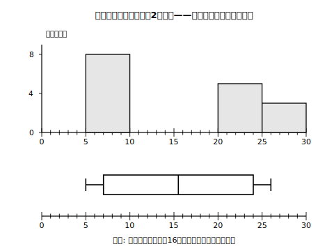

# L06 データでたしかめる——一連の統計的活動と箱ひげ図の限界

## ねらい

- 「**収集→整理→箱ひげ図→比較→説明**」の一連の統計的活動を、自分のデータで最初から最後まで通す。
- コンピュータで箱ひげ図を作るときの手順と**注意点**（四分位数の計算方式の違い）を知る。
- **箱ひげ図の限界**——分布の形が失われること——を知り、必要に応じてヒストグラムと**併用**する判断ができるようになる。

## 主概念1：問いから始める——「計算は速くなったか？」

この単元で学んだ道具は、問題集の中だけの道具ではない。**自分の生活の問い**に答えるために使えて、はじめて本物だ。一つ、通しでやってみよう。

**問い**: 毎朝の計算プリント（同じ形式）を1か月続けたら、タイムは速くなっただろうか？

**収集**: 20回分のタイム（秒）を記録してあった。**整理**: 前半10回と後半10回に分け、それぞれ小さい順に並べる。

- **前半**: 52, 55, 58, 60, 61, 63, 65, 68, 70, 74
- **後半**: 42, 45, 47, 49, 51, 52, 54, 55, 58, 62

**箱ひげ図**: それぞれ5つの値を求める（各自で計算してから進もう——練習1がこの計算だ）。**比較→説明**: 2本の箱ひげ図を上下に並べ、L05の型で根拠を書く。実はこのデータ、後半の第3四分位数が前半の第1四分位数より小さい——L05のパターン3が使える、はっきりした変化が出ている。

大事なのは、箱ひげ図をかくことが**ゴールではない**ということ。ゴールはあくまで「問いに、根拠つきで答えること」。図や四分位数は、そのための通過点だ。

:::guide
**結論を書くまえの「批判的なひと呼吸」**

説明を書く前に、データそのものを一度疑おう。①このデータの取り方は公平か（前半だけ難しいプリントだった、などの事情はないか）。②極端にかけ離れた値はないか。あればそれは記録ミスか、本当の値か（L04）。③自分の結論は、データが示す範囲を超えていないか（「速くなった傾向」とは言えても「もう遅くなることはない」とは言えない）。データから発せられた主張を批判的に考察する——これもこの単元の学習内容そのものだ。
:::

## 主概念2：コンピュータに手伝わせる

データが100個・1000個になったら、手計算では現実的でない。この単元の内容は、もともと「**コンピュータなどの情報手段を用いるなどしてデータを整理し箱ひげ図で表す**」ことまで含んでいる。表計算ソフトなら、おおよそ次の流れだ。

1. 1列にデータを入力する。
2. 並べ替え機能で小さい順にする（手計算の検算にも使える）。
3. 関数（最小値・最大値・中央値・四分位数など）やグラフ機能で、5つの値や箱ひげ図を出す。

ただし、1つ**重要な注意**がある。

:::guide
**ソフトの四分位数は、この教材と違う値になることがある**

L03で触れたとおり、四分位数の求め方は世界で一通りではない。表計算ソフトの四分位数の関数（QUARTILEなどの名前のもの）が、この教材の方式と**別の方式**で計算することがあり、その場合、答えの値がわずかにずれる。だから——①ソフトの出力とこの教材の答えが食い違っても、即どちらかの間違いとは限らない。②テストの答案はこの教材（＝学校で学ぶ方式）の手順で。③ソフトを使うときは、まず小さいデータ（L03の例1・例2など）で**手計算の結果と一致するか確かめてから**使うのが安全だ。自分の使うソフトがどの方式かは「（ソフト名）　四分位数　計算方法」で調べられる。
:::

## 主概念3：箱ひげ図の限界——消えた「二つの山」

最後に、この道具の**弱点**を正面から見ておく。16人の通学時間（分）だ。

**通学時間（分）**: 5, 6, 6, 7, 7, 8, 8, 9, 22, 23, 23, 24, 24, 25, 25, 26

5つの値を求めると、最小5・第1四分位数7・中央値15.5・第3四分位数24・最大26。箱ひげ図にすると、ごくふつうの図に見える。

<!-- figure-spec: 意図=箱ひげ図では分布の形(二山)が失われることの体感。同じデータのヒストグラムと上下に並べて「見えるもの・消えるもの」を対比。データ=通学時間16人(本文の生データ)。上段=ヒストグラム(階級幅5分・以上〜未満: 5〜10分8人・10〜15分0人・15〜20分0人・20〜25分5人・25〜30分3人。値25の2個は25以上30未満)、下段=箱ひげ図(五数=5/7/15.5/24/26)。軸=横軸0〜30分を上下段共通・上段縦軸=度数(人)。生成方法=assets_provenance/generate_figures.py のパラメトリックSVG（五数・度数とも生データから再計算しassert検算） -->

ところが、ヒストグラムと並べると別の顔が現れる。**山が2つ**——5〜9分のグループと、22〜26分のグループに割れている。たとえば徒歩の人たちとバスの人たち、のような二つの集まりがあるのかもしれない——ただし通学手段のデータは取っていないので、理由はこのデータだけからは分からない（気になったら、それを次の調査の問いにすればいい）。中央値は15.5分だが、**15分前後で通学している生徒は1人もいない**。箱ひげ図の大きな箱は「真ん中の約半数が7〜24分に散らばっている」と正しく言っているのだが、「その中身が2つのかたまりに割れている」ことは、5つの値のどこにも残っていない。

L01で言ったとおり、箱ひげ図は情報を5つの値まで**縮める**ことで一覧性を手に入れた。その代償が、**分布の形が失われる**ことだ。だから、分布の形まで調べたいときや、箱ひげ図の様子に不自然さを感じたときは、**必要に応じてヒストグラムと合わせて用いる**。道具は使い分け——たくさんの集団をざっと比べるなら箱ひげ図、1つの集団の形を見るならヒストグラム。両方使えるようになった今の君は、中1のときより確実に強い。

:::zatsudan
「箱ひげ図だけでは分布の形が失われる」——だから解説も、必要に応じてヒストグラムと合わせて用いることをわざわざ書いている。万能グラフはこの世に存在しなくて、1つのデータを複数のグラフで見ると、それぞれ別の顔が見えてくる。箱ひげ図とヒストグラムは、ライバルじゃなくて相棒なんだ。
:::

## 練習

1. 主概念1の計算タイムについて、
   (1) 前半・後半それぞれの5つの値（最小値・第1四分位数・中央値・第3四分位数・最大値）を求めよう（4ブロック検算も）。
   (2) 2本の箱ひげ図をかこう（同じ数直線の上に上下に並べる)。
   (3) 「タイムは速くなったといえるか」を、L05のパターン3を使って型どおりに記述しよう。
2. 主概念3の通学時間について、
   (1) 中央値は15.5分である。通学時間が15分前後（10分より長く20分未満）の生徒は何人いるか、データを数えて答えよう。
   (2) この例で「箱ひげ図だけを見た人」に伝わらない情報は何か。また、それを伝えるにはどうすればよいか、1文で答えよう。
3. 次の文が正しければ○を、正しくなければ×を付けて理由を言おう。
   (1) 箱ひげ図が正しくかければ、データの分析は完了したといえる。
   (2) 表計算ソフトの四分位数が手計算と違う値になったら、必ず手計算の方が間違っている。
   (3) 1本の箱ひげ図からは、分布の山が1つか2つかは判断できない。

:::stretch
**S1** 自分の生活から問いを1つ立てて、一連の統計的活動を最初から最後まで通してみよう。
手順: ①問いを立てる（例:「読書時間は週末の方が長いか」「起床時刻は安定してきたか」）→②データを10個以上×2グループ集める（自分の記録・家の記録など、自分がアクセスしてよいものに限る）→③それぞれ5つの値を求め、箱ひげ図を2本並べてかく→④L05の型で結論を書く→⑤最後に「この結論が言いすぎになっていないか」を1文で自己点検する。
コンピュータを使う場合は、まず主概念2の注意（方式の確認）を済ませてから。AIチャットに手伝ってもらうなら「四分位数の求め方を、中学校で学ぶ方法で確認したい」のように**方式を指定して**質問するとよい（自分や他人の名前・住所などの個人情報は入力しないこと）。
なお、この箱ひげ図と四分位範囲は、中3の「標本調査」の単元でまた使うことになる。道具箱にしまわず、手入れしておこう。
:::

---

対応解答: answer_key_L04-06.md

<!-- gen_nav:nav:start（自動生成・手編集しない） -->

---

[← 前のレッスン](lesson_05.md)｜[単元の目次](README.md)｜[解答](answer_key_L04-06.md)

<!-- gen_nav:nav:end -->
