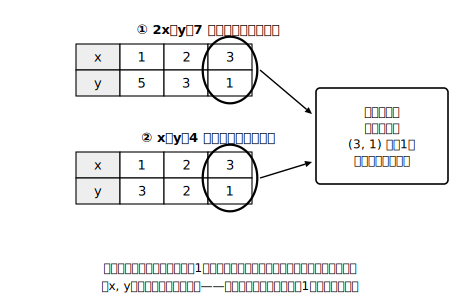

# L01 条件が2つあるとき——二元一次方程式と連立方程式

## ねらい

- 文字が2つある一次方程式（**二元一次方程式**）の解は「x, yの値の**組**」であり、**一つとは限らない**ことを、表への列挙で体感する。
- **連立方程式**とその**解**（二つの方程式を**同時に**満たす組）の意味を理解し、「代入して両方成り立つか確かめる」ができるようになる。

## 主概念1：文字が2つだと、答えは「組」になる

湖のボート乗り場に、2人乗りボートと1人乗りボートがある。あわせて何艘（そう）か借りて、7人全員がちょうど乗るには、どう借りればいいだろう。

2人乗りをx艘、1人乗りをy艘とすると、人数の条件は次の式になる。

> **2x＋y＝7**

文字xとyが2つあって、どちらも1次（2乗や、xとyをかけ合わせた項などがない）——このような方程式を**二元一次方程式**という（「元」は文字の種類の数のこと。中1で学んだ x＋3＝5 のような方程式は、文字が1つなので一元一次方程式だ）。

この方程式の**解**とは何だろうか。xとyの**両方の値が決まって、はじめて式が成り立つかどうか判定できる**。たとえばx＝1, y＝5なら 2×1＋5＝7 で成り立つ。つまり解は、xとyの**値の組**だ。組であることが分かるように (x, y)＝(1, 5) のように書く。

ここでは、どちらのボートも1艘は借りたと考えて、xもyも自然数（1, 2, 3, …）として、成り立つ組を表で探してみよう（「借りない＝0艘」を入れる場合はstretchで考える）。

| x（2人乗り） | 1 | 2 | 3 |
|---|---|---|---|
| y（1人乗り） | 5 | 3 | 1 |

(1, 5), (2, 3), (3, 1)——**解は3組もある**。中1の方程式では「解を求めなさい」と言われたら答えは（ふつう）1つだった。二元一次方程式では、**解は一つとは限らない**。しかもxを自然数に限らなければ、組はいくらでも作れる（x＝0.5でもy＝6で成り立つ）。

:::guide
**表で全部書き出すなんて、遠回りに見えるけれど**

表への列挙は、たしかに能率のよいやり方とはいえない。でも「解が組であること」「一つとは限らないこと」を自分の目で確かめるには、これがいちばん確実な方法だ。この章の後半で速い解き方（L02〜L05）を学んだあとも、「解とは何だったか」に迷ったらこの表に戻ってくればいい。急がば回れの2時間である。
:::

## 主概念2：条件が2つそろうと、組が1つに絞られる

ボートの話に条件を1つ追加しよう。「艘数はあわせて4艘だった」。つまり、

> **x＋y＝4**

この式も二元一次方程式で、自然数の解を表にすると (1, 3), (2, 2), (3, 1) の3組（x＝4, y＝0は「1人乗りを借りていない」ので今回は除く）。

さて、実際のボートの借り方は、**人数の条件と艘数の条件を両方とも**満たしていたはずだ。2つの表を見比べてみよう。

- 2x＋y＝7 の解: (1, 5), (2, 3), **(3, 1)**
- x＋y＝4 の解: (1, 3), (2, 2), **(3, 1)**

両方の表に現れる組は **(3, 1) ただ1つ**。2人乗り3艘と1人乗り1艘——これが答えだ。人数と艘数という**中身のちがう**条件が2つそろったことで、組が1つに絞られたわけだ。

このように、二元一次方程式を2つ組にしたものを**連立方程式**（正式には**連立二元一次方程式**）といい、次のように中かっこでまとめて書く。

> { 2x＋y＝7
> { x＋y＝4

**二つの方程式を同時に満たすx, yの値の組**を、この連立方程式の**解**といい、解を求めることを連立方程式を**解く**という。

## 型の導入：「代入して確かめる」

(3, 1)が本当に解かどうかは、**両方の式に代入して、両方成り立つか**を見ればいつでも確かめられる。

- 2×3＋1＝7 → 成り立つ
- 3＋1＝4 → 成り立つ

**片方だけ成り立ってもだめ**、というのが急所だ。たとえば(2, 3)は 2×2＋3＝7 で1本目は成り立つが、2＋3＝5≠4 で2本目が成り立たないから、この連立方程式の解ではない。この「両方に代入して確かめる」は、この章のすべての問題で使える自前の検算法になる。答えを書く前に毎回やる習慣にしよう。

:::zatsudan
中1の方程式 3x＝6 の解はx＝2の1つだけ。ところが文字が2つになったとたん、解は「組」になって、しかも一つとは限らなくなる。「方程式の解は1つ」という常識のほうが、実は一元一次方程式だけの特別な事情だったんだね。数学では、世界を広げると「当たり前」の方が例外だったと分かることがよくある。
:::

:::guide
**「解が組」のつまずきどころ**

「x＝3, y＝1」と別々に書くと、xとyがばらばらに決まったように見えてしまう。解は**ペアでワンセット**——(3, 1)のxだけ取り出して別の組のyとつなぐことはできない。表の同じ**列**（縦のならび）が1つの解、と目で覚えておくと混乱しない。また、組の書き方 (3, 1) は**xが先、yが後**の約束。(1, 3)と書くと別の組になってしまうので、順序にも注意。
:::

:::guide
**なぜ「同時に」が大事なのか**

連立方程式の解の定義でいちばん効いている言葉は「**同時に**」だ。変域を広げれば、1本目だけの解は無数、2本目だけの解も無数。その中で**両方の条件をくぐり抜ける組**だけが連立方程式の解になる。問題文に条件が2つ書かれていたら「式も2本、解は両方を同時に満たす組」——この対応がこの章の土台になる。
:::

## 練習

1. 次の組のうち、二元一次方程式 3x＋y＝10 の解をすべて選ぼう。
   ア (1, 7)　イ (2, 3)　ウ (3, 1)　エ (4, −2)
2. 二元一次方程式 x＋2y＝10 の解のうち、x, yがともに自然数であるものをすべて書こう。
3. 連立方程式 { x＋y＝6, 2x＋y＝9 } について、x, yが自然数の範囲で、それぞれの式の解を表に書き出し、共通する組を見つけて解を求めよう。求めた解は両方の式に代入して確かめること。
4. 次の文が正しければ○、正しくなければ×を付けて、×は正しく直そう。
   (1) 二元一次方程式 x＋y＝8 の解は1組だけである。
   (2) (2, 5)が連立方程式の解であるとは、二つの方程式のどちらか一方を成り立たせることである。

:::stretch
**S1** 二元一次方程式 2x＋y＝7 で、xの変域を自然数に限ると解は3組だった。では、xの変域を「0以上の整数」に広げると解は何組になるだろうか。さらに「整数全体」に広げると？　表を延長して調べ、気づいたことを一言で書こう。
:::

---

対応解答: answer_key_L01-04.md

<!-- gen_nav:nav:start（自動生成・手編集しない） -->

---

[単元の目次](README.md)｜[解答](answer_key_L01-04.md)｜[次のレッスン →](lesson_02.md)

<!-- gen_nav:nav:end -->
