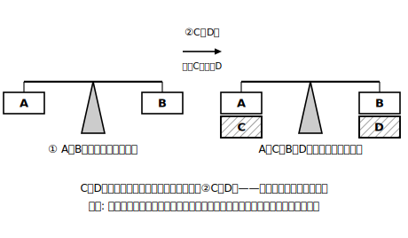
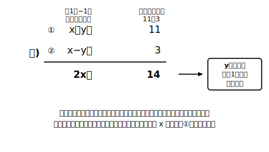

# L02 文字を消すという作戦——等式の性質と加減法

## ねらい

- 二つの等式の**辺々を足したり引いたりしてよい理由**を、等式の性質から説明できる。
- 文字を1つ**消去して**、既に解ける一元一次方程式に**戻す**（帰着）という作戦を理解し、係数がそのままそろっている型の**加減法**で連立方程式を解けるようになる。

## 準備運動：道具箱の点検（前提診断）

この章の解き方は、中1と前章の道具をフル活用する。次の4問がすらすら解けるか点検しよう。

1. 方程式 3x−5＝7 を解こう。
2. 方程式 4x＋6＝x−3 を解こう（移項を使って）。
3. 計算しよう。 (3x＋2y)＋(2x−2y)
4. 計算しよう。 2(3x−2y)−3(2x＋5y)

3と4のような「文字が2つある式の計算」を前章でみっちりやったのは、実はこの章の準備だった。今日からその道具が本番で働き始める。

## 主概念1：等式は「天びん」——辺々を足してもつり合いは崩れない

中1で学んだ**等式の性質**を思い出そう。等式の両辺に**同じ数**を足しても、引いても、等式は成り立ったままだ（天びんの両側に同じおもりをのせるイメージ）。

ここで一歩進める。二つの等式があるとする。

> ① A＝B
> ② C＝D

①の両辺に**同じもの**を足すなら、等式は崩れない。では「Cを左辺に、Dを右辺に足す」のはどうか。②が成り立っているなら、**CとDは同じ量**だ。名札はちがっても中身は同じおもりだから、左にC・右にDをのせても、天びんはつり合ったまま。つまり、

> **A＋C＝B＋D**（辺々を加える）　同じ理由で　**A−C＝B−D**（辺々を引く）

が成り立つ。これが今日の主役の道具、「**辺々の加減**」だ。ここで絶対に外せない注意がひとつ——**足すのは左辺どうしと右辺どうしの両方**。左辺だけ足して右辺を忘れると、天びんの片側にだけおもりをのせたことになり、等式が壊れる。

## 主概念2：加減法——文字を消して、知っている形に戻す

連立方程式を解いてみよう。

> ① x＋y＝11
> ② x−y＝3

文字が2つあるから、このままでは中1の方法が使えない。そこで作戦——**文字を1つ消して、文字1つの方程式（一元一次方程式）に戻せば、あとは中1の手順で解ける**。

①と②を見ると、yの係数が＋1と−1。**辺々を加えれば**yが消える。

①＋②:　左辺 (x＋y)＋(x−y)＝2x、右辺 11＋3＝14　→　**2x＝14**　→　x＝7

xが分かれば、①に代入して 7＋y＝11 → y＝4。解は **(x, y)＝(7, 4)**。

検算（L01の型）: ① 7＋4＝11 成り立つ／② 7−4＝3 成り立つ。両方OK。

今度は**引く**型。

> ① 3x＋y＝17
> ② x＋y＝7

yの係数がどちらも＋1だから、**辺々を引けば**yが消える。

①−②:　左辺 (3x＋y)−(x＋y)＝2x、右辺 **17−7＝10**　→　2x＝10　→　x＝5

②に代入して 5＋y＝7 → y＝2。解は **(5, 2)**（検算: 15＋2＝17、5＋2＝7、両方成り立つ）。

このように、文字を1つ**消去して**解く方法を**加減法**という。消えた瞬間に「あ、中1で見た形だ」と思えたら、この章の背骨はもうつかめている。

:::guide
**よく起こる事故は「右辺の計算忘れ」**

①−②と書いたら、**右辺も 17−7 を計算する**。左辺だけ引き算して右辺を17のまま残す・右辺どうしの引き算の符号をまちがえる——この2つが、加減法の事故の定番だ。おすすめの型は、辺々の計算を筆算のように**上下にそろえて書く**こと。左辺の列と右辺の列を同時に処理すれば、右辺だけ置き去りにする事故は起きにくい。
:::

:::guide
**引き算のときは全体にかっこを**

①−②の左辺は (3x＋y)−(x＋y)。**後ろの式全体にかっこを付けて引く**のが安全だ。かっこを外すとき符号が全部ひっくり返る（−x−y）のは前章でやったとおり。かっこを省略して 3x＋y−x＋y としてしまうと、yが消えるどころか2yが現れてしまう。「引き算はかっこごと」——前章の道具の正しい使い方がそのまま事故防止になる。
:::

:::zatsudan
「新しい問題は、解ける形に**戻して**攻略する」——この作戦、数学ではこの先も何度も出てくる。この章では文字を1つ消して中1の方程式に戻した。中3では、2乗のある方程式（二次方程式）を「次数を減らして」一次方程式に戻す場面が出てくる。作戦の名前だけ覚えておこう。「帰着」——困ったら、知っている形に帰る。
:::

## 練習

1. 次の連立方程式を加減法で解こう。解は両方の式に代入して確かめること。
   (1) { x＋y＝9, x−y＝5 }
   (2) { 2x＋y＝13, x＋y＝9 }
   (3) { 3x＋2y＝19, 3x−y＝13 }
   (4) { 5x＋2y＝16, 3x＋2y＝8 }
2. 次はある人の答案である。まちがいを見つけて、正しく解き直そう。
   「① x＋2y＝10、② x＋y＝6。①−②より y＝10。よって x＝−10…あれ？」
3. 連立方程式 { 4x＋3y＝11, 4x−3y＝5 } は、辺々を**加える**のと**引く**のとどちらでも文字を消せる。どちらの文字が消えるかをそれぞれ先に予想してから、好きな方で解こう。

:::stretch
**S1** 「① A＝B、② C＝D のとき A＋C＝B＋D」を、等式の性質だけを使った説明に書き直してみよう。（ヒント: まず①の両辺にCを足すと A＋C＝B＋C。次に、②からCとDが等しいことを使うと右辺はどう書き換えられる？）
:::

---

対応解答: answer_key_L01-04.md

<!-- gen_nav:nav:start（自動生成・手編集しない） -->

---

[← 前のレッスン](lesson_01.md)｜[単元の目次](README.md)｜[解答](answer_key_L01-04.md)｜[次のレッスン →](lesson_03.md)

<!-- gen_nav:nav:end -->
