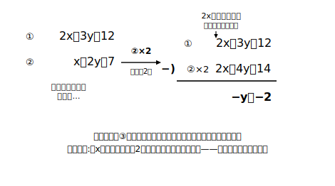

# L03 係数をそろえる——加減法の完成

## ねらい

- 係数がそのままではそろっていない連立方程式を、**一方または両方の式を何倍かして係数をそろえてから**加減法で解けるようになる。
- 計算を始める前に「**どの文字を、足して消すか引いて消すか**」を宣言する型を身につける。

## 主概念1：そろっていないなら、そろえればいい

次の連立方程式は、L02の方法がそのまま使えない。

> ① 2x＋3y＝12
> ② x＋2y＝7

足してもxもyも消えないし、引いても消えない。係数がそろっていないからだ。

ここで等式の性質の3つ目を思い出そう——**等式の両辺に同じ数をかけても、等式は成り立ったまま**。②の両辺を2倍すれば、

②×2:　**2x＋4y＝14**

xの係数が①とそろった。あとはL02と同じだ。

①−②×2:　左辺 (2x＋3y)−(2x＋4y)＝−y、右辺 12−14＝−2　→　−y＝−2　→　**y＝2**

②に代入して x＋4＝7 → x＝3。解は **(3, 2)**（検算: ① 6＋6＝12、② 3＋4＝7、両方成り立つ）。

注意点は2つ。**かけるときは右辺にも同じ数をかける**（②×2の右辺は7×2＝14。ここでも「右辺も忘れず」）。そして、−y＝−2のように**負の数どうしの式が現れても慌てない**（両辺を−1でわればよい）。

## 主概念2：両方の式を何倍かする型

> ① 3x＋2y＝8
> ② 2x＋5y＝−2

今度は、どちらか一方を整数倍しても係数がそろわない。そこで**両方の式をそれぞれ何倍かして**そろえる。xを消すなら、xの係数3と2の最小公倍数6にそろえればいい。

①×2:　6x＋4y＝16
②×3:　6x＋15y＝−6

①×2−②×3:　左辺 −11y、右辺 16−(−6)＝22　→　−11y＝22　→　**y＝−2**

①に代入して 3x−4＝8 → 3x＝12 → x＝4。解は **(4, −2)**（検算: ① 12−4＝8、② 8−10＝−2、両方成り立つ）。

## 型の導入：「消す文字を先に宣言」

計算に入る前に、次の一言を書く（または心の中で言う）習慣にしよう。

> 「**yを消す。係数が＋2と−2だから、辺々を加える**」
> 「**xを消す。係数を6にそろえて、辺々を引く**」

先に作戦を宣言すると、①「足すとどの文字が消えるか」の見立てちがい、②そろえたのに引くべきところを足す、という2大事故が激減する。**同符号どうしなら引く、異符号どうしなら足す**——そろえた係数の符号を見て決める。

:::guide
**どちらの文字を消すのが得か**

どちらを消しても答えは同じになる。選ぶ基準は「**手数が少ない方**」だ。目のつけどころは、(1) 係数がすでにそろっている（またはちょうど何倍かでそろう）文字はないか、(2) 異符号でそろっていて「足すだけ」で消える文字はないか、(3) 最小公倍数が小さくてすむのはどちらか。たとえば { 4x−3y＝18, 2x＋y＝4 } なら、②×2で4xがそろう（引く）ルートと、②×3で±3yがそろう（足す）ルートの両方がある——どちらでも解は同じ。自分で選べることが、加減法を「使えている」証拠だ。
:::

:::guide
**「そろえたら右辺も」——事故の再発防止**

L02の「右辺も忘れず」は、この時間では2か所に増える。**（ア）何倍かするとき右辺にも同じ数をかける**、**（イ）辺々を引くとき右辺どうしも引く**。特に（ア）の忘れは、検算（両式に代入）で必ず引っかかるので、解が汚い数になったときは「右辺にかけ忘れていないか」を最初に疑うとよい。
:::

:::zatsudan
加減法の作戦を一言でいえば「そろえて、消す」。じつはこの2ステップの前半「両辺を何倍かしてよい」も、後半「辺々を足し引きしてよい」も、ぜんぶ中1の等式の性質が保証してくれている。新しい章に見えて、使っている道具は全部知っているものの組み合わせ——数学の章立ては、道具の「使い回し」がうまくなる順に並んでいるのかもしれないね。
:::

## 練習

1. 次の連立方程式を解こう。消す文字と足すか引くかを先に宣言し、解は両方の式に代入して確かめること。
   (1) { x＋3y＝11, 2x＋5y＝19 }
   (2) { 4x−3y＝18, 2x＋y＝4 }
   (3) { 2x＋3y＝5, 3x＋4y＝7 }
   (4) { 5x−2y＝4, 3x＋4y＝18 }
2. 連立方程式 { 4x＋3y＝18, 2x−3y＝0 } について、「辺々を加える」と宣言した人と「②を2倍して辺々を引く」と宣言した人がいる。どちらでも解けることを、実際に両方のやり方で解いて確かめよう。
3. 次はある人の答案である。まちがいを見つけて、正しく解き直そう。
   「① 3x＋2y＝7、② x＋2y＝5。②の両辺を3倍して 3x＋6y＝5。①から引いて −4y＝2、y＝−1/2…なんだか変だ」

:::stretch
**S1** { 2x＋3y＝12, 3x＋2y＝13 } を、(ア) xを消す、(イ) yを消す、の両方で解いて、解が一致することを確かめよう。さらに、辺々を**加えてから**5でわると x＋y＝5 という新しい式が作れる。この式と元の①だけを組にして解いても、同じ解になるだろうか。試して、気づいたことを書こう。
:::

---

対応解答: answer_key_L01-04.md

<!-- gen_nav:nav:start（自動生成・手編集しない） -->

---

[← 前のレッスン](lesson_02.md)｜[単元の目次](README.md)｜[解答](answer_key_L01-04.md)｜[次のレッスン →](lesson_04.md)

<!-- gen_nav:nav:end -->
