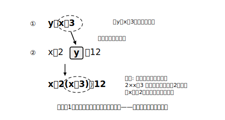

# L04 代入法と解法の選択

## ねらい

- **代入法**（一方の式を他方に代入して文字を消去する）で連立方程式を解けるようになる。
- 式の形を見て**加減法と代入法を選べる**ようになる（どちらでも解ける・答えは同じ、と知っていることを含めて）。

## 主概念1：代入法——「yの正体」が分かっているなら、置きかえてしまう

> ① y＝x＋3
> ② x＋2y＝12

①をよく見ると、「**yはx＋3と同じもの**」と教えてくれている。同じものなら、②のyを**まるごとx＋3に置きかえて**よいはずだ。

②のyに①を代入:　x＋2**(x＋3)**＝12

かっこを外して x＋2x＋6＝12 → 3x＝6 → **x＝2**。①に代入して y＝2＋3＝5。解は **(2, 5)**。

検算: ① 5＝2＋3 成り立つ／② 2＋10＝12 成り立つ。

このように、一方の式を他方に**代入することで文字を消去して**解く方法を**代入法**という。加減法とゴールは同じ——**文字を1つ消して、一元一次方程式に帰着**だ。ちがうのは消し方だけ。加減法は「打ち消して消す」、代入法は「置きかえて消す」。

**急所はかっこ**。2yのyをx＋3に置きかえるとき、かっこを付けずに 2×x＋3 と書くと「x＋3の全体を2倍する」が「xだけ2倍する」に化けてしまう。**代入は必ずかっこ付きで**。

## 主概念2：y＝形どうしなら、右辺を直結できる

> ① y＝2x−1
> ② y＝x＋3

どちらも「y＝…」の形。yは同じ値なのだから、**右辺どうしを等号で結べる**。

2x−1＝x＋3　→　x＝4　→　①に代入して y＝2×4−1＝7。解は **(4, 7)**（検算: ① 7＝8−1、② 7＝4＋3、両方成り立つ）。

これも代入法の一種だ（①のyに②を代入した、と見てもよい）。この形は次章の一次関数で主役級の出番がある。

## 主概念3：式の形で解法を選ぶ

**この章で「解こう」と問われる**連立方程式は、どれも加減法でも代入法でも解ける。答えも必ず同じになる。そのうえで、**手数が少ない方を選ぶ**のが上級者だ。目安はシンプルにこれだけ——

- **「y＝…」「x＝…」の形の式が（作りやすい形が）あるか** → あるなら**代入法**が速い。
- **係数がそろっている・そろえやすいか** → そうなら**加減法**が速い。

たとえば { y＝3x, x＋y＝8 } は代入法（一瞬でx＋3x＝8）。{ 3x＋2y＝8, 2x＋5y＝−2 } は加減法（y＝…の形に直すと分数が出て損）。選んだ理由を一言言えれば、この章の解き方は完成だ。

:::guide
**「求めたxを、どの式のどこに代入するか」で迷ったら**

xの値が出たあと、yを求める代入は**どの式に入れてもよい**（元の①でも②でも、変形途中の式でも、**yの残っている**正しい式なら必ず同じyになる）。おすすめは**いちばん形が簡単な式**（y＝…の形があればそこ）。そして最後の検算だけは、**変形前の元の2式**に入れること。変形途中で写しまちがいがあった場合、変形後の式では検算をすり抜けてしまうからだ。
:::

:::guide
**代入法の符号事故**

x＝3y−5 を 2x−y＝5 に代入するときは 2**(3y−5)**−y＝5。かっこを外すと 6y−**10**−y＝5——「−5の2倍は−10」の符号まで含めて全体が2倍される。かっこを書かずに暗算すると、ここが＋10に化けやすい。**書いてから外す**。1行の手間が符号事故を防ぐ。
:::

:::zatsudan
加減法と代入法、教わる順はあっても、偉さの順はない。どちらも「文字を1つ消して、解ける形に帰る」という同じ作戦の2つの道具だ。料理で「切ってから焼く」か「焼いてから切る」かを素材で選ぶように、式の形を見て道具を選ぶ——選べるようになると、計算はぐっと速く、まちがいはぐっと減る。
:::

## 練習

1. 次の連立方程式を代入法で解こう。解は両方の式に代入して確かめること。
   (1) { y＝3x, x＋y＝8 }
   (2) { x＝2y−1, 2x＋3y＝12 }
   (3) { y＝x−2, y＝−2x＋7 }
2. 連立方程式 { 2x＋y＝10, y＝x＋1 } を、(ア) 代入法、(イ) 加減法（yの係数をそろえて）の両方で解き、解が一致することを確かめよう。
3. 次の各連立方程式について、加減法と代入法のどちらで解くか、理由を一言つけて宣言してから解こう。
   (1) { y＝4x−3, 3x＋y＝11 }
   (2) { 3x＋2y＝1, 5x−2y＝7 }
4. x＝3y−5 を 2x−y＝5 に代入して解こう（かっこを忘れずに）。

:::stretch
**S1** { 2x＋3y＝16, 3x−y＝2 } を、(ア) 加減法、(イ) ②を y＝3x−2 に変形してから代入法、の両方で解いて、解と手数（何行かかったか）を比べよう。どちらが自分に合っていたか、理由も一言。
:::

---

対応解答: answer_key_L01-04.md

<!-- gen_nav:nav:start（自動生成・手編集しない） -->

---

[← 前のレッスン](lesson_03.md)｜[単元の目次](README.md)｜[解答](answer_key_L01-04.md)｜[次のレッスン →](lesson_05.md)

<!-- gen_nav:nav:end -->
