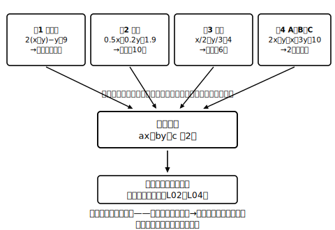

# L05 いろいろな連立方程式

## ねらい

- かっこ・小数・分数をふくむ連立方程式やA＝B＝Cの形を、**整理して基本の形（ax＋by＝cの組）に直してから**解けるようになる。

## 主概念：見た目がちがっても、作戦はひとつ——「整理して、基本の形へ」

L02〜L04で解いてきたのは { ax＋by＝c } が2本ならんだ「基本の形」だった。この時間の相手は、見た目がごちゃっとしたもの。でも新しい解き方は**何も出てこない**。やることは「**整理して基本の形に戻す→あとはいつもどおり**」だけだ。

### 型1：かっこがある → まず展開して整理

> ① 2(x＋y)−y＝9
> ② 3x−2y＝3

①を展開: 2x＋2y−y＝9 → **2x＋y＝9**。基本の形になった。あとは加減法——②＋①×2 でyを消す。

①×2: 4x＋2y＝18。②＋①×2: 7x＝21 → **x＝3**。①（整理後）に代入: 6＋y＝9 → y＝3。解は **(3, 3)**。

検算は**整理前の元の式**で: ① 2(3＋3)−3＝12−3＝9 成り立つ／② 9−6＝3 成り立つ。

### 型2：小数がある → 両辺を10倍・100倍して整数に

> ① 0.5x＋0.2y＝1.9
> ② x−y＝1

①の両辺を10倍: **5x＋2y＝19**（右辺の1.9も忘れず10倍——「右辺も忘れず」はここでも現役）。②から x＝y＋1 として代入: 5(y＋1)＋2y＝19 → 7y＝14 → y＝2、x＝3。解は **(3, 2)**（検算: ① 1.5＋0.4＝1.9、② 3−2＝1、両方成り立つ）。

### 型3：分数がある → 両辺に分母の最小公倍数をかける

> ① x/2＋y/3＝4
> ② x＋y＝10

①の両辺を6倍: **3x＋2y＝24**。②×2: 2x＋2y＝20。引いて x＝4、y＝6。解は **(4, 6)**（検算: ① 2＋2＝4、② 4＋6＝10、両方成り立つ）。

### 型4：A＝B＝C の形 → 2本の等式に分解する

> 2x＋y＝x＋3y＝10

これは「2x＋y＝10」と「x＋3y＝10」が同時に成り立つ、という意味。**A＝C、B＝Cの2本に分解**すれば連立方程式になる（A＝B、A＝Cの組でもよい——どの2本を選んでも解は同じ）。

{ 2x＋y＝10, x＋3y＝10 }。①から y＝10−2x を②に代入: x＋30−6x＝10 → −5x＝−20 → x＝4、y＝2。解は **(4, 2)**（検算: 2×4＋2＝10、4＋6＝10、両方10で成り立つ）。

:::guide
**10倍・6倍は「その式の両辺」だけ**

型2で①を10倍するとき、**②まで10倍する必要はない**（してもまちがいではないが、無駄に数が大きくなる）。逆に、①の左辺だけ10倍して右辺を1.9のまま残すのは等式が壊れる事故。「かけるなら、その式の**両辺全部**。ほかの式はさわらない」と整理しておこう。
:::

:::guide
**検算は「変形前の式」に戻って**

整理・展開・10倍のどこかで写しまちがえていた場合、**整理後の式で検算しても通ってしまう**。最後の代入検算だけは、必ず問題に書かれた元の形（かっこ・小数・分数のまま）に入れること。L04のguideで言った「検算は変形前の元の2式に」の徹底版だ。
:::

:::zatsudan
今日の4つの型、ぜんぶ「知らない見た目→知っている形に戻す」の練習だったことに気づいただろうか。かっこは外す、小数・分数は整数に、A＝B＝Cは2本に。この章の背骨「帰着」は、連立方程式を一元一次方程式に戻すだけじゃなく、**1問の中でも**ずっと働いている。「戻せる形はないか？」——この目は、数学のどの単元でも使える。
:::

## 練習

1. 次の連立方程式を解こう。解は**元の式**に代入して確かめること。
   (1) { 3(x−y)＋2y＝3, x＋2y＝8 }
   (2) { 0.3x＋0.1y＝1, 2x−y＝5 }
   (3) { x/3＋y/2＝3, 2x−3y＝−6 }
2. 方程式 3x＋y＝x＋2y＝10 を解こう。
3. 連立方程式 { 0.2x＋0.1y＝0.7, 3(x−y)＋5y＝12 } を解こう。（小数の式は10倍、かっこの式は展開——1問の中で型を組み合わせる）

:::stretch
**S1** A＝B＝C型（問2）は、「A＝B と B＝C」「A＝B と A＝C」「A＝C と B＝C」の3通りの組み方ができる。問2を別の組み方でもう一度解いて、解が同じになることを確かめよう。そして「どの組み方がいちばん計算が楽だったか」を一言で。
:::

---

対応解答: answer_key_L05-08.md

<!-- gen_nav:nav:start（自動生成・手編集しない） -->

---

[← 前のレッスン](lesson_04.md)｜[単元の目次](README.md)｜[解答](answer_key_L05-08.md)｜[次のレッスン →](lesson_06.md)

<!-- gen_nav:nav:end -->
