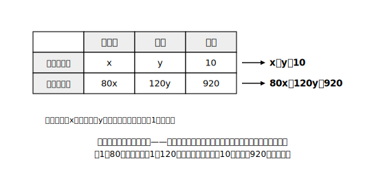

# L06 二つの文字で場面を表す——個数と代金

## ねらい

- 場面の中の**二つの数量**を文字で表し、数量の関係から式を2本作って、連立方程式で問題を解けるようになる（**利用の手順4ステップ**）。
- 求め方を人に伝わる形で書く**説明の3点セット**を身につける。

## 主概念1：利用の手順は4ステップ

文化祭の模擬店で、1本80円の飲み物と1個120円のパンを、あわせて10個買ったら代金は920円だった。それぞれ何個買っただろう。

**ステップ1: 何をx, yにするか宣言する。**
「飲み物をx本、パンをy個とする」——最初に必ず書く。ここを飛ばすと、最後に出た数が何なのか分からなくなる。

**ステップ2: 数量の関係を見つけて、式を2本作る。**
分からない数が2つあるときは、**数量の関係を2つ見つけて式を2本作る**（L01で、条件が2つそろって組が絞れたことを思い出そう）。表に整理すると関係が見えやすい。

| | 飲み物 | パン | 合計 |
|---|---|---|---|
| 個数（個） | x | y | 10 |
| 代金（円） | 80x | 120y | 920 |

表の**行ごと**に式ができる。 個数の関係: **x＋y＝10**　代金の関係: **80x＋120y＝920**

**ステップ3: 連立方程式を解く。**
②の両辺を40でわると 2x＋3y＝23。①×2: 2x＋2y＝20。引いて y＝3、x＝7。

**ステップ4: 解を場面に戻して確かめ、答えを書く。**
飲み物7本・パン3個。個数 7＋3＝10個、代金 80×7＋120×3＝560＋360＝920円——場面と合う。個数が負の数や小数になっていないかもここで見る。 **答え: 飲み物7本、パン3個。**

## 主概念2：説明の3点セット——「連立にすればよい」で止まらない

「求め方を説明しなさい」と言われたら、次の3点がそろって初めて説明になる。

> **① どの数量関係から式を2本作るか**（例: 個数の合計と代金の合計から x＋y＝10 と 80x＋120y＝920 を作る）
> **② その2本を連立方程式として解く**
> **③ どちらの文字の値（またはそこから計算する量）が答えか**（例: 解のxが飲み物の本数、yがパンの個数）

ありがちなのは「連立方程式の形にすればよい」で止まる説明。それは作戦名を言っただけで、**解く操作**と**何が答えか**が抜けている。特に③は、聞かれているのがxなのかyなのか、それとも解から計算する別の量なのか——取り違えると、正しく解けたのに答えをまちがえる。

## 主概念3：二つの文字で表す「よさ」

実はこの問題、中1の方法でも解ける。飲み物をx本とすれば、パンは(10−x)個だから 80x＋120(10−x)＝920 という一元一次方程式になる。

では連立方程式は何が「よい」のか。**一つの文字よりは二つの文字を用いた方が、式に表しやすい場合が多い**。上の式の 120(10−x) のような「ひとひねり」を考えなくても、見えている数量ごとに素直に文字を置いて、関係を素直に2本書けばいい。**立式の素直さ**——これが二つの文字を使う最大の利点だ（そのかわり式は2本必要になる）。

:::guide
**表は「単位の行」で作る**

数量の表は「個数の行」「代金の行」のように**単位ごと**に行を作るのがコツ。単位のちがうものを足してしまう事故（個数と円を足す等）が防げて、行ごとにそのまま式になる。線分図が合う場面（合計と差など）では線分図でもよい——どちらも「関係を目に見える形にしてから式にする」ための道具だ。
:::

:::guide
**ステップ4の「場面に戻す」は検算と別もの**

方程式への代入検算（L01の型）は「計算が正しいか」の確認。ステップ4の吟味は「**答えが場面として意味をもつか**」の確認で、役割がちがう。人数が7.5人・個数が−2個などが出たら、計算ミスか立式ミスのサイン。両方やって初めて安心できる。
:::

:::zatsudan
「文字を増やすと難しくなりそう」と思いきや、実際は逆で、文字を増やした方が式は素直に書けることが多い。分からないものに片っぱしから名前を付けてしまえば、あとは見たままを式にするだけ。「うまく1文字で表す工夫」に頭を使うより、「素直に2文字で書いて、消去の技術で処理する」——工夫を技術で置きかえるのが、この章の発明なんだ。
:::

## 練習

1. 大人と子どもあわせて8人で博物館に入ったら、入館料の合計は2500円だった。大人1人500円、子ども1人200円である。大人と子どもの人数をそれぞれ求めよう。（4ステップで。表も書くこと）
2. 30gのおもりと50gのおもりがあわせて12個あり、全体の重さは460gである。それぞれの個数を求めよう。
3. 2つの数があり、和は26で、大きい方の数は小さい方の数の3倍より2大きい。2つの数を求めよう。
4. 問1について、「求め方の説明」を説明の3点セット（①②③）の形で書こう。数値の計算まではしなくてよい。

:::stretch
**S1** 問2を、中1の方法（おもりの個数を1文字だけで表す一元一次方程式）でも解いてみよう。連立方程式の解と一致することを確かめたうえで、どちらが「式を作りやすかったか」を自分の言葉で比べよう。
:::

---

対応解答: answer_key_L05-08.md

<!-- gen_nav:nav:start（自動生成・手編集しない） -->

---

[← 前のレッスン](lesson_05.md)｜[単元の目次](README.md)｜[解答](answer_key_L05-08.md)｜[次のレッスン →](lesson_07.md)

<!-- gen_nav:nav:end -->
