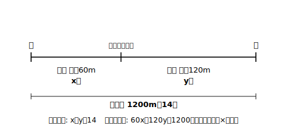

# L07 速さ・割合の場面

## ねらい

- **速さ**の場面を「道のり・速さ・時間」の表に整理して、連立方程式で解けるようになる。
- **割合**（%の増減）の場面で、**もとにする量**を文字に置いて式を作り、**問われている量はどれか**を吟味して答えられるようになる。

## 主概念1：速さの場面——表の3行（道のり・速さ・時間）

家から駅までは1200mある。はじめは分速60mで歩き、途中から分速120mで走ったら、全体で14分かかった。歩いた時間と走った時間を求めよう。

**ステップ1**: 歩いた時間をx分、走った時間をy分とする。
**ステップ2**: 「道のり・速さ・時間」の表に整理する。速さの場面の関係は **道のり＝速さ×時間** の1本だけ——表がそのまま式を作ってくれる。

| | 歩き | 走り | 合計 |
|---|---|---|---|
| 速さ（m/分） | 60 | 120 | — |
| 時間（分） | x | y | 14 |
| 道のり（m） | 60x | 120y | 1200 |

時間の行: **x＋y＝14**　道のりの行: **60x＋120y＝1200**

**ステップ3**: ②を60でわって x＋2y＝20。①を引いて y＝6、x＝8。
**ステップ4**: 歩き8分・走り6分。道のり 60×8＋120×6＝480＋720＝1200m、時間 8＋6＝14分——場面と合う。 **答え: 歩いた時間8分、走った時間6分。**

「時間をx, yに置くか、道のりをx, yに置くか」は自分で選べる。**問われている量を文字に置く**と、解がそのまま答えになって取り違えにくい（道のりを問われたら道のりをx, yに——練習3で試す）。

## 主概念2：割合の場面——「もとにする量」を文字に置く

ある中学校の去年の生徒数は、男女あわせて500人だった。今年は男子が10%増え、女子が5%減って、全体では20人増えた。去年の男子・女子の人数を求めよう。

割合の場面の急所はステップ1にある。10%増・5%減の「もとにする量」は**去年**の人数。だから文字に置くのは去年だ——「**去年の**男子をx人、**去年の**女子をy人とする」。

| | 男子 | 女子 | 全体 |
|---|---|---|---|
| 去年（人） | x | y | 500 |
| 増減（人） | ＋0.1x | −0.05y | ＋20 |

去年の行: **x＋y＝500**　増減の行: **0.1x−0.05y＝20**

②×100: 10x−5y＝2000 → 5でわって 2x−y＝400。①と辺々を加えて 3x＝900 → x＝300、y＝200。

**ステップ4（ここが割合の勝負どころ）**: 解の(300, 200)は「**去年の**男子300人・女子200人」。問いが「去年の人数」だからこのまま答えてよい。もし「**今年の**人数」を問われていたら、答えは 300×1.1＝330人、200×0.95＝190人（合計520人＝500＋20で場面と合う）と、**解から一歩計算した量**になる。説明の3点セットの③——「どの量が答えか」——が、割合の場面ではいちばん効く。

:::guide
**「10%増えた」の式化は2通り**

去年x人が10%増える——増えた**あと**は1.1x人（もとの1.1倍）、増えた**分**は0.1x人。表を「今年の行」で作れば 1.1x＋0.95y＝520、「増減の行」で作れば 0.1x−0.05y＝20。**どちらでも解は同じ**（去年の式 x＋y＝500 と増減の式を辺々加えると今年の式が作れる——520＝500＋20）。増減で作ると数が小さくなり計算が楽なことが多い。自分の作った式がどちらの意味なのかを言えることが大事だ。
:::

:::guide
**解イコール答えとは限らない**

「解けたのに答えをまちがえる」事故は、最後の一歩で起こりがちだ。求めた解が①問いの量そのものか、②解から計算する量（今年の人数・残りの道のり等）か——答えを書く直前に問いの文をもう一度読む。「解＝連立方程式の答え、答え＝問いへの返事」。この2つは別の言葉だと覚えておこう。
:::

:::zatsudan
速さでも割合でも、結局やったことは「数量の関係を**表などに整理して**、行を式にする」だけ。L01で解を探したときも表、立式もまた表。表は“数学が苦手な人の道具”ではなくて、関係を見える化する正式な武器なんだ。ノートに大きく表を書くひと手間が、結局いちばんの近道になる。
:::

## 練習

1. 家から図書館まで2000mの道を、はじめ自転車で分速200m、途中から徒歩で分速50mで進んだら、全体で13分かかった。自転車の時間と徒歩の時間をそれぞれ求めよう。（表を書いて4ステップで）
2. ある店で先月、品Aと品Bがあわせて300個売れた。今月はAが20%増、Bが10%増で、あわせて340個売れた。先月のA・Bの販売数をそれぞれ求めよう。
3. 峠をこえて3000m先の隣村へ行く。上りは分速60m、下りは分速90mで歩いたら、全体で40分かかった。上りと下りの**道のり**をそれぞれ求めよう。（今度は道のりをx, yに置くのがよい——時間の式は x/60＋y/90＝40 と分数になるが、L05の型で処理できる）
4. 【説明】問2について、「先月のAの販売数の求め方」を説明の3点セット（①どの数量関係から式を2本作るか ②どう解くか ③どの値が答えか）で書こう。
5. 問2で、問いが「**今月の**Aの販売数」だったら答えはどうなるか。

:::stretch
**S1** ある品物に、原価の2割の利益を見込んで定価を付けた品Xと、原価の3割の利益を見込んで定価を付けた品Yがある。原価の合計は3000円、定価の合計は3700円である。X・Yの原価をそれぞれ求めよう。（「2割の利益を見込んだ定価」＝原価の1.2倍。定価の行と原価の行で表を作る）
:::

---

対応解答: answer_key_L05-08.md

<!-- gen_nav:nav:start（自動生成・手編集しない） -->

---

[← 前のレッスン](lesson_06.md)｜[単元の目次](README.md)｜[解答](answer_key_L05-08.md)｜[次のレッスン →](lesson_08.md)

<!-- gen_nav:nav:end -->
