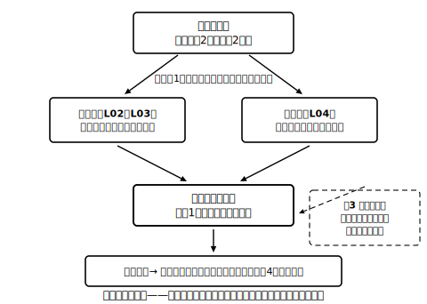

# L08 章末まとめ——「消して戻す」作戦をふり返る

## ねらい

- 「意味・解く・使う」の3部屋で章全体を自己点検し、穴のある部屋を特定して戻れるようになる。
- 次章（一次関数）・中3（二次方程式）への接続を知る。

## 3部屋の自己チェック

次の各問いに、**教科書やノートを見ずに**自分の言葉で答えられるか試そう。詰まった部屋が、復習に戻る場所だ。

**部屋1: 意味（L01）**
- 二元一次方程式の解が「組」なのはなぜ？　解は1つに決まる？
- 連立方程式の解の定義を、「同時に」という言葉を使って言える？
- 答えの組が正しいかどうか、自分ひとりで確かめる方法は？

**部屋2: 解く（L02〜L05）**
- 加減法と代入法に共通する作戦（〇〇を1つ消して、△△△△方程式に戻す）を言える？
- 辺々を引くとき、右辺はどうする？
- どんなときに代入法を選ぶと速い？

**部屋3: 使う（L06〜L07）**
- 利用の4ステップ（宣言→式2本→解く→場面に戻す）を順に言える？
- 「求め方の説明」に必要な3点は？
- 解がそのまま答えにならないのは、どんなとき？

## 総合演習

1. 次の連立方程式を解こう（解き方は自分で選び、選んだ理由を一言）。解は両方の式に代入して確かめること。
   (1) { 4x＋3y＝1, 2x−y＝3 }
   (2) { y＝2x−3, 3x−2y＝4 }
   (3) { 0.2x＋0.5y＝1.6, x−2y＝−1 }
2. 1枚50円のカードと1枚80円のカードをあわせて15枚買ったら、代金は990円だった。それぞれ何枚買ったか求めよう。（4ステップで）
3. 【説明】「和が20、差が6である2つの数の求め方」を、説明の3点セットで書き、実際に2つの数を求めよう。
4. (2, 3)を解にもつ連立方程式を、自分で1つ作ってみよう。（作ったら、本当に(2, 3)が解になるか代入で確かめること——問題を作る側に回ると、解の意味の理解が試される）

## 次の章へ——予告編

**一次関数（次章）**: L01で、二元一次方程式の解を表にずらりと並べた。あの**解の組の並びを、目に見える形で表す方法**を次章で学ぶ。そのとき、連立方程式の解が「2つの直線の交点」として見えてくる——いまはこの一文の予告まで。表に並べたあの組たちが図の上でどこにいるのか、楽しみにしていてほしい。

**二次方程式（中3）**: この章の作戦は「**文字の種類を減らして**、解ける形に帰着」だった。中3では「**次数を減らして**、解ける形に帰着」が登場する。減らすものはちがっても、作戦は同じ。「消して戻す」は一生ものの型だ。

:::guide
**「解ける」と「意味が分かっている」は別の到達点**

計算がすらすらできることと、部屋1の問いに答えられることは、別のチェック項目だ。どちらか片方だけでは、次章（一次関数のグラフと交点）で必ず苦しくなる。部屋1で詰まった人は、L01の表に戻って、解の組を自分の手でもう一度書き出してみよう——遠回りに見えて、それが最短ルート。
:::

:::guide
**総合演習で解き方に迷ったら**

迷うこと自体は悪くない。「y＝…の形があるか→係数はそろえやすいか」の順に見る（L04）。そして、どちらで解いても**答えは必ず同じ**——だから、選択に時間をかけすぎるより、宣言して手を動かし、最後に代入検算で守る方が実戦的だ。
:::

:::zatsudan
2x＋y＝7の解を表に並べる遊び、覚えているだろうか。変域を自然数に限ると3組で打ち止め——じつはあの表遊びが、この章の入り口（解の意味）でもあり、次の章の入り口（組が図の上で一直線に並ぶ）でもある。1つの素朴な表が2つの章をつないでいる。数学の単元は、こうやって手をつないでいるんだ。
:::

:::stretch
**S1** { x＋y＝5, 2x＋2y＝10 } の2本の式について、それぞれ自然数の解を表に書き出してみよう。何に気づくだろうか。この「連立方程式」の解を1組に絞ることはできるか、考えたことを自分の言葉で書こう。（ヒント: 2本目の式は、1本目の両辺を2倍しただけ——新しい条件になっている？）
:::

---

対応解答: answer_key_L05-08.md

<!-- gen_nav:nav:start（自動生成・手編集しない） -->

---

[← 前のレッスン](lesson_07.md)｜[単元の目次](README.md)｜[解答](answer_key_L05-08.md)

<!-- gen_nav:nav:end -->
