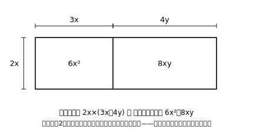

# L01 単項式と多項式の乗法・除法

## ねらい

- 中3の式の計算に入る前に、道具箱の中身（中2の式の計算・中1の素因数分解）を自分で点検する。
- 単項式×多項式・多項式÷単項式を、**分配法則に帰着させて**確実に計算できるようになる。

## 導入：中3の数学は「式の変形」から始まる

中3の数学の最初の章へようこそ。この章の主役は、**式の形を自在に変える技術**だ。式をバラバラに開く技と、逆にかけ算の形にまとめる技——この2つがそろうと、複雑な計算が一瞬で終わったり、数の隠れた性質が証明できたりする。その入り口として、まずは今もっている道具の点検から始めよう。

## 準備運動：道具箱の点検（前提診断）

新しい章に入る前に、次の6問をやってみよう。すらすら解ければ準備は万全。あやしいところがあれば、それが分かっただけで収穫だ。

1. 次を計算しよう。 3(x＋2y)
2. 次を計算しよう。 5a＋2b−3a＋4b
3. 次を計算しよう。 (−2)×(−3) と (−2)×3
4. 30を**素因数分解**しよう（素数だけの積の形にする）。
5. 次のうち**素数**をすべて選ぼう。 1, 2, 6, 7, 9
6. 12＝3×4 のように、12をいくつかの整数の積で表す表し方を、ほかに1つ書こう。

:::guide
**準備運動の6問は「この章でつまずく場所」の予告になっている**

1〜3は中2の式の計算と中1の正負の数。この章の計算はすべて分配法則（1）・同類項の整理（2）・符号の処理（3）の組み合わせでできているので、ここがあやしいと感じたら、中2の教科書の「式の計算」の章を先に見直しておくのが近道だ。

4〜6は中1の「素因数分解」。とくに5で「1」を選んでしまった人は要注意——**1は素数に含めない**という約束だった（素数は「1とその数自身しか約数がない、1より大きい整数」）。この章では「因数」という語が主役級で登場する。数を積の形に分解した経験（4・6）が、そのまま**式**を積の形に分解する話（この章の後半）につながっていく。忘れていても大丈夫、L05でもう一度ていねいに定義し直す。
:::

## 主概念1：単項式×多項式——分配法則に帰着させる

2x(3x＋4y) のような、単項式と多項式の乗法を考える。新しい規則は何もいらない。中2で使ってきた**分配法則**

a(b＋c)＝ab＋ac

の a, b, c に、数だけでなく単項式が入るだけだ。

2x(3x＋4y)＝2x×3x＋2x×4y＝6x²＋8xy

かっこの外の単項式を、**かっこの中の各項に1つずつ、もれなくかける**。これがすべてだ。

長方形の面積で見ると、この計算の意味がよく見える。縦2x・横(3x＋4y)の長方形の面積は、全体を一度に求めても、縦線で2つに切って足しても同じ。**「全体＝部分の和」——分配法則は面積の図そのもの**なのだ。

負の符号が入るときは、符号の処理に一段だけ注意がいる。

−3a(2a−5b)＝(−3a)×2a＋(−3a)×(−5b)＝−6a²＋15ab

「マイナス×マイナスはプラス」。あやしくなったら、すでに学んだ正負の数の乗法まで戻って1項ずつ確かめればよい。

:::guide
**「もれなく・符号ごと」——この2語がこの章全体の合言葉**

単項式×多項式の誤りは、だいたい「かけ忘れ（後ろの項にかけていない）」か「符号の処理」のどちらかに落ちる。おすすめの自己点検は、①かっこの中の項の数と、答えの項の数が一致しているか数える ②マイナスを含む項の計算だけ、(−3a)×(−5b) のように**かっこをつけて書き直してから**符号を決める、の2つ。この点検はL02以降の展開でもそのまま使える。
:::

## 主概念2：多項式÷単項式——わり算は逆数のかけ算へ

(6x²＋8xy)÷2x のような除法は、すでに学んだ約束「わり算は逆数のかけ算に直す」で乗法に帰着できる（文字で割るので、xは0でないとする）。

(6x²＋8xy)÷2x＝(6x²＋8xy)× 1/(2x) ＝ 6x²/(2x) ＋ 8xy/(2x) ＝ 3x＋4y

主概念1の 2x(3x＋4y)＝6x²＋8xy と見比べてほしい。**かけて、割ったら、もとに戻った**。かけ算とわり算が互いに逆の操作であること——実はこの「逆」という見方が、この章の後半の主役になる。頭の片すみに置いておこう。

:::zatsudan
30＝2×3×5 のような素因数分解、覚えているかな？ 数を「分解する」と、その数の正体——何で割れるか、どんな数を組み立てられるか——が見えてくるのだった。この章でこれから学ぶのは、いわば**式バージョンの分解と組み立て**。そして式の世界の分解は、数のときよりずっと強力な道具になる！
:::

## 練習

1. 次を計算しよう。
   (1) 4x(2x＋3)　(2) −2a(a−4b)　(3) (3x−6y)×(−5x)
2. 次を計算しよう。
   (1) (9a²＋6ab)÷3a　(2) (8x²−12xy)÷(−4x)
3. ある長方形の縦の長さは 3a、面積は 3a(2a＋7b) である。この長方形の横の長さを求めよう。
4. 次の計算はまちがっている。どこがまちがいかを説明し、正しく計算し直そう。
   2x(x＋5)＝2x²＋5

:::stretch
**S1** (a＋b)÷c ＝ a/c ＋ b/c は、cが0でないときいつでも使えるが、c÷(a＋b) を c/a ＋ c/b としてよいだろうか。a＝1, b＝2, c＝6 などの数を入れて確かめ、この2つの違いを自分の言葉で説明してみよう。

（わり算の向きに関するこの区別は、この先ずっと効いてくる。数で実験して納得しておく価値がある。）
:::

---

対応解答: answer_key_L01-04.md

<!-- gen_nav:nav:start（自動生成・手編集しない） -->

---

[単元の目次](README.md)｜[解答](answer_key_L01-04.md)｜[次のレッスン →](lesson_02.md)

<!-- gen_nav:nav:end -->
