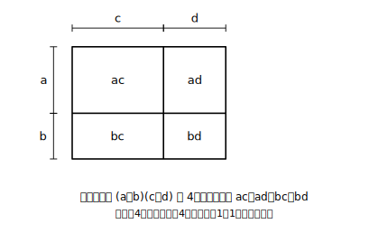
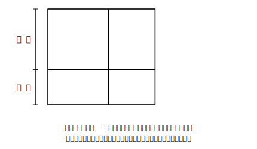

# L02 式の展開——多項式×多項式

## ねらい

- (a＋b)(c＋d) の計算を、**すでに知っている分配法則に帰着させて**自分で導けるようになる。
- かっこをはずして単項式の和の形に表すことを「展開」ということを知り、部分積の構造（どの項とどの項をかけたか）を面積の図で説明できるようになる。

## 導入：かっこ×かっこは計算できるか？

L01では、単項式×多項式 2x(3x＋4y) を分配法則で計算した。では、**多項式×多項式**

(a＋b)(c＋d)

はどうだろう。かっこの外にあるのが単項式ではなく多項式だから、このままでは分配法則の形 □(c＋d)＝□c＋□d に見えない。新しい規則を教わる……のではなく、**知っている形に持ち込む工夫**でなんとかしてみよう。

## 主概念1：ひとまとまりをMと置く——分配法則への帰着

a＋b を、ひとまとまりの1つの文字 **M** と置き換えてみる。すると、

(a＋b)(c＋d)＝M(c＋d)

これはL01でやった単項式×多項式の形だ。分配法則で開くと、

M(c＋d)＝Mc＋Md

最後にMをもとの a＋b に戻して、もう一度分配法則を使う。

Mc＋Md＝(a＋b)c＋(a＋b)d＝ac＋bc＋ad＋bd

つまり、

**(a＋b)(c＋d)＝ac＋ad＋bc＋bd**

新しい規則はどこにも登場していない。使ったのは中2までの分配法則、それも2回だけ。「初めて見る形は、置き換えで知っている形にする」——この工夫自体が、この章で何度も使う技だ。

:::guide
**「4つの項はどこから来たか」を言えることがゴール**

結果の ac＋ad＋bc＋bd を「前の項どうし、外どうし……」のような手順の呪文で覚えるだけだと、項が3つのかっこや複雑な式で崩れやすい。確実なのは「**左のかっこの各項を、右のかっこの各項に、1回ずつもれなくかける**」という構造の理解だ。左が2項・右が2項なら、かけ算の組み合わせは 2×2＝4 通り——だから項は（同類項がなければ）4つになる。左が2項・右が3項なら6つ。項の個数を予告してから計算し、答え合わせに使う習慣をつけると、かけ忘れが自分で発見できる。
:::

## 主概念2：面積で見る展開——「展開」の定義

(a＋b)(c＋d) は、縦(a＋b)・横(c＋d)の長方形の面積と見ることができる。

縦を a と b に、横を c と d に区切ると、長方形は4つの部分に分かれ、それぞれの面積が ac, ad, bc, bd。全体の面積は4つの和に等しい。主概念1で式から出した4つの項が、図の4つの部屋と1対1で対応している——**式の計算と面積の図は、同じことの2つの表現**なのだ。

このように、単項式や多項式の積の形の式を、かっこをはずして単項式の和の形に表すことを、その式を**展開する**という。

数や同じ文字が混ざるときは、展開のあとに**同類項の整理**まで進める。

(x＋3)(x＋5)＝x²＋5x＋3x＋15＝x²＋8x＋15

(2a−b)(a＋4b)＝2a²＋8ab−ab−4b²＝2a²＋7ab−4b²

負の項は、L01の合言葉どおり「符号ごと」かける。(−b)×a＝−ab のように、符号を項の一部として運ぶこと。

:::guide
**面積の図は「公式を忘れたときの帰る場所」**

この図をここでていねいに扱うのには理由がある。次のレッスンから展開の公式が登場するが、公式は忘れることがある。忘れたときに「解けない問題」にしないための保険が、①分配法則（1回ずつもれなくかける）と②この面積の図、の2つだ。とくに図は、(a＋b)² のような公式を「なぜ項が3つになるのか」ごと思い出させてくれる。公式を学んだあとも、ときどきこの図に戻って「いまの計算は図のどの部屋か」を確かめる習慣が、公式を忘れても崩れない力になる。
:::

## 展開の練習——項の数を予告してから

展開の手順を型にしておこう。

1. **予告する**: 左の項数×右の項数で、（整理前の）項の個数を予告する。
2. **もれなくかける**: 左の各項を右の各項に、符号ごと1回ずつかける。
3. **整理する**: 同類項をまとめる。

(x−2)(x−6)＝x²−6x−2x＋12＝x²−8x＋12

予告どおり整理前は4項、同類項をまとめて3項。この「予告→計算→照合」のリズムが、かけ忘れへのいちばんの防御になる。

:::zatsudan
(x＋3)(x＋5) の展開、xに10を入れてみると 13×15 の計算になる。展開した式 x²＋8x＋15 に10を入れると 100＋80＋15＝195。……つまり 13×15＝195 が、10のまとまりを崩さないまま「100が1枚、10が8本、1が15個」と数えられたことになる！ 実は筆算も、位ごとに分けてかける「展開」を縦書きにしたもの——ずっと使ってきた計算の中に、この章の主役は隠れていたんだ。
:::

## 練習

1. 次の式を展開しよう。
   (1) (a＋2)(b＋3)　(2) (x＋4)(x＋6)　(3) (x−5)(x＋2)　(4) (3a＋b)(2a−5b)
2. 次の式を展開しよう（左のかっこは3項。項数の予告から）。
   (1) (a＋b＋1)(c＋2)
3. (x＋3)(x＋5)＝x²＋8x＋15 について、面積の図をかき、8x が図のどの部分から来るかを説明しよう。
4. 次の計算のまちがいを見つけ、正しく直そう。
   (x＋4)(x−7)＝x²−7x＋4x＋28＝x²−3x＋28 …… とした。どこがまちがいだろう？

:::stretch
**S1** (a＋b)(c＋d＋e) の展開では、整理前の項はいくつになるか予告してから展開しよう。さらに (a＋b＋c)(d＋e＋f) ではどうか。「左の項数×右の項数」の予告がいつでも成り立つ理由を、面積の図（部屋の数）で説明してみよう。

**S2** (x＋1)(x＋2)(x＋3) のように、かっこが3つの積も、2つずつ順に展開すれば計算できる。やってみよう。（どの2つから先に計算しても結果が同じになることも、確かめられるとなおよい。）
:::

---

対応解答: answer_key_L01-04.md

<!-- gen_nav:nav:start（自動生成・手編集しない） -->

---

[← 前のレッスン](lesson_01.md)｜[単元の目次](README.md)｜[解答](answer_key_L01-04.md)｜[次のレッスン →](lesson_03.md)

<!-- gen_nav:nav:end -->
