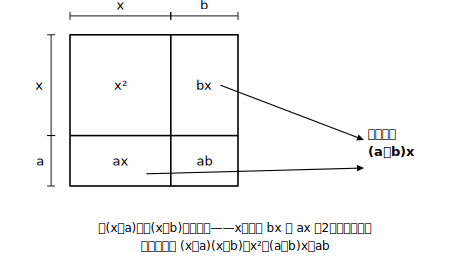

# L03 乗法の公式①——(x＋a)(x＋b)

## ねらい

- 同じ形の展開を並べて観察し、**結果の規則性を自分で見つける**。
- (x＋a)(x＋b)＝x²＋(a＋b)x＋ab を公式として使えるようになり、忘れたら分配法則に戻れることも確かめる。

## 導入：3つの展開を並べてみる

L02の型（予告→もれなくかける→整理）で、次の3つを展開してみよう。まず自分の手で。

(x＋2)(x＋3)＝
(x＋4)(x＋5)＝
(x＋1)(x＋6)＝

結果はこうなる。

(x＋2)(x＋3)＝x²＋5x＋6
(x＋4)(x＋5)＝x²＋9x＋20
(x＋1)(x＋6)＝x²＋7x＋6

3つとも「x²＋●x＋▲」の形。では、●と▲はもとの2つの数からどう決まっているのだろう？ 展開する前の数（2と3、4と5、1と6）と見比べて、規則を探してみよう。

## 主概念：規則を式にする——公式①

見つかっただろうか。●は**2つの数の和**、▲は**2つの数の積**になっている（2＋3＝5と2×3＝6、4＋5＝9と4×5＝20、1＋6＝7と1×6＝6）。これを文字で書き表すと、

**(x＋a)(x＋b)＝x²＋(a＋b)x＋ab**

この規則がいつでも成り立つことは、L02の型で確かめられる。

(x＋a)(x＋b)＝x²＋bx＋ax＋ab＝x²＋(a＋b)x＋ab

xの項が2つ（bxとax）出てきて、同類項をまとめると係数が a＋b になる——「和」の正体は、**2か所から来たxの項の合流**だったのだ。

このように、よく使う形の展開の結果を規則としてまとめたものを、この教材では**乗法の公式**と呼ぶ。この章では全部で4つの乗法の公式を使い、一覧（L04で出そろう）の並び順の番号で呼ぶ——今日の公式はその1番目、**公式①**だ（②〜④は次のレッスンで登場する）。公式を使えば、展開の途中式を省いて一気に結果が書ける。

(x＋3)(x＋7)＝x²＋10x＋21 （和10・積21）

負の数が入っても、公式のa, bに**符号ごと**入れればそのまま使える。

(x−2)(x＋5)＝x²＋(−2＋5)x＋(−2)×5＝x²＋3x−10
(x−4)(x−6)＝x²＋(−4−6)x＋(−4)×(−6)＝x²−10x＋24

:::guide
**公式は「暗記」ではなく「途中式の圧縮」**

この公式を「呪文」として丸暗記すると、忘れた瞬間に手が止まる。そうではなく、「分配法則で開けば必ず x の項が2本出て、合流する」という**構造**ごと持っておけば、忘れても分配法則で30秒あれば再現できる。公式が身についた状態とは、①速く使える ②なぜ成り立つか説明できる ③忘れたら作り直せる、の3つがそろった状態を指す。とくに③は、この先すべての公式に共通する保険になる。
:::

:::guide
**符号のミスは「和と積を先にメモする」で防ぐ**

(x−4)(x−6) のような両方マイナスの場合、「積は＋24なのに、なんとなく−24と書いてしまう」ことが起きやすい。おすすめは、展開を書き出す前に余白へ「和: −10、積: ＋24」と**先にメモしてから**式を書く手順。和と積の計算（正負の数の加法・乗法）と、公式への当てはめを分離すると、どちらでミスしたかも自分で切り分けられる。符号があやしいときは、中1の正負の数の乗法（マイナス×マイナス＝プラス）まで戻って確認してよい——戻るのは後退ではなく点検だ。
:::

:::zatsudan
この公式、xに10を入れると2けたの数のかけ算の暗算術になる。たとえば 13×16 なら (10＋3)(10＋6)＝100＋(3＋6)×10＋3×6＝100＋90＋18＝208。「和を10倍して、積を足して、100を足す」——慣れると頭の中だけでいける！ 12×14、11×17あたりで試してみよう。
:::

## 練習

1. 公式①を使って展開しよう（余白に「和・積」をメモしてから）。
   (1) (x＋5)(x＋6)　(2) (x＋8)(x−3)　(3) (x−7)(x＋4)　(4) (x−5)(x−9)
2. 次の□に当てはまる数を求めよう。
   (1) (x＋2)(x＋□)＝x²＋9x＋14　(2) (x−3)(x＋□)＝x²＋□x−24 （□は2か所。左の□を先に）
3. (y−6)(y＋6−1) のままでは公式①が使えない。かっこの中を整理してから、公式①で展開しよう。
4. 公式①を忘れてしまったと仮定して、(x＋a)(x＋b) を分配法則から展開し、公式を自力で作り直そう（「忘れたら作り直せる」の練習）。

:::stretch
**S1** (x＋a)(x＋b)＝x²＋(a＋b)x＋ab で、a＋b＝10、ab＝21 になる整数 a, b を見つけよう。次に、a＋b＝10、ab＝25 の場合、a＋b＝10、ab＝24 の場合はどうか。「和と積から2つの数を逆に探す」このゲーム、実はこの章の後半で主役になる。
:::

---

対応解答: answer_key_L01-04.md

<!-- gen_nav:nav:start（自動生成・手編集しない） -->

---

[← 前のレッスン](lesson_02.md)｜[単元の目次](README.md)｜[解答](answer_key_L01-04.md)｜[次のレッスン →](lesson_04.md)

<!-- gen_nav:nav:end -->
