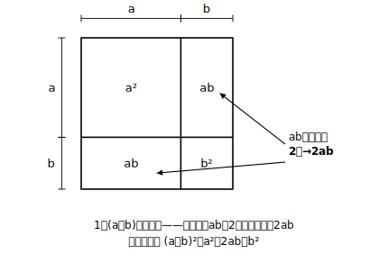

# L04 乗法の公式②③④——平方の公式・和と差の積

## ねらい

- (a＋b)²・(a−b)²・(a＋b)(a−b) の展開を、公式①の**特別な場合**として自分で導く。
- 4つの公式を場面に応じて使い分け、少し複雑な式にも「置き換え」で公式を適用できるようになる。

## 導入：公式①の「特別な場合」を調べる

新しい公式を教わる前に、手もとの公式①でどこまでいけるか試そう。公式① (x＋a)(x＋b)＝x²＋(a＋b)x＋ab で、**aとbが同じ数**だったら？ **aとbが符号だけ違う数**だったら？ この2つの「特別な場合」から、今日の公式が全部出てくる。

## 主概念1：平方の公式——(a＋b)²と(a−b)²

(x＋a)(x＋a)、つまり (x＋a)² を公式①で計算すると、和は a＋a＝2a、積は a×a＝a² だから、

(x＋a)²＝x²＋2ax＋a²

文字を一般の形にそろえて書くと、

**(a＋b)²＝a²＋2ab＋b²**

同じように、(x−a)² は和が −2a・積が ＋a² となるので、

**(a−b)²＝a²−2ab−…ではなく、a²−2ab＋b²**

わざと一度書きまちがえてみせた。最後の項は (−b)×(−b)＝**＋b²**。マイナス×マイナスはプラス——ここがこの公式でいちばん狙われる場所だ。

(a＋b)² を面積で見ると、1辺(a＋b)の正方形の中に、a²の部屋とb²の部屋のほかに、**abの部屋が2つ**ある。「なぜ2abなのか」は、この図が一生忘れさせてくれない。

:::guide
**「(a＋b)²＝a²＋b²としない」への足場は2段構え**

真ん中の項 2ab を落とす誤りへの防御は、①面積の図（abの部屋が2つ、目で見える）②数での検算（(3＋4)²＝49 だが 3²＋4²＝25 で一致しない——2×3×4＝24 が足りない分）の2段構えが確実だ。「公式がこうだから」という記憶だけに頼らず、疑わしいときは小さい数を入れて確かめる。この「数を入れて確かめる」は、自分の答えを自分で点検できる、独習でいちばん頼りになる技である。

(a−b)² の符号は、(a−b)²＝(a＋(−b))² と読み替えて公式②に−bを入れる、と理解しておくと、公式を2本覚える負担が実質1本になる。真ん中の項は 2×a×(−b)＝−2ab、最後の項は (−b)²＝＋b²。
:::

## 主概念2：和と差の積——(a＋b)(a−b)

今度は、aとbの**符号だけ違う**2数の積 (x＋a)(x−a)。公式①で、和は a＋(−a)＝0、積は a×(−a)＝−a²。和が0だから、xの項が**消える**。

(x＋a)(x−a)＝x²−a²

一般の形で、

**(a＋b)(a−b)＝a²−b²**

展開すると必ず4項出るはずだったのに、結果は2項。途中の ＋ab と −ab がちょうど打ち消し合うからだ。この「消える」という性質が、この公式を4公式の中でもとくに強力な道具にしている。

これで、この章で使う**4つの公式**が出そろった。この一覧の番号①〜④で、この章の公式を呼ぶ。

- **公式①** (x＋a)(x＋b)＝x²＋(a＋b)x＋ab（L03で学んだ公式）
- **公式②** (a＋b)²＝a²＋2ab＋b²
- **公式③** (a−b)²＝a²−2ab＋b²
- **公式④** (a＋b)(a−b)＝a²−b²

どれも、分配法則（L02）から数分で作り直せる。**4本の公式の下に、分配法則という1本の幹がある**——この見取り図を忘れないでほしい。

## 使い分けと置き換え

式の形を見て、どの公式が使えるか判定する練習をしよう。判定の目のつけどころは、**2つのかっこが同じか・符号だけ違うか・別々か**。

- (x＋7)² → 同じかっこの2乗 → 公式②（平方。−なら公式③）
- (x＋9)(x−9) → 符号だけ違う → 公式④（和と差の積）
- (x＋2)(x−8) → 別々の数 → 公式①

さらに、複雑に見える式も**ひとまとまりの置き換え**（L02のMの技）で公式が使える形になることがある。

(a＋b＋3)(a＋b−3) は、a＋b＝M と置くと (M＋3)(M−3)＝M²−9。Mを戻して (a＋b)²−9、公式②でさらに開いて a²＋2ab＋b²−9。

:::guide
**「どの公式か」の判定は、展開の前の3秒でする**

計算を始めてから公式を思い出そうとすると、途中で手順が混ざりやすい。おすすめは、式を書き写した直後に「同じ／符号違い／別々」のどれかを3秒で判定し、使う公式の番号を式の横に小さくメモしてから展開に入る手順。判定がつかないときは、無理に公式を思い出さず**分配法則で開いてよい**。公式は近道であって、通らなければ解けない道ではない——この安心感が、試験の場でもいちばん効く。
:::

:::zatsudan
公式④を数で試すと、ちょっと気持ちいい。29×31＝(30−1)(30＋1)＝900−1＝899——一瞬だよね！ 48×52なら(50−2)(50＋2)＝2500−4＝2496。きりのいい数の前後のかけ算を見たら、公式④の出番だ。
:::

## 練習

1. 公式②③④を使って展開しよう。
   (1) (x＋6)²　(2) (x−9)²　(3) (a＋5)(a−5)　(4) (2x＋3)²　(5) (3a−4b)(3a＋4b)
2. 4公式のどれを使うか判定してから、展開しよう。
   (1) (x−4)(x−9)　(2) (x−10)(x＋10)　(3) (x−1)²　(4) (a＋8)(a−2)
3. 置き換えを使って展開しよう。
   (1) (x＋y＋2)(x＋y−2)　(2) (a−b＋5)²
4. (a＋b)²＝a²＋b² と計算した人がいる。a＝3, b＝4 を入れてこの式が正しくないことを確かめ、正しい展開との差がどの項なのかを説明しよう。

:::stretch
**S1** (a＋b)² と (a−b)² を両方展開して、**差** (a＋b)²−(a−b)² を計算してみよう。結果は驚くほど簡単な形になる。さらに**和** (a＋b)²＋(a−b)² も計算し、a＝5, b＝2 などの数で両方の結果を検算してみよう。

**S2（発展の入り口——公式④を2回使うと）** (x＋1)(x−1)(x²＋1) のような積も、まず (x＋1)(x−1)＝x²−1（公式④）と閉じると、残りは (x²−1)(x²＋1)——x² をひとまとまりとみれば、これも「符号だけ違う」形だ。このように公式を重ねて使う4乗の式の展開・因数分解は、高校の数学で本格的に扱う。興味があれば「乗法公式 くり返し使う」で調べてみよう。
:::

---

対応解答: answer_key_L01-04.md

<!-- gen_nav:nav:start（自動生成・手編集しない） -->

---

[← 前のレッスン](lesson_03.md)｜[単元の目次](README.md)｜[解答](answer_key_L01-04.md)｜[次のレッスン →](lesson_05.md)

<!-- gen_nav:nav:end -->
