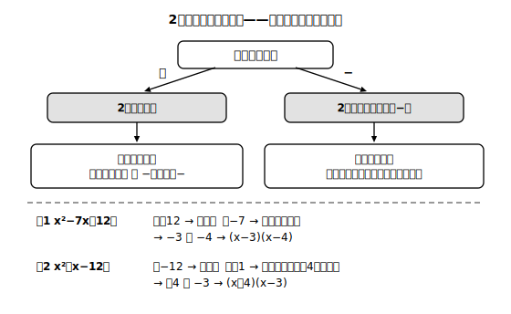

# L06 公式による因数分解①——「和と積」から2つの数を探す

## ねらい

- x²＋px＋q の形の式を、乗法の公式①の**逆向き**で因数分解できるようになる。
- 2数の探し方を「積から絞る」手順として身につけ、検算（展開で戻す）までを1セットにする。

## 導入：展開の公式を逆から読む

L03の公式①をもう一度見よう。

(x＋a)(x＋b)＝x²＋(a＋b)x＋ab

これを**右から左へ**読むと、そのまま因数分解の公式になる。

x²＋(a＋b)x＋ab＝(x＋a)(x＋b)

つまり、x²＋7x＋12 を因数分解したければ、「**和が7、積が12**になる2つの数」を探せばよい。見つかるだろうか？ 3と4だ（3＋4＝7、3×4＝12）。よって、

x²＋7x＋12＝(x＋3)(x＋4)

検算: (x＋3)(x＋4)＝x²＋7x＋12 ✓。L05で決めた型どおり、**展開で戻して**から次へ進む。

## 主概念：2数の探し方——「積から絞る」

「和が7、積が12」の2数を、あてずっぽうで探すと時間がかかるし、見落とす。手順を決めよう。ポイントは、**和からではなく積から絞る**ことだ。

**例: x²＋8x＋12 を因数分解する。**

1. **積になる組を書き出す**: 積が12になる整数の組は (1,12)(2,6)(3,4)。
2. **和で選ぶ**: このうち和が8になるのは (2,6)。
3. **書いて検算**: x²＋8x＋12＝(x＋2)(x＋6)。展開して確認 ✓

積から絞る理由は、積の組は**有限個しかない**からだ（和が8になる2数は無限にある）。12なら3組を調べれば必ず終わる。

負の数が入る場合も、手順は同じ。**符号の見取り図**を持っておくと速い。

- 積が**プラス**（例: x²−7x＋12）→ 2数は**同符号**。和がマイナスなら両方マイナス → (−3,−4) → (x−3)(x−4)
- 積が**マイナス**（例: x²＋x−12）→ 2数は**異符号**。和の符号は絶対値の大きいほうが決める → (4,−3) → (x＋4)(x−3)

:::guide
**うまくいかないときの切り分け——「組がない」のか「見落とし」なのか**

2数がなかなか見つからないとき、原因は2つに分かれる。①積の組の書き出しに漏れがある（とくに負の数の組。積が−12なら (1,−12)(−1,12)(2,−6)(−2,6)(3,−4)(−3,4) の6組ある）②そもそも整数の組では因数分解できない式である（例: x²＋x＋1。積が1で和が1になる整数はない）。①を防ぐには、書き出しを「絶対値の組を先に全部→符号をあとで割り振る」の2段階にするとよい。②のような式に出会ったら、それは「解けない自分」のせいではなく式の性質。中学の範囲では「これ以上は分解できない」と判断してよい。
:::

:::guide
**因数分解の公式は「別の公式」ではない**

このレッスンで使っている規則は、L03で学んだ展開の公式①、それ自体である。向きを変えて使っているだけで、新しく覚えることは実は1つもない。「因数分解の公式は、式の展開の公式の逆」——この見方を持っていると、公式の総数は増えないし、忘れたときの復元場所（分配法則→展開の公式→その逆読み）も1本につながる。次のレッスンの平方・和と差の積も、すべて同じ構図で出てくる。
:::

:::zatsudan
「和が10、積が21」→3と7、「積が24」→4と6、「積が25」→5と5……気づいた？ 和を10に固定して積を大きくしていくと、2つの数はどんどん**近づいて**、5と5（真ん中どうし）で積が最大の25になる。同じ長さのひもで長方形を作るとき、正方形がいちばん広くなる話と同じ構造だ！ 「和が一定なら積は真ん中で最大」——ちょっとした宝物みたいな法則だよ。
:::

## 練習

1. 次の式を因数分解しよう（積の組の書き出し→和で選ぶ→展開で検算）。
   (1) x²＋9x＋20　(2) x²＋10x＋16　(3) x²−8x＋15　(4) x²−12x＋36 はどうなるか、まず公式①の手順（2数探し）でやってみよう
2. 次の式を因数分解しよう（異符号の組に注意）。
   (1) x²＋2x−15　(2) x²−3x−18　(3) x²−x−30
3. x²＋□x＋18 が (x＋a)(x＋b)（a, bは正の整数）の形に因数分解できるとき、□に当てはまる数をすべて求めよう。
4. 次の因数分解のまちがいを、展開の検算で発見し、正しく直そう。
   x²−5x−14＝(x＋7)(x−2) …… 検算するとどうなる？

:::stretch
**S1** x²＋px＋36 が整数の範囲で因数分解できるような正の整数 p をすべて挙げよう（ヒント: 積が36になる同符号の組を全部書き出す）。36を別の数（たとえば30や16）に変えると、pの候補の個数はどう変わるだろうか。積の数の「約数の個数」との関係を観察してみよう。
:::

---

対応解答: answer_key_L05-08.md

<!-- gen_nav:nav:start（自動生成・手編集しない） -->

---

[← 前のレッスン](lesson_05.md)｜[単元の目次](README.md)｜[解答](answer_key_L05-08.md)｜[次のレッスン →](lesson_07.md)

<!-- gen_nav:nav:end -->
