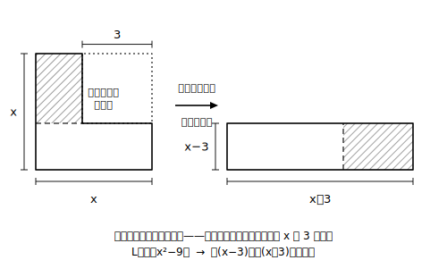

# L08 いろいろな因数分解——組み合わせと往復

## ねらい

- 共通因数のくくり出しと公式を**組み合わせて**、2段構えの因数分解ができるようになる。
- 置き換えを使った因数分解と、「これ以上分解できないか」の完了判定を身につける。
- 展開⇄因数分解の往復練習で、2つの変形が互いに逆であることを確かめる。

## 導入：地図の順番どおりに調べる

L07の終わりに作った「因数分解の地図」を、実戦で使ってみよう。

**(1) 共通因数 →(2) 平方−平方 →(3) 平方の形の3点点検 →(4) 2数探し**

**例: 2x²＋12x＋18 を因数分解する。**

手順(1)から。共通因数2があるので、まずくくり出す。

2x²＋12x＋18＝2(x²＋6x＋9)

かっこの中はまだ終わりではない。x²＋6x＋9 に地図を再適用——3点点検で平方の形（2×x×3＝6x ✓）。

2(x²＋6x＋9)＝**2(x＋3)²**

検算: 2(x＋3)²＝2(x²＋6x＋9)＝2x²＋12x＋18 ✓

ポイントは、**くくり出したあと、かっこの中にもう一度地図を使う**こと。因数分解は「1回変形して終わり」ではなく、**すべての因数がそれ以上分解できなくなるまで**続ける。

## 主概念1：2段構えと置き換え

**くくり出し→公式**の2段構えは、最初に共通因数を見落とすと公式が見えなくなる。

3x²−27＝3(x²−9)＝3(x＋3)(x−3)

もし最初の3を見落とすと、3x²−27 は「平方−平方」に見えず（3x²は、この単元で扱う範囲——整数の係数と文字の単項式——では「何かの平方」の形とはみなさない）、手が止まってしまう。**地図の(1)を飛ばさない**理由がここにある。

もう1つの技は、L02・L04でも使った**置き換え**だ。ひとまとまりを1文字とみなすと、公式が使える形が浮かび上がる。

**例: (x＋y)²−6(x＋y)＋9**

x＋y＝M と置くと、M²−6M＋9＝(M−3)²。Mを戻して、

(x＋y)²−6(x＋y)＋9＝ **(x＋y−3)²**

:::guide
**「途中で止まった因数分解」を自分で見つける2つの検査**

因数分解の誤りには、まちがった変形だけでなく「正しいが不完全」という型がある（例: 8x²＋12x＝2(4x²＋6x) で止まる——かっこの中にまだ共通因数2xが残っている）。完了判定の検査は2つ。①**かっこの中それぞれに地図を再適用したか**（共通因数・平方−平方・3点点検・2数探しのどれも通らないことを確認して初めて「完了」）②**検算の展開でもとに戻るか**（不完全でも戻ってしまうので、①の代わりにはならない——①と②は役割が違う検査だ）。「戻るからOK」だけで済ませず、①の完了チェックを口ぐせにしよう。
:::

## 主概念2：展開⇄因数分解の往復

ここで一度、章の前半と後半をつないでみよう。次の左右は、同じ等式を逆向きに読んだものだ。

| 展開（左→右） | 因数分解（右→左） |
|---|---|
| (x＋3)(x＋4)＝x²＋7x＋12 | x²＋7x＋12＝(x＋3)(x＋4) |
| (x−5)²＝x²−10x＋25 | x²−10x＋25＝(x−5)² |
| (x＋6)(x−6)＝x²−36 | x²−36＝(x＋6)(x−6) |

**往復練習**をしよう——因数分解した答えを展開してもとに戻し、展開した答えを因数分解してもとに戻す。この往復が一瞬でできるようになると、どちらの向きの変形も「検算つき」で使えるようになる。式の形を目的に合わせて選ぶ——開いた形（和の形）と閉じた形（積の形）を自由に行き来する力が、次の節「利用」の土台になる。

:::guide
**「開いた形」と「閉じた形」、それぞれの得意分野**

和の形（展開した形）は、同類項をまとめたり、式を整理して比べたりするのが得意。積の形（因数分解した形）は、値の計算を楽にしたり、「何で割り切れるか」「いつ0になるか」を読み取ったりするのが得意。つまり**どちらが偉いのではなく、用途が違う**。次のレッスンからの「利用」では、目的に応じて「どちらの形に持ち込むか」を最初に決めることが作戦のすべてになる。この往復の視点は、そのまま高校数学でも使い続けることになる。
:::

:::zatsudan
展開は「一本道」、因数分解は「宝探し」——同じ等式なのに、向きが変わるだけで難しさがまるで違うの、不思議じゃない？ 実は「かけるのは簡単、分解するのは難しい」という非対称は数の世界でも同じ——ためしに91を素因数分解してみよう。7×13＝91の検算は一瞬なのに、91から7と13を見つけ出すほうは、ちょっと探す時間がかかったはず。展開と因数分解が「互いに逆」なのに手ごたえが違う理由が、この小さな実験に詰まっている！

:::

## 練習

1. 地図の順番で調べて、因数分解しよう（完了チェックまで）。
   (1) 2x²−18　(2) 3a²＋18a＋27　(3) 4x²＋8x　(4) ax²−ax−12a
2. 置き換えを使って因数分解しよう。
   (1) (a＋b)²−16　(2) (x−2)²＋8(x−2)＋16
3. 次の式を展開し、その結果をもう一度因数分解して、もとに戻ることを確かめよう（往復練習）。
   (1) (x−4)(x＋9)　(2) 5(x＋2)²
4. 次の因数分解は完了しているか。完了していなければ続きを、完了していればその根拠（地図のどれも通らないこと）を書こう。
   (1) x²−5x−6＝(x−6)(x＋1)　(2) 2x²−8＝2(x²−4)

:::stretch
**S1（発展の入り口——4乗でも置き換えは使える）** x⁴−16 のような4乗の式も、x²＝M と置くと平方−平方の形になる。
x⁴−16＝M²−16＝(M＋4)(M−4)＝(x²＋4)(x²−4)
置き換え1つで、4乗の式が2次の式の積まで開けた。この先——それぞれの因数がさらに分解できるか、どこで止まるか——は、高校の数学で本格的に扱う。興味があれば「因数分解 高次式」で調べてみよう。

**S2** 1辺 x の正方形から1辺 3 の正方形を切り取った残りの面積は x²−9。この残りの部分を切って並べ替えると、縦 (x−3)・横 (x＋3) の長方形が作れる。 この図が公式 x²−9＝(x＋3)(x−3) の「絵による説明」になっている理由を、自分の言葉で書いてみよう。
:::

---

対応解答: answer_key_L05-08.md

<!-- gen_nav:nav:start（自動生成・手編集しない） -->

---

[← 前のレッスン](lesson_07.md)｜[単元の目次](README.md)｜[解答](answer_key_L05-08.md)｜[次のレッスン →](lesson_09.md)

<!-- gen_nav:nav:end -->
