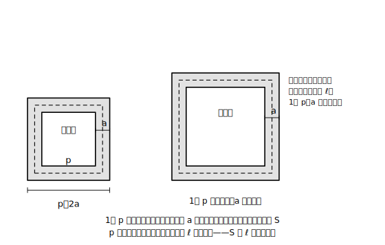
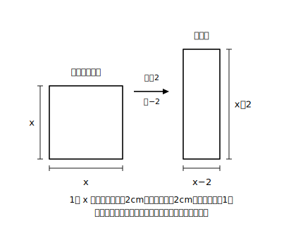
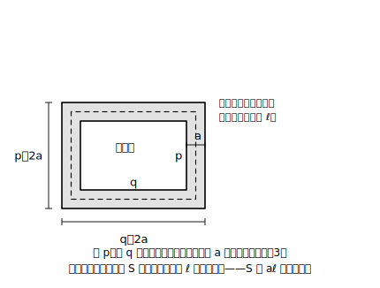
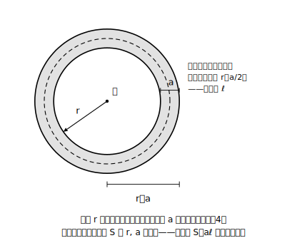

# L11 式による説明②——図形の性質と、式を「読む」

## ねらい

- 図形の長さや面積を文字式で表し、図形の性質を3ステップで説明できるようになる。
- **変形した式を読み取って**、新しいことを見つける——説明の「その先」を経験する。

## 導入：花だんのまわりの道

正方形の花だんのまわりに、はば a の道が一周ついている。

花だんの1辺を p とすると、道の外側の正方形の1辺は p＋2a。**道の部分の面積 S** は、外側の正方形から花だんを引いて、

S＝(p＋2a)²−p²

ここで、もう1つの量を用意する。**道の真ん中を通る一周の線の長さ ℓ**（点線）。真ん中の線がつくる正方形の1辺は p＋a だから、ℓ＝4(p＋a)。

さて、予想。**S＝aℓ** ——「道の面積は、はば×真ん中の一周の長さ」になっていそうだ。これを式で確かめよう。

## 主概念1：図形の性質を3ステップで説明する

ステップ①はもう済んでいる（S と ℓ を文字で表した）。ステップ②③——Sを計算して、aℓ の形を目指す。

S＝(p＋2a)²−p²
＝p²＋4ap＋4a²−p²
＝4ap＋4a²
＝4a(p＋a) ……共通因数 4a をくくり出した

一方、aℓ＝a×4(p＋a)＝4a(p＋a)。よって **S＝aℓ** が、どんな p, a でも成り立つと説明できた。

展開（公式②）で開き、くくり出しで閉じる——この章の技の総動員だ。ゴールの形（aℓ＝4a(p＋a)）を先に計算しておいて、そこへ向かって変形する作戦（L10のステップ③）が、ここでも効いている。

:::guide
**図形の説明問題の下ごしらえ——「どこを文字にするか」**

図形の問題では、ステップ①（文字で表す）の前に「何を文字に置くか」の選択がある。指針は2つ。①**変わるものすべてに文字を割り当てる**（この例では花だんの1辺 p と道はば a の2つ。1つの文字で足りると思い込むと、一般性が失われる）②**求めたい量を、置いた文字だけで表せるか確認する**（S も ℓ も p と a で書けた）。図に文字を直接書き込み、「外側の1辺＝p＋2a」のような**図から読める関係**を先にメモしてから式を立てると、立式の誤りが大きく減る。
:::

## 主概念2：式を「読む」——変形が教えてくれること

説明が終わった S＝aℓ を、もう一度眺めてみよう。この式は、計算の結果である以上に、**新しい発見**を語っている。

**発見1: S は、はば a と真ん中の一周 ℓ の2つだけで書ける。** S＝4a(p＋a) には p が残っているが、ℓ＝4(p＋a) を使って書き直すと S＝aℓ——花だんの1辺 p が**どんな値でも、同じ形の式**になる。これは「式の形の発見」だ。注意してほしいのは、p が答えに関係なくなったわけでは**ない**こと。p を変えれば ℓ＝4(p＋a) も変わり、ℓ を通して S も変わる。p の影響がすべて ℓ の中に**まとめられた**——だから、はばと真ん中の一周の長ささえ測れば、花だんの1辺を測らなくても道の面積が求められる、と読める。

**発見2: 形は正方形でなくてもよさそうだ。** 長方形の花だん（縦 p・横 q）で同じ計算をすると——練習3で確かめるが——やはり S＝aℓ になる。式の形が同じになるのは偶然だろうか？ それとも、もっと広い範囲で成り立つ性質なのだろうか？

このように、**変形後の式の形から意味を読み取り、次の問いを見つける**ことを「式を読む」という。中2では、証明を読んで新たな性質を見いだす練習をした。中3では、自分の計算結果を読んで新たな性質を見いだす——説明は「書いて終わり」ではなく、読み直すとその先の数学が始まる。

:::guide
**「式を読む」の型——3つの読み方**

式を読むときの観点を3つ持っておくと、発見が偶然でなくなる。①**文字のゆくえを追う**——文字が式から本当に消えたのか、別の量の中にまとめられたのかを見極める（練習2の差 a² のように x が本当に消えれば「正方形の大きさによらない」と読める。一方 S＝aℓ の p は ℓ の中にまとめられただけ——「S は a と ℓ だけで書ける。p が変われば ℓ を通して S も変わる」と読む）②**式の形の意味を言葉にする**（4a(p＋a)＝はば×4×(1辺＋はば)→「真ん中の一周」の正体）③**条件を変えても同じ形になるか試す**（正方形→長方形→もっと別の形？）。この3つは高校以降も、そして数学の外でも使える「結果の吟味」の型だ。答えが出た瞬間がいちばん学べる瞬間——もったいないので素通りしないこと。
:::

:::zatsudan
発見2の続きは、なんと練習4で待っている。正方形でも長方形でも成り立った S＝aℓ、円形の池のまわりの道でも成り立つのか？ 円の面積と円周の式だけで確かめられるから、ぜひ自分の手で試してみよう。1つの式の発見が、正方形→長方形→円へと転がっていく——数学の性質は、思ったより遠くまで散歩するのが好きなんだ！
:::

## 練習

1.  1辺 x の正方形の縦を2cmのばし、横を2cm縮めて長方形を作る。長方形の面積はもとの正方形の面積と比べてどうなるか。式で説明しよう（ゴール: 差がいくつになるかを式で示す）。
2. 練習1で「縦を5のばし、横を5縮める」と差はどうなるか。のばす長さを a として一般の場合を式で説明し、**式を読んで**「同じ量だけのばして縮めると、面積は必ずどうなるか」を言葉でまとめよう。
3. 縦 p・横 q の長方形の花だんのまわりに、はば a の道が一周ついている。道の面積 S と、道の真ん中を通る一周の長さ ℓ を p, q, a で表し、S＝aℓ が成り立つことを説明しよう。
4. 半径 r の円形の池のまわりに、はば a の道が一周ついているとする（道の外側は半径 r＋a の円）。道の面積 S を r と a の式で表し（円の面積は π×半径²）、道の真ん中を通る円（半径 r＋a/2）の円周 ℓ について S＝aℓ がこの場合も成り立つか確かめよう。 

:::stretch
**S1** 練習1・2の逆を考える。「縦を a のばし、横を b 縮める」（a と b が違う）とき、面積がもとの正方形と**同じ**になるのはどんなときか。(x＋a)(x−b)＝x² を整理して、a, b, x の間に成り立つべき関係式を導き、読み取れることを書こう（xが残ることに注目——正方形の大きさに関係する条件だろうか？）。
:::

---

対応解答: answer_key_L09-12.md

<!-- gen_nav:nav:start（自動生成・手編集しない） -->

---

[← 前のレッスン](lesson_10.md)｜[単元の目次](README.md)｜[解答](answer_key_L09-12.md)｜[次のレッスン →](lesson_12.md)

<!-- gen_nav:nav:end -->
