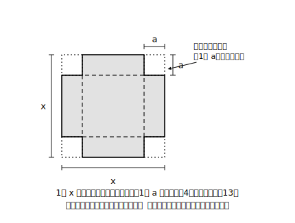

# L12 章末まとめ——積の形という道具

## ねらい

- 展開⇄因数分解の往復と利用の力を、総合演習で点検する。
- この章の道具が、次の章以降（平方根・二次方程式）でどう主役になるかの見取り図をもつ。

## この章の地図——1本の幹と4枚の葉

この章で手に入れた道具を1枚にまとめよう。

- **幹**: 分配法則（もれなく・符号ごと）——すべての公式の親
- **展開の4公式**: ①(a＋b)²／②(a−b)²／③(a＋b)(a−b)／④(x＋a)(x＋b)
- **因数分解の地図**: (1)共通因数 →(2)平方−平方 →(3)平方の形の3点点検 →(4)2数探し（すべて4公式の**逆読み**）
- **検算の型**: 因数分解したら展開で戻す
- **利用の型**: きりのいい数±少し（計算の工夫）／3ステップ＋ゴールの形から逆算（式による説明）／式を読む（文字のゆくえ・形の意味・条件を変える）

どの道具も、忘れたら幹（分配法則）まで戻れば作り直せる。**丸暗記が1つもない**ことを、総合演習で確かめてほしい。

## 総合演習

**A 展開（判定3秒→公式番号メモ→展開）**

1. (x＋7)(x−7)
2. (a−9)²
3. (x＋3)(x−8)
4. (2x＋5y)²
5. (x＋y−4)(x＋y＋4)

**B 因数分解（地図の順に調べ、完了チェックと展開検算まで）**

6. x²−15x＋56
7. 3x²−48
8. x²＋22x＋121
9. 2a²−4ab＋2b²
10. (x−1)²−9(x−1)＋20 （置き換え）

**C 利用**

11. 工夫して計算しよう: 105×95、53²−47²
12. 「連続する2つの整数の積に、大きいほうの整数をたすと、大きいほうの整数の2乗になる」ことを、3ステップで説明しよう（例で確認: 4×5＋5＝25＝5²）。
13.  1辺 x の正方形の紙の四すみから、1辺 a の正方形を4つ切り取った。残りの面積を x, a の式で表し、因数分解した形と展開した形の両方で書こう。どちらの形からどんなことが読み取れるか、1つずつ挙げられるとなおよい。

**D 自己点検（答え合わせのあとで）**

- 展開のミスは「かけ忘れ」「符号」のどちらだったか？ → L01・L02の合言葉へ
- 因数分解のミスは「地図の順番飛ばし」「2数の書き出し漏れ」「完了チェック忘れ」のどれだったか？ → L06〜L08へ
- 説明問題で手が止まったのは、①文字で表す ②計算 ③ゴールの形、のどのステップだったか？ → L10・L11へ

:::guide
**まちがい直しは「分類」までやると次につながる**

総合演習の価値は、解くことより**直し方**にある。答えが合わなかった問題を「たまたまミスした」で流さず、D欄のように原因を分類して、対応するレッスンの該当箇所を読み直す——この一手間で、同じ型のミスが次に出る確率がはっきり下がる。分類できないまちがいに出会ったら、それはノートの左端に印をつけておき、次の章の学習中にもう一度だけ見返すとよい。時間をおくと、原因が見えることがある。
:::

## 次の章への予告——因数分解が「方程式を解く鍵」になる

この章の締めくくりに、道具たちの「次の仕事」を予告しておこう。

この先、中3の数学は**平方根**（2乗してaになる数）へ進み、そのあと**二次方程式**——x²＋5x＋6＝0 のような、2乗の入った方程式——に挑む。そこで主役になるのが、ほかならぬ因数分解だ。

x²＋5x＋6＝(x＋2)(x＋3) と閉じた形にできれば、「**積が0になるのは、どちらかの因数が0のとき**」という一撃で方程式が解ける（くわしい仕組みは二次方程式の章で）。L05のguideで「積の形は、0になるxが読める形」と書いた伏線が、ここで回収される。**この章の因数分解は、因数分解で解ける二次方程式の中心的な範囲を支える**（二次方程式には平方根による解法もあり、それは次の単元からの話だ）。往復練習の貯金は、確実に利子がついて返ってくる。

:::guide
**この単元の「その先」の地図（学びの系統）**

本レッスンの予告は最小限にとどめたが、系統としては——①式の展開と因数分解（本章）→②平方根→③二次方程式（因数分解による解法・平方根による解法）と進む。また「式による説明」の力は、この先も図形・関数のあらゆる場面で説明・証明の言語として使い続ける。x²の係数が1でない式の因数分解など、この章ではstretchで少しだけ顔を出すにとどめた形は、高校の数学で本格的に扱う——中学の4公式が確実なら、そこでの拡張はスムーズだ。先取りしたい人は、まず本章の往復練習（L08）を「一瞬でできる」水準まで上げることが、実は最短の準備になる。
:::

:::stretch
**S1（章の卒業問題）** 「4けたの数 abba の形の数（例: 1221, 3443——千の位と一の位、百の位と十の位が同じ）は、必ず11の倍数になる」ことを、式で説明してみよう（ヒント: この数は 1000a＋100b＋10b＋a と表せる。ゴールの形は 11×(整数)——くくり出しだ）。説明できたら、式を読んで「11で割った商」がどんな式になるかも観察してみよう。

**発展への導線**: 因数分解の世界はこの先もずっと続く。「因数分解 高校 どこまで」「因数定理とは」で調べると、この章の道具がどう成長していくかの地図が見える。
:::

:::zatsudan
最後にひとつ、この章まるごとの種明かし——L01の準備運動で「30を素因数分解しよう」から始めたのを覚えてる？ 数の分解で始まり、式の分解で終わる——この章は最初から「**分解すると正体が見える**」という1つの物語だったんだ。素因数分解が数の設計図なら、因数分解は式の設計図。設計図が読めるようになったきみが次に出会うのは、設計図から答えを組み立てる話（二次方程式）——続きは数か月後の教科書で！
:::

---

対応解答: answer_key_L09-12.md

<!-- gen_nav:nav:start（自動生成・手編集しない） -->

---

[← 前のレッスン](lesson_11.md)｜[単元の目次](README.md)｜[解答](answer_key_L09-12.md)

<!-- gen_nav:nav:end -->
