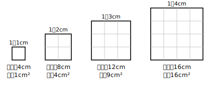

# L01 関数の物語・第3幕——2乗に比例との出会い

## ねらい

- 中1・中2で学んだ関数の道具（関数の意味・比例・反比例・一次関数・変化の割合）を点検し、使える状態にする。
- 比例でも一次関数でもない、**新しい増え方をする関数**に出会う。「xがm倍になると、yがm²倍になる」という性質に自分で気づく。

## 準備運動：道具箱の点検（前提診断）

この章は、中学3年間の「関数」の総仕上げだ。はじめる前に、これまでの道具がそろっているか点検してみよう。

1. 「yはxの関数である」とはどういう意味だったか、自分の言葉で言ってみよう。
2. 空の水そうに水を入れる。1分あたり2Lずつ入れるとき、x分後の水の量をy Lとする。yをxの式で表そう。また、xとyのどちらが「決める側」の変数だろうか。
3. 次の関数の式を、比例・反比例・一次関数に分けてみよう。
   (ア) y＝3x　(イ) y＝−2x＋5　(ウ) y＝6/x
4. 一次関数 y＝2x＋1 について、xの値が1から4まで増えるときの変化の割合を求めよう。
5. 【意味の確認】「変化の割合」とは何を何で割ったものだったか、言葉で言ってみよう。

1と5は、この章の主役級の考え方だ。とくに5を「yの増えた分のこと」と答えた人は、あとでつまずきやすいポイントなので、いま確認しておこう。変化の割合は（yの増加量）**÷（xの増加量）**——引き算の結果ではなく、割り算の結果だ。あやしかった人は中1・中2の関数の章に一度戻っておくと、この先がぐっと楽になる。

## 主概念1：同じ正方形から、ちがう増え方が生まれる

1辺がx cmの正方形を考えよう。この正方形から、2つの量が決まる。

- まわりの長さ y＝4x（cm）
- 面積 y＝x²（cm²）

どちらも、xの値を決めるとyの値がただ1つ決まる。つまりどちらも**yはxの関数**だ。では、増え方も同じだろうか？ 表で比べてみよう。

| x（cm） | 1 | 2 | 3 | 4 | 5 | 6 |
|---|---|---|---|---|---|---|
| まわりの長さ y＝4x | 4 | 8 | 12 | 16 | 20 | 24 |
| 面積 y＝x² | 1 | 4 | 9 | 16 | 25 | 36 |

まわりの長さは、中1で学んだ比例そのものだ。xが2倍・3倍になると、yも2倍・3倍になる。

面積の行をよく見てみよう。xが1から2へ**2倍**になると、yは1から4へ、**4倍**になっている。xが1から3へ**3倍**になると、yは1から9へ**9倍**。2倍なのに4倍、3倍なのに9倍。比例のルール「xが2倍ならyも2倍」が、ここでは成り立っていない。

## 主概念2：新しい増え方——m倍するとm²倍

面積の増え方には、それでもきちんとしたきまりがある。

**xの値がm倍になると、yの値はm²倍になる。**

2倍→2²＝4倍、3倍→3²＝9倍、4倍→4²＝16倍。表で確かめてみよう。xが2から6へ3倍になるところでは、yは4から36へ、たしかに9倍になっている。

この増え方は、比例（m倍→m倍）ともちがうし、反比例（m倍→1/m倍）ともちがう。一次関数 y＝4x＋1 のような「一定の割合で増える」形ともちがう。中1・中2の道具箱のどれにも当てはまらない、**新しいタイプの関数**が目の前に現れた。

ふり返れば、関数の学びは物語のように進んできた。中1では比例と反比例。中2では比例を仲間にふくむ一次関数へと広がった。そして中3のいま、目の前にあるのは「2乗」というひとひねりの入った関数——第3幕の主役だ。次のレッスンで、この関数に正式な名前をつけよう。

:::zatsudan
同じ「増える」でも、増え方には個性がある。1歩ごとに同じ高さだけ上る階段が一次関数だとすると、この新顔は、進むほど1段の高さが増していく階段だ。最初はゆるやかなのに、気がつくと目もくらむ高さになっている。この「あとから効いてくる」感じが、2乗という演算の持ち味だ。
:::

:::guide
**なぜ「まわりの長さ」と「面積」を並べたのか**

新しいものは、よく知っているものと並べたときにいちばんくっきり見える。この教材ではこの先ずっと、「一次関数（比例）ではこうだった→y=x²の仲間ではどうか」という比べ方を繰り返し使う。同じ1つの正方形から出発しても、「長さ」を測るか「面積」を測るかで関数のタイプが変わる——この対比が、章全体の見取り図になる。新しい性質に出会うたびに「一次関数のときはどうだったか」と自分に問い直すことを、この章の読み方の型にしてほしい。
:::

:::guide
**「変化の割合＝yの差」と思っていた人へ**

準備運動の5は、この章の合否を分けるくらい大事な確認だ。変化の割合は、yの増加量そのものではなく、（yの増加量）÷（xの増加量）という**割り算の値**である。一次関数ではこの値がいつも一定（yの増加量だけ見ても、xが1ずつ増えるなら差は一定）だったから、「差」と「割合」を区別しなくても答えが合ってしまうことが多かった。しかしこの章の関数では、差も割合も場所によって変わる。区別があいまいなままだと、L08で混乱しやすい。いまのうちに「割合は割り算」と言葉ごと整えておこう。
:::

:::guide
**「決める側」と「決まる側」**

準備運動の2で問うた「どちらが決める側か」は、関数の意味の核心だ。x（時間）を決めると、y（水の量）がただ1つ決まる——このとき「yはxの関数である」という。逆に「yを決めればxも決まるのでは？」と思った人は、よい着眼だ。ただ、関数という言葉は「どちらを決める側とみなして考えているか」という**見方の宣言**でもある。この章では一貫して「xを決める→yが決まる」の向きで考える。表を作るときも、決める側のxを等間隔に並べるのが定石だ。
:::

## 練習

1. 1辺x cmの立方体がある。次の量のうち、「xの値を決めるとただ1つに決まる量」をすべて選ぼう。
   (ア) 1つの面の面積　(イ) すべての辺の長さの合計　(ウ) この立方体を作るのにかかる時間
2. 底辺x cm・高さx cmの三角形の面積をy cm²とする。yをxの式で表そう。また、xの値が2倍になると、yの値は何倍になるか。表を作って確かめよう（x＝1, 2, 3, 4）。
3. 次の表は、ある関数のxとyの対応を表している。xが2倍・3倍になるとyがそれぞれ何倍になるかを調べ、この関数が「比例」「m倍→m²倍の新しいタイプ」のどちらの増え方をしているか答えよう。

   | x | 1 | 2 | 3 | 4 |
   |---|---|---|---|---|
   | y | 3 | 12 | 27 | 48 |

4. 一次関数 y＝5x について、xが1から2になるときと、2から3になるときの変化の割合をそれぞれ求めよう。y＝x²（上の面積の関数）についても同じ2つの区間で変化の割合を求め、気づいたことを一言書いてみよう。

:::stretch
**S1** 1辺x cmの立方体の体積をy cm³とする。xの値が2倍・3倍になると、yの値はそれぞれ何倍になるだろうか。x＝1, 2, 3で表を作って調べ、「m倍→何倍」の形でまとめてみよう。長さ（1乗）・面積（2乗）・体積（3乗）で増え方がどう変わるか、見比べてみよう。
:::

---

対応解答: answer_key_L01-05.md

<!-- gen_nav:nav:start（自動生成・手編集しない） -->

---

[単元の目次](README.md)｜[解答](answer_key_L01-05.md)｜[次のレッスン →](lesson_02.md)

<!-- gen_nav:nav:end -->
