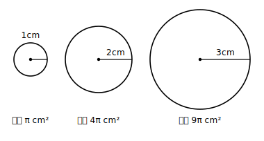

# L03 事象の中から見つける——数学化の入口

## ねらい

- 身のまわりの場面から「2乗に比例する関数」を**自分で見つけ出す**手順（数学化の型）を身につける。
- 場面がxの変域（へんいき）を決めることに気づく。

## 主概念：数学化の型——いきなり式にしない

式やグラフの問題は、たいてい最初から式が与えられている。しかし現実の場面には、式は書かれていない。場面から関数を**見いだす**——これがこの章でいちばん価値のある技術だ。手順を型にしよう。

> **数学化の型**
> ① 変わる量を2つ選び、どちらを決める側（x）にするか決める
> ② 対応の表を作る（xは等間隔に並べる）
> ③ きまりを調べる（m倍→m²倍か？　y÷x²は一定か？）
> ④ 式に表す。xの変域も場面から確認する

**例題** 半径x cmの円の面積をy cm²とする。yはxの2乗に比例するだろうか。

①決める側は半径x、決まる側は面積y。②表を作る。円の面積の公式（半径×半径×π）から、

| x | 1 | 2 | 3 | 4 |
|---|---|---|---|---|
| y | π | 4π | 9π | 16π |
| y÷x² | π | π | π | π |

③商がどこでもπで一定。xが2倍になるとyは4倍（π→4π）——2本の見分け方がどちらも成立。④よって **y＝πx²**、yはxの2乗に比例し、比例定数はπだ。比例定数は整数や分数とは限らない。πのような数がなってもよい。

そして最後にもうひとつ。xは円の半径だから、**x＞0**。式だけ見るとxはどんな数でもよさそうに見えるが、場面が変域を決めている。数学化の仕上げには、いつも「xはどんな値を取りうるか？」を場面に戻って確認しよう。

## 「2乗に比例しない」と見抜くことも数学化

数学化の型は、「ちがう」と見抜くためにも使う。

**例題** 1辺x cmの正三角形のまわりの長さをy cmとする。yはxの2乗に比例するか。

表を作るまでもなく y＝3x。y÷x²を計算すると 3/x となり、xの値によって変わってしまうから一定でない。これは2乗に比例ではなく、中1の比例だ。「2乗に比例っぽい場面」と「本物」を区別できることが、型が身についた証拠になる。

:::zatsudan
式にする、というのは一種の翻訳だ。日本語で書かれた場面を、数学語に訳す。翻訳のコツが「単語をいきなり置き換えず、まず文全体の意味をつかむこと」であるように、数学化のコツも「いきなり式にせず、まず表で全体のふるまいをつかむこと」だ。表は、翻訳者が最初に作る下書きメモにあたる。
:::

:::guide
**なぜ「まず表」なのか**

②で表を経由するのは遠回りに見えるかもしれない。しかし、xを等間隔に並べた表は、変化や対応のきまりを**目で見つけやすくする**ための道具だ。式が先に思いつく場面（公式が使える図形など）でも、表を1本作って商一定を確かめておくと、思いこみによる立式ミスを自分で発見できる。式が思いつかない場面では、表だけが頼りになる。どちらに転んでも表は無駄にならない——だから型の真ん中に置いてある。
:::

:::guide
**「決める側」の選び方**

①で「どちらをxにするか」に迷ったら、「実際に自分が動かせるのはどちらか」を考えるとよい。円の例なら、半径を決めれば面積が決まる（半径が決める側）。逆向きに「面積を決めて半径を求める」場面も作れるが、その場合は関数の式の形が変わる。関数とは「どちらを決める側とみなすか」の宣言つきの対応だった（L01）——数学化の第一歩が①なのは、この宣言を自覚的にやるためだ。
:::

## 練習

1. 底辺がx cm、高さが底辺の3倍の三角形の面積をy cm²とする。
   (1) 数学化の型①〜④にそって、yをxの式で表そう（表はx＝1, 2, 3, 4で作る）。
   (2) yはxの2乗に比例するといえるか。比例定数も答えよう。
   (3) xの変域を答えよう。
2. 次の場面のうち、yがxの2乗に比例するものをすべて選ぼう（それぞれ式に表して判断しよう）。
   (ア) 1辺x cmの正方形の対角線で作る直角二等辺三角形の面積y cm²
   (イ) 半径x cmの円の周の長さy cm
   (ウ) 縦x cm・横2x cmの長方形の面積y cm²
   (エ) 1辺x cmの正方形のまわりの長さy cm
3. 直径x cmの円の面積をy cm²とする。yをxの式で表し、比例定数を答えよう（半径ではなく直径であることに注意）。

:::stretch
**S1** 身のまわりから「2乗に比例していそうな量」を1つ探し、数学化の型①〜④で調べてみよう。うまく見つからないときは、図形の面積（相似な形の拡大縮小）が有力な狩り場だ。ヒントがほしいときの調べるフレーズ例:「身のまわり 2乗に比例する量」「面積 相似 2乗」。AIチャットに聞くなら、たとえば「中3数学で習う『2乗に比例する関数』の実例を、図形から3つ挙げて。式も添えて」のように、学年と条件を添えると探しやすい。
:::

---

対応解答: answer_key_L01-05.md

<!-- gen_nav:nav:start（自動生成・手編集しない） -->

---

[← 前のレッスン](lesson_02.md)｜[単元の目次](README.md)｜[解答](answer_key_L01-05.md)｜[次のレッスン →](lesson_04.md)

<!-- gen_nav:nav:end -->
