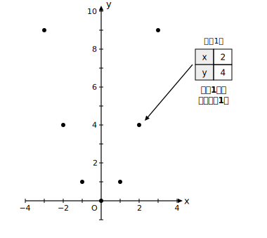
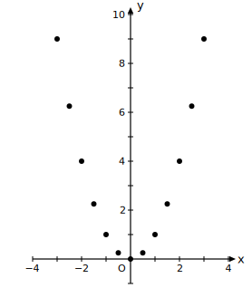
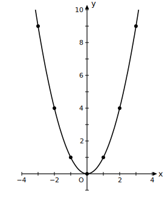

# L04 グラフをかく——グラフは「対応の集まり」

## ねらい

- グラフとは「**式を満たすxとyの組（点）をすべて集めたもの**」であることを、y＝x²のグラフを自分でかく過程で体感する。
- y＝x²のグラフの形（原点を通るなめらかな曲線）を知り、**放物線**（ほうぶつせん）という慣用の呼び名と、軸（じく）・頂点（ちょうてん）という言葉を知る。

## 主概念1：グラフは形の絵ではない

一次関数のグラフをかくとき、私たちは点を2つだけ取って直線で結んだ。あれができたのは「グラフが直線になる」と分かっていたからだ。新しい関数y＝x²では、その手は使えない。原点に立ち返ろう。

**グラフとは、式を満たす(x, y)の組を座標にもつ点を、すべて集めたものである。**

まず、y＝x²を満たす組を表で作り、その1組1組を点として打ってみよう。

| x | −3 | −2 | −1 | 0 | 1 | 2 | 3 |
|---|---|---|---|---|---|---|---|
| y | 9 | 4 | 1 | 0 | 1 | 4 | 9 |

7個の点が、谷のような形に並んだ。でも、点と点のあいだはどうなっているのだろう？ xは整数だけではない。x＝0.5ならy＝0.25、x＝1.5ならy＝2.25、x＝2.5ならy＝6.25。もっと細かく取ってみよう。

点がぎっしり並んできて、1本の曲線の気配が見えてくる。xの値は0.1刻みでも0.01刻みでも取れるから、点は限りなく増えていき、すきまが埋まって、**原点を通るなめらかな曲線**になる。

ここで強調しておきたい。グラフは「それらしい形の絵」ではない。**1点1点が「x＝2のときy＝4」といった対応の事実を背負っている**。だから、点(2, 5)がこの曲線上にないことは「x＝2のときy＝5ではない」（実際 2²＝4≠5）という意味だし、曲線が原点を通ることは「x＝0のときy＝0」という対応の表明だ。グラフを見るとは、形をながめることではなく、無数の対応を一望することなのだ。

## 主概念2：放物線——この曲線の呼び名

y＝x²のグラフの形の曲線を、**放物線**（ほうぶつせん）と呼ぶ。放物線には、見てとれる特徴が2つある。

- **y軸について左右対称**である。x＝2とx＝−2でyの値がどちらも4になるように、xの符号を変えてもx²の値は変わらないからだ。この対称の軸となる直線（ここではy軸）を、放物線の**軸**（じく）という。
- 軸とグラフが交わる点（ここでは原点(0, 0)）を、放物線の**頂点**（ちょうてん）という。

「放物線」「軸」「頂点」は、グラフのようすを言い表すのに便利な言葉として使っていこう。

一次関数との対比も忘れずに。直線のグラフは2点で決まったが、曲線はそうはいかない。**曲線のグラフをかくときは、点を多めに取り、なめらかに結ぶ**——これがこの章のグラフ作法だ。とくに頂点(0, 0)の近くは、とがらせずに丸く、ゆるやかに向きが変わるようにかく。

:::zatsudan
「なめらかな曲線」と聞くと1本のひものように思えるが、その正体は、ぎっしり並んだ点の大群だ。どんなに拡大しても、そこには対応の点がすきまなく詰まっている。グラフをかくとき、私たちは無数の点を一筆で代弁している——そう思うと、フリーハンドの1本の線がちょっと重みを増さないだろうか。
:::

:::guide
**「グラフ=形の絵」と思うと何が起きるか**

グラフを対応の集まりではなく「ようすを写した絵」として見てしまうと、場面の見た目とグラフの形を混同する誤りが起きる。たとえば「坂を下る場面だからグラフも右下がりのはず」「容器の形とグラフの形は似ているはず」といった判断だ。グラフの形を決めるのは、場面の見た目ではなく、**xとyの対応のしかた**だけである。グラフの問題で迷ったら、いつでも「この点はどの(x, y)の組か」に立ち返ろう。点に戻れば、絵の印象にだまされない。
:::

:::guide
**なぜ負のxも表に入れるのか**

L01〜L03の面積の例では、xは長さだったからx＞0だけを考えていた。しかし関数y＝x²そのものは、xが負の値でも意味を持つ（(−3)²＝9）。式としての関数を調べるときは、変域の指定がないかぎり、xは負の数もふくめて考える。負の側まで表を作ってはじめて、「y軸対称」というこのグラフのいちばん美しい特徴が姿を現す。場面つきの問題に戻ったときは、また場面が変域を決める——この行き来はL07とL10で本格的に扱う。
:::

:::guide
**フリーハンドでかくコツ**

きれいにかけない、と感じる人ほど、点の数を増やすとよい。とくに頂点付近（−1≦x≦1）は0.5刻みで点を取ると、底が平らに近いゆるやかなカーブであることが分かる。かき方の崩れとしてよく見かけるのは（頻度の調査データではなく、指導経験からの経験則だが）、点と点を定規で直線的に結んでカクカクの折れ線にしてしまうことと、頂点をV字にとがらせてしまうことだ。どちらも「点のあいだにも無数の点がある」ことを思い出せば直せる。点を限りなく細かく取っていくと、y＝x²ではなめらかな曲線が見えてくる——ただし、どんな関数でもなめらかになるわけではない（L12で出会う階段の形のグラフは、その例だ）。
:::

## 練習

1. y＝2x²について、x＝−2, −1.5, −1, −0.5, 0, 0.5, 1, 1.5, 2 に対するyの値の表を作り、グラフをかこう（方眼のy軸は0から9まで使う）。
2. 点(3, 18)と点(−2, 6)は、y＝2x²のグラフ上にあるか。それぞれ代入して判定しよう。
3. y＝x²のグラフについて、次の文の正誤を判定し、誤りは正しく直そう。
   (ア) グラフは点(−4, 16)を通る。
   (イ) グラフはx軸について対称である。
   (ウ) 頂点は原点である。
4. y＝x²のグラフとy＝x（比例）のグラフを同じ座標平面にかくと、原点のほかにもう1点で交わる。その点の座標を、表を作って見つけよう（x＝0, 0.5, 1, 1.5, 2で比べる）。

:::stretch
**S1** y＝x²のグラフ上に、y座標がちょうど2になる点がある。その点のx座標は、x²＝2を満たす数——前の章までに学んだ平方根の記号を使えば x＝√2 と x＝−√2 だ。√2≒1.41を使って、この2点のおよその位置をグラフ上に打ってみよう。表の整数値のあいだにも、こうして「名前のある点」が無数に見つかる。
:::

---

対応解答: answer_key_L01-05.md

<!-- gen_nav:nav:start（自動生成・手編集しない） -->

---

[← 前のレッスン](lesson_03.md)｜[単元の目次](README.md)｜[解答](answer_key_L01-05.md)｜[次のレッスン →](lesson_05.md)

<!-- gen_nav:nav:end -->
