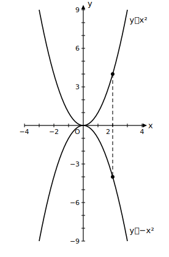
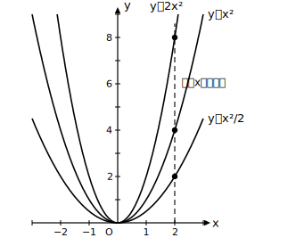
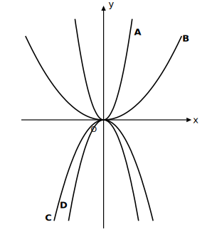

# L05 aがグラフを決める——向きと開き方

## ねらい

- y＝ax²のグラフの**開く向き**が比例定数aの符号で、**開き具合**がaの絶対値で決まることを、式に関連付けて理解する。
- 方眼のないグラフでも、向きと開き方から式と曲線を対応させられるようになる。

## 主概念1：aの符号が、開く向きを決める

y＝x²とy＝−x²を、同じxの値で比べてみよう。

| x | −3 | −2 | −1 | 0 | 1 | 2 | 3 |
|---|---|---|---|---|---|---|---|
| y＝x² | 9 | 4 | 1 | 0 | 1 | 4 | 9 |
| y＝−x² | −9 | −4 | −1 | 0 | −1 | −4 | −9 |

どのxの値でも、yの符号だけがちょうど逆になっている。だから2つのグラフは、**x軸について対称**の位置にある。

なぜこうなるのかは、式が教えてくれる。x²は、xが正でも負でも**0以上**の値にしかならない。だからy＝ax²のyの符号は、aの符号がそのまま決める（x＝0のときだけy＝0）。

- **a＞0のとき**: yはつねに0以上。グラフは**上に開き**、頂点(0, 0)がいちばん低い点になる。
- **a＜0のとき**: yはつねに0以下。グラフは**下に開き**、頂点(0, 0)がいちばん高い点になる。

## 主概念2：aの絶対値が、開き具合を決める

今度は上に開く仲間どうしで、y＝x²・y＝2x²・y＝x²/2を同じxの値で比べよう。

| x | −2 | −1 | 0 | 1 | 2 |
|---|---|---|---|---|---|
| y＝2x² | 8 | 2 | 0 | 2 | 8 |
| y＝x² | 4 | 1 | 0 | 1 | 4 |
| y＝x²/2 | 2 | 0.5 | 0 | 0.5 | 2 |

同じxの値のところで、y＝2x²のyはy＝x²の2倍、y＝x²/2のyは半分になっている。つまりy＝ax²のグラフは、y＝x²のグラフの各点を**縦方向にa倍**した位置に来る。縦に引きのばされるほど曲線は立ち上がりが急になり、開き方は**せまく**なる。

まとめよう。

> **【ことば】y＝ax²のグラフ**
> y＝ax²のグラフは、原点を頂点とし、y軸を軸とする放物線である。
> - **aの符号**が開く向きを決める（a＞0なら上に、a＜0なら下に開く）
> - **aの絶対値**が開き具合を決める（絶対値が大きいほど、開き方はせまい）
> また、y＝ax²とy＝−ax²のグラフは、x軸について対称である。

一次関数y＝ax＋bでは、aは「傾き」として直線の向きを決めていた。y＝ax²でも、グラフの姿を決めているのはやはりaだ。式の中のたった1つの文字が、グラフ全体の性質をにぎっている——この見方は関数を通じて共通だ。

:::zatsudan
aは、この関数に1つだけ付いているダイヤルのようなものだ。プラス側に回せば上へ、マイナス側に回せば下へ。大きく回すほど曲線はきゅっと細くなる。無数にあるy＝ax²の仲間たちも、ちがいはこのダイヤルの目盛りひとつ。そう思うと、グラフの見分けは「ダイヤルの読み取り」の練習ともいえる。
:::

:::guide
**なぜ「同じxの値で比べる」のか**

主概念2の表は、xの行をそろえて縦に読むのがポイントだ。同じxのところでyが何倍かを見れば、2つのグラフの縦方向の関係がそのまま分かる。グラフの比較で迷ったら、「x＝1の列」を見るのが手早い。x＝1のときy＝aだから（L02のguideで見たとおり）、x＝1での高さがそのまま比例定数になっている。方眼のあるグラフから式を求めるときも、この「x＝1での高さ」がいちばん速い手がかりだ。
:::

:::guide
**「開き方がせまい」は「増え方が急」の言いかえ**

開き具合という見た目の言葉は、値の言葉に翻訳できる。開き方がせまいとは、xが原点から少し離れただけでyが大きく変わる、つまり**変わり方が急**だということだ。y＝2x²はy＝x²より、同じxの動きに対してyが2倍動く。見た目（グラフ）と値（表・式）を行き来して同じことを2通りに言えるようになると、L08で変化の割合を扱うときの土台になる。
:::

:::guide
**方眼がなくても判断できる、ということの意味**

練習2のような方眼のない図では、点の座標を読み取ることができない。それでも式と曲線を対応させられるのは、座標の値ではなく**性質**（向きと開き方の大小関係）で判断しているからだ。逆にいえば、この判断ができれば「aの符号と絶対値がグラフを決める」ことが本当に身についた証拠になる。細かい値が分からなくても大づかみに姿が言える——これはグラフというものの強みでもある。
:::

## 練習

1. y＝3x²について、x＝−2, −1, 0, 1, 2に対するyの値の表を作ろう。また、y＝x²のグラフと比べて、開き方はせまいか広いか答えよう。
2. 
   図の曲線A〜Dは、次の4つの関数のグラフである。どの曲線がどの式か、向きと開き方をもとに対応させよう。
   y＝3x²　y＝x²/3　y＝−x²　y＝−2x²
3. y＝−3x²について答えよう。
   (1) グラフは上と下のどちらに開くか。
   (2) x＝2のときのyの値を求めよう。
   (3) このグラフとx軸について対称なグラフの式を答えよう。
4. 次の文の正誤を判定し、誤りは正しく直そう。
   (ア) y＝−x²のグラフは、比例定数が負だから下に開く。
   (イ) y＝4x²のグラフは、y＝x²のグラフより開き方が広い。
   (ウ) y＝ax²のグラフの頂点は、aの値によって原点から動く。

:::stretch
**S1** y＝ax²のグラフが点(2, −2)を通っている。aの値を求め、このグラフの開く向きと、y＝x²と比べたときの開き方（せまいか広いか）を答えよう。求めたaが分数になっても、ダイヤルの読み方は同じだ。
:::

---

対応解答: answer_key_L01-05.md

<!-- gen_nav:nav:start（自動生成・手編集しない） -->

---

[← 前のレッスン](lesson_04.md)｜[単元の目次](README.md)｜[解答](answer_key_L01-05.md)｜[次のレッスン →](lesson_06.md)

<!-- gen_nav:nav:end -->
