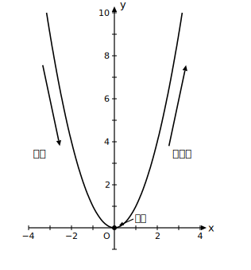

# L06 グラフを読む——増減は原点を境に

## ねらい

- y＝ax²（a＞0）で、xの値が増えるときのyの増減（ぞうげん）が**原点を境に変わる**ことを、xが2乗されていることに関連付けて理解する。
- a＞0で調べた方法をそのまま使って、a＜0の場合を**自分の手で**まとめる。
- 増減のようすを、xの範囲を添えた言葉で説明できる。

## 主概念1：xが増えるとyは？——答えは「場所による」

一次関数y＝2x＋3では、xの値が増えるとyの値はどこでも増えた。y＝−2x＋3なら、どこでも減った。増えるか減るかは、グラフ全体で1つに決まっていた。

y＝x²ではどうだろう。表を左から右へ、xが増える向きに読んでみよう。

| x | −3 | −2 | −1 | 0 | 1 | 2 | 3 |
|---|---|---|---|---|---|---|---|
| y＝x² | 9 | 4 | 1 | 0 | 1 | 4 | 9 |

xが−3から0へ増えるあいだ、yは9→4→1→0と**減って**いる。ところがxが0を過ぎると、yは0→1→4→9と**増えて**いく。増えるか減るかが、途中で切りかわる関数が現れた。

なぜ原点が境目になるのか。式のx²に戻って考えよう。xが負の側で0に近づくとき（−3→−2→−1）、xの**絶対値は小さく**なっていく。2乗した値は絶対値で決まるから、x²も小さくなる。xが0を過ぎて正の側に入ると、今度は絶対値が大きくなっていくから、x²も大きくなる。つまり境目が原点なのは、**xの符号が切りかわる場所**だからだ。

まとめると、a＞0のとき:

- x＜0の範囲では、xが増えるとyは**減る**。
- x＞0の範囲では、xが増えるとyは**増える**。
- x＝0のときy＝0で、これはこの関数のyの値の中で**もっとも小さい値**である。

## 主概念2：a＜0は、自分の手でまとめる

ではa＜0のとき、増減はどうなるだろう。新しく教わる必要はない。いま使った調べ方——**表を左から右へ読む・式のx²に戻って考える**——をそのまま使えばよい。

y＝−x²で自分の表を作り、a＞0のまとめと同じ形式で「x＜0では」「x＝0では」「x＞0では」の3行を書いてみよう。書けたら、下のまとめと見比べてほしい。

- x＜0の範囲では、xが増えるとyは**増える**（−9→−4→−1→0）。
- x＞0の範囲では、xが増えるとyは**減る**。
- x＝0のときy＝0で、これはこの関数のyの値の中で**もっとも大きい値**である。

a＞0の場合と、増える・減るがちょうど入れかわっている。L05で見た「x軸対称」を思い出せば、グラフが上下逆さまなのだから増減も逆になる——2つのレッスンがここでつながる。

## 増減を言葉にする——「どこで」を必ず添える

y＝x²の増減を「xが増えるとyも増える」とだけ言うと、半分まちがいになってしまう。x＜0の範囲では減るからだ。この章の関数の増減を説明するときは、**「どこで」（xの範囲）を必ず添える**。

> **増減の説明の型**
> 「x＜（あるいは＞）0の範囲では、xの値が増えるとyの値は増える（減る）」
> のように、**xの範囲＋増減**をセットで言う。

一方通行だった一次関数との、これがいちばん大きなちがいだ。

:::zatsudan
峠道を東へ向かって歩く場面を思いうかべてほしい。峠にたどり着くまでは上り、峠を越えたら下り。進む向きは同じ「東」のままなのに、足もとの上り下りは峠を境に反転する。y＝ax²の増減もこれと同じで、xはずっと増える向きに進んでいるのに、yの上り下りは頂点を境に切りかわる。グラフの上を歩くつもりで読むと、増減は体感で分かる。
:::

:::guide
**「x＜0では減る」を式だけで納得する**

図がない場面でも増減を判断できるようにしておこう。かぎは「2乗は絶対値で決まる」だ。たとえばy＝x²でx＝−5とx＝−2を比べると、xとしては−2の方が大きい（増えた側）が、絶対値は小さいので、2乗した値は25から4へ減る。負の数どうしの大小と、その2乗の大小が**逆転する**——この1点さえ押さえれば、表やグラフがなくても「x＜0では減る」と言い切れる。a＜0のときは、これに「aを掛けると符号が反転する」を重ねればよい。
:::

:::guide
**「もっとも小さい値」という言い方について**

a＞0のy＝ax²では、yの値はx＝0のときの0がいちばん小さく、それより小さくなることはない。本書ではこれを「yの値の中でもっとも小さい値」と表現する。グラフでいえば頂点の高さのことだ。この見方は、次のL07（変域）で「yの値の範囲」を答えるときの決め手になる。端の値だけでなく「いちばん低い（高い）場所はどこか」を意識する習慣を、ここでつけておこう。
:::

:::guide
**なぜa＜0を自分でまとめさせるのか**

主概念2をあえて自習の形にしたのは、a＜0が「新しい知識」ではなく「同じ調べ方の再利用」で片づく、と体験してほしいからだ。数学の学びでは、場合が2つあるとき、片方を丁寧に調べればもう片方は対称性で手に入ることが多い。「もう半分は自分で出せる」という感覚は、この先どの単元でも効く道具になる。
:::

## 練習

1. y＝3x²について答えよう。
   (1) x＜0の範囲では、xの値が増えるとyの値はどうなるか。
   (2) x＞0の範囲では、xの値が増えるとyの値はどうなるか。
   (3) x＝0のときのyの値を答え、それがこの関数のyの値の中でどんな値かを言おう。
2. y＝−2x²の増減を、「x＜0の範囲では」「x＝0のときは」「x＞0の範囲では」の3つに分けてまとめよう。
3. 次の文の正誤を判定し、誤りは正しく直そう。
   (ア) y＝x²では、xの値が増えるとyの値はつねに増える。
   (イ) y＝−x²のyの値が、0より大きくなることはない。
   (ウ) 一次関数y＝−3x＋1では、xの値が増えるとyの値はどこでも減る。
4. 【説明】y＝2x²のグラフは、x＝0の左右でようすが変わる。そのようすを、増減の説明の型（xの範囲＋増減）を使って2文で説明しよう。

:::stretch
**S1** y＝x²で、xが−3から−1まで増えるときのyの減少量と、xが−1から0まで増えるときのyの減少量をそれぞれ求めよう。同じ「減る」でも、減り方の大きさは場所によってちがうだろうか？　この「変わり方そのものが変わる」という現象の正体は、L08で明かされる。
:::

---

対応解答: answer_key_L06-09.md

<!-- gen_nav:nav:start（自動生成・手編集しない） -->

---

[← 前のレッスン](lesson_05.md)｜[単元の目次](README.md)｜[解答](answer_key_L06-09.md)｜[次のレッスン →](lesson_07.md)

<!-- gen_nav:nav:end -->
